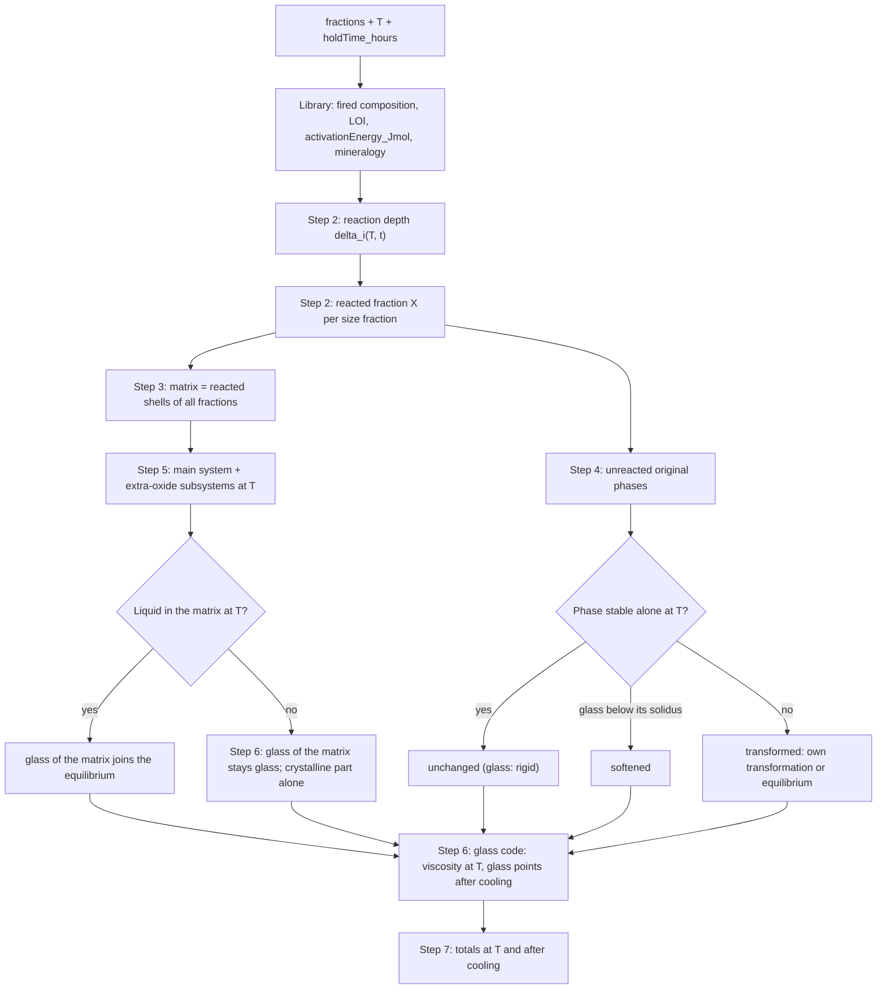

# Phase Equilibrium Algorithm (phase diagrams, grain size, unreacted original phases)

**Service:** `backend/src/modules/refractory/services/composition/phase-equilibrium.service.ts` (`PhaseEquilibriumService`)  
**Endpoint:** `POST /api/v1/refractory/phase-equilibrium` ([API spec §1](../api/REFRACTORY_API_SPEC.md))  
**Constants:** `constants/phase-equilibrium.constants.ts` (`PHASE_EQUILIBRIUM_CONSTANTS`), `constants/grain-reaction.constants.ts` (`GRAIN_REACTION_CONSTANTS`)  
**Data:** `data/phase-diagrams/` (phase catalog, main systems, extra-oxide subsystems), `mineralogy` of each mix component in `data/materials/*.data.ts`  
**Utils:** `utils/phase-diagram/`, `utils/grain-reaction/`, `utils/mineralogy/`, `utils/glass-phase/`  
**Glass and melt properties:** existing `GlassViscosityService` ([glass-viscosity spec](glass-viscosity/INDEX.md))  
**Tests:** `backend/test/unit/refractory/services/composition/phase-equilibrium.service.spec.ts`, `backend/test/unit/refractory/utils/phase-diagram/`, `backend/test/unit/refractory/utils/grain-reaction/`, `backend/test/unit/refractory/utils/glass-phase/`, `backend/test/unit/refractory/data/mineralogy-consistency.spec.ts`, `backend/test/unit/refractory/data/phase-diagram-sources.spec.ts`

---

## Purpose

Phases of a mix of library raw materials after firing at temperature T for a hold time t:

- **at T:** crystals, liquid and glass. Glass at T is glass that does not crystallize, rigid or softened, for example sodium silicate below its solidus. Each liquid and glass has its viscosity;
- **after cooling:** the same crystals, with all liquid quenched to glass. Each glass has its glass transition and softening point;
- **unreacted original phases:** for every phase of the raw materials, how much did not react, and whether it stayed unchanged or transformed on its own.

Coarse grains react only to a limited depth during a firing. A 3–5 mm tabular alumina grain keeps most of its corundum, while the same alumina below 0.1 mm dissolves into the matrix. The result therefore depends on the particle size of each fraction, the firing temperature and the hold time.

It replaces the earlier model, which had no diagram data:
- liquid % = 0.4·((T − 1265)/(T_liq − 1265))³ with a constant liquidus near 1400 °C;
- one CaO–Al2O3–SiO2 eutectic for every composition;
- threshold rules for the mineral phases;
- enrichment factors from `COMPONENT_PROPERTIES`, whose keys did not match the oxide names.

## Data rule: no data without proof

Every phase, invariant point, cotectic curve, liquidus node, solid-solution limit and transformation temperature in `data/phase-diagrams/` and in the catalog carries a `DataSource`:
- `kind`: `acers-nist-ped` (ACerS-NIST *Phase Equilibria Diagrams*), `paper` (peer-reviewed experimental study) or `calphad` (peer-reviewed thermodynamic assessment);
- `citation`;
- `figure?` / `table?`.

`phase-diagram-sources.spec.ts` fails if any datum has no source. Values are digitized from the cited figure or table and nothing is estimated. An oxide whose interactions have no proven data is not modelled: it is reported in `unmodelled` with a warning. The approximate numbers in this document are indicative only; the data files are authoritative.

## Inputs

- `fractions[]`: `{ materialId, d50_mm, massFraction }`. Mix components only (`MixComponentCatalogService.getMixComponent`); the same material may appear in several size fractions.
- `temperature` T, °C: `PHASE_EQUILIBRIUM_CONSTANTS.minTemperature_C`–`maxTemperature_C` (500–2000 °C), the same limits in the DTO and the service.
- `holdTime_hours` t: hold at T (default 2 h, the same name as in `/shrinkage`).
- `totalMass`: fired mass of the body for the reported masses (default 1).
- Per material, from the library:
  - `composition` and loss on ignition: fired basis, every oxide and fluoride, as in [MIX_COMPOSITION_ALGORITHM.md](MIX_COMPOSITION_ALGORITHM.md);
  - `activationEnergy_Jmol`;
  - `mineralogy`.

## Step 1 — raw material mineralogy

Each mix component carries `mineralogy` in the library:

- `phases[]`: `{ phaseId, wt }`. These are the crystalline phases as delivered, in wt% of the raw material, with ids from the phase catalog.
- `source`: the reference for the phase contents.
- **Amorphous remainder:** material composition minus the oxides of the listed phases (all keys, including H2O and CO2). It is reported as the pseudo-phase *Glass (material name)* with that composition. This is the glass of the raw material: the whole of `sodium_silicate`, `potassium_silicate`, `boric_oxide`, `silica_fused` and `microsilica`, and the glassy bond of chamotte and clays.

| Material (examples) | Phases |
|---------------------|--------|
| tabular alumina | corundum |
| chamotte | mullite, cristobalite, quartz; remainder glass |
| kaolin | kaolinite, quartz, illite |
| CAC | CA, CA2, C12A7 |
| dolomite | dolomite |
| stabilised zirconia | cubic / tetragonal (Zr,Y)O2 |
| microsilica | remainder glass |
| borax | borax (Na2B4O7·10H2O) |
| calcium borate | colemanite (2CaO·3B2O3·5H2O) |
| calcium fluoride | fluorite |
| silicon carbide | SiC |

Original phase masses are reported on the fired basis. A precursor phase loses its own LOI from the catalog; for example, kaolinite loses 13.96 % H2O.

The library consistency test checks every mix component: the phase oxides must not exceed the material composition, so the remainder is ≥ 0 within 0.5 wt%.

## Step 2 — grain reaction (shrinking core)

Each grain reacts from its surface to a depth δ. The depth grows with the square root of time, because the reaction is diffusion-controlled, and with temperature by an Arrhenius law:

`δᵢ(T, t) = δ_ref · √(t / t_ref) · exp(−Eᵢ / (2R) · (1/T − 1/T_ref))`

- `Eᵢ` = `activationEnergy_Jmol` of material i, the same library value used by `/shrinkage`.
- T, T_ref in kelvin via `celsiusToKelvin`.
- `GRAIN_REACTION_CONSTANTS`: `penetrationDepthRef_mm` = 0.1, `referenceTemperature_C` = 1450, `referenceHoldTime_hours` = 2.

Reacted mass fraction of a sphere of diameter d = `d50_mm`:

`X = 1 − (1 − 2δ/d)³` when 2δ < d, otherwise `X = 1`.

Calibration: at the reference firing (1450 °C, 2 h), the legacy unreacted-core table (`legacy/refractory/docs/spec.md` §4.3) is reproduced within about 10 %. δ_ref is a model calibration, not phase-diagram data, and is documented as such in `GRAIN_REACTION_CONSTANTS`.

| d50 | Unreacted, this model | Unreacted, legacy table |
|-----|-----------------------|-------------------------|
| < 0.2 mm | 0 % | 0 % |
| 0.5 mm | 22 % | 30 % |
| 2 mm | 73 % | 60 % |
| 5 mm | 88 % | 85 % |

As δ → ∞ (long hold, fine powders), X → 1 and the result is the full equilibrium of the bulk composition. When δ = 0, nothing reacts.

**All oxide phases react** through this model, including ZrO2, CeO2, La2O3, Cr2O3 and B2O3: an ultrafine grade dissolves into the matrix, while a coarse grade mostly stays as unreacted grains.

**Inert phases** are only carbides (SiC, TiC, B4C, Cr3C2), nitrides (Si3N4, h-BN, AlN, TiN, Si2N2O, AlON) and graphite. They never react, whatever X is, and their oxidation is not modelled. Their oxide impurities react normally.

## Step 3 — matrix

The matrix is made of the reacted shells of all fractions:

`m_matrix · c_matrix = Σ_fractions m_f · X_f · c_i,reactive`

- `m_f` is the fired mass of the fraction: `massFraction · (100 − LOIᵢ)`, rescaled to the fired body.
- `c_i,reactive` is the fired composition of material i without its inert phases: all oxides, both the eight accepted ones and the other oxides.

The **glass of the matrix** G is the part that comes from the glass of the raw materials (their amorphous remainders):

`m_G · c_G = Σ_fractions m_f · X_f · w_glass,i · c_glass,i`

The matrix is equilibrated in Step 5, and G is treated in Step 6. Oxides without proven data go to `unmodelled`.

## Step 4 — unreacted original phases

For every original phase p of material i (crystals and the amorphous remainder):

- `unreactedMass = Σ_fractions of i  m_f · (1 − X_f) · w_p`. For inert phases X is taken as 0.
- `unreactedShare = unreactedMass / originalMass`, the % of the phase's original amount that did not react.

**State at T:**

- `unchanged`: T is below the phase's `stableBelow_C` from the catalog. Corundum, mullite and SiC stay unchanged up to their melting or decomposition.
- `transformed`: T is at or above `stableBelow_C`. The phase changes on its own, without the matrix:
  - If the catalog has a transformation step for T, its products are used. Examples:
    - kaolinite: 550 °C → metakaolin (amorphous); ≥ 980 °C → equilibrium;
    - calcite: 900 °C → lime;
    - dolomite: 800 °C → lime + periclase;
    - pyrolusite → bixbyite → hausmannite in air;
    - quartz: practical conversion ≥ 1200 °C → equilibrium;
    - zircon: dissociation → zirconia + SiO2.
  - Otherwise the products are the Step 5 equilibrium of the phase's own fired composition at T. This covers, for example, K-feldspar above 1150 °C, which gives leucite + liquid.

Products and their liquid are added to the totals with origin `unreactedTransformed`.

**Glass of a raw material** (amorphous remainder) does not crystallize (Step 6). Its state:

| State | When | Example |
|-------|------|---------|
| `unchanged` | no liquid in the Step 5 equilibrium of its own composition at T, and η(T) ≥ 10¹² Pa·s (below its annealing point, i.e. glass transition): rigid glass | fused silica at 1000 °C |
| `softened` | no liquid in its own equilibrium at T, but η(T) < 10¹² Pa·s: supercooled melt, kept as glass | sodium silicate (NS2 composition, solidus 874 °C) at 700 °C |
| `transformed` | its own equilibrium at T has liquid: liquid ± crystals of that equilibrium | sodium silicate at 1000 °C, boric oxide at any T ≥ 500 °C |

η(T) comes from the glass code (Step 6). If the glass code has no model for the composition, the state is `unchanged` and a warning says that softening could not be checked.

## Step 5 — equilibrium of one composition

This step is used for the matrix and for each transforming phase. The six **base oxides** (SiO2, Al2O3, CaO, MgO, K2O, Na2O) are calculated in one **main system**. Every other oxide (**extra oxides**: Fe oxides, TiO2, ZrO2, Y2O3, Cr2O3, Mn oxides, B2O3, La2O3, CeO2, SO3) and the fluorides (CaF2, NaF, KF, MgF2) react afterwards through their own **subsystem** diagrams.

### Main systems

| System | Priority | Raw materials it covers | Key data (≈; exact values and references in `data/phase-diagrams/`) |
|--------|----------|-------------------------|------------------------------------------------------------------|
| Al2O3–SiO2 | required | fireclay, chamotte, mullite, high-alumina | cristobalite–mullite eutectic ≈ 1587 °C at ≈ 5–8 wt% Al2O3; mullite melts ≈ 1890 °C; SiO2 1723 °C; Al2O3 2054 °C |
| K2O–Al2O3–SiO2 | required | illite clays, potash feldspar, mica, potassium silicate | K-feldspar + tridymite + mullite eutectic ≈ 985 °C; K-feldspar melts incongruently ≈ 1150 °C; leucite and kalsilite fields; K2O–SiO2 and K2O–Al2O3 edges |
| Na2O–Al2O3–SiO2 | required | albite, nepheline syenite, sodium silicate, sodium aluminate, β-alumina, Na in aluminas | albite + tridymite + mullite eutectic ≈ 1050 °C; albite melts ≈ 1118 °C; Na2O–SiO2 edge (NS, NS2) and Na2O–Al2O3 edge (NaAlO2, β-alumina) |
| CaO–Al2O3–SiO2 | required | CAC castables, chamotte + CAC, Portland cement, wollastonite, anorthite | invariant points: anorthite + mullite + tridymite ≈ 1345 °C, anorthite + gehlenite + wollastonite ≈ 1265 °C, anorthite + corundum + mullite ≈ 1512 °C; CA, CA2, CA6, C12A7 fields; CaO-rich side with lime, C3S, C2S, C3S2, C3A |
| MgO–Al2O3–SiO2 | second | cordierite, spinel, forsterite | periclase, spinel, forsterite, enstatite, cordierite, sapphirine, mullite, corundum fields |
| CaO–MgO–SiO2 | second | magnesia with CaO / SiO2 impurities, dolomite, Ca–Mg clays | magnesia corner: with periclase, the silicate phase follows the CaO/SiO2 molar ratio: < 1 forsterite + monticellite, 1–1.5 monticellite + merwinite, 1.5–2 merwinite + C2S, > 2 C2S + C3S; diopside, akermanite, wollastonite fields |

Main-system sources:
- Levin, Robbins, McMurdie, *Phase Diagrams for Ceramists* / ACerS-NIST *Phase Equilibria Diagrams*;
- Osborn & Muan (1960), *Phase Equilibrium Diagrams of Oxide Systems*;
- Schairer & Bowen (1955, 1956);
- Aramaki & Roy (1962);
- Klug, Prochazka & Doremus (1987);
- Eriksson & Pelton (1993), CALPHAD assessment of CaO–Al2O3–SiO2;
- Jung, Decterov & Pelton (2004), CALPHAD assessment of MgO–Al2O3–SiO2;
- *Slag Atlas* (VDEh, 1995).

Each main-system file holds:
- the phases (catalog ids);
- the subsolidus **compatibility triangles**, each with its invariant point (T and liquid composition);
- the **cotectic curves** between neighbouring primary fields, as polylines of (T, liquid composition);
- a digitized **liquidus grid** (wt%, T_liq and primary-field label at each node).

The binary uses liquidus polylines per primary phase instead of a grid.

### Selecting the main system

1. **Choose the system:** among AS, KAS, NAS, CAS, MAS and CMS, take the one whose oxides hold the largest wt% of the base-oxide composition. On a tie, the first in that order wins, so a flux-free composition uses the binary. Examples:
   - magnesia (MgO 97, CaO 1.5, SiO2 0.8, Al2O3 0.3) → CMS;
   - spinel → MAS;
   - chamotte with CaO 1.5 and MgO 0.8 → CAS;
   - illite clay → KAS.
2. **Base oxides outside the system** are projected, so that the mass balance stays exact:
   - Fluxes (K2O, Na2O, CaO, MgO) are converted by molar equivalence to the flux of the system: K2O for KAS, Na2O for NAS, CaO for CAS, MgO for MAS. In CMS, alkalis become CaO.
   - After the calculation they are put back, by molar share, into the phases that hold that flux (liquid, feldspar, anorthite, monticellite, etc.).
   - Al2O3 in a CMS composition is set aside as spinel with MgO, or as corundum when there is no MgO.
3. **Method:** `phase-diagram` when the projected oxides total less than `pureSystemThreshold_wt` (0.5 wt%). Otherwise `projected`, with a warning that lists the converted oxides.

### Phases at T (main system)

The base oxides are renormalised to the three oxides of the system. All lever rules are linear mass balances in wt%.

1. **Compatibility triangle:** the triangle whose barycentric coordinates are all ≥ 0. Its invariant temperature is the **solidus**.
2. **Below the solidus:** crystals only; their amounts are the barycentric coordinates.
3. **At or above the liquidus** of the composition (from the grid): fully liquid.
4. **Between the solidus and the liquidus**, following the equilibrium crystallization path:
   - **one solid:** S is the primary phase of the composition. L is the point on the ray from S through the composition, beyond the composition, where `T_liq(L) = T` (bisection on the grid). It is accepted if L lies in the field of S. Then liquid = |S–c| / |S–L|.
   - **two solids:** otherwise L is the point at T on the cotectic curve of S and its neighbour S2. Solve `c = a·L + b·S + d·S2` and accept the solution if a, b, d ≥ 0.
   - The SiO2 polymorph is the one stable at T: quartz < 870 °C, tridymite 870–1470 °C, cristobalite 1470–1723 °C. In practice tridymite seldom forms without mineralisers, so this is reported as a note.

### Extra-oxide subsystems

| Extra oxide | Subsystems (air) | Phases | Sources to verify and record in step 2 |
|-------------|------------------|--------|----------------------------------------|
| Fe oxides (Fe2O3, FeO) | Fe–O; Fe2O3–Al2O3–SiO2; FeO–Al2O3–SiO2; FeO–TiO2 | hematite, magnetite, wüstite, (Al,Fe)2O3 and Fe-mullite solid-solution limits, hercynite, fayalite, ilmenite | Muan (1958), *Am. J. Sci.*; Muan & Osborn (1965), *Phase Equilibria among Oxides in Steelmaking*; ACerS-NIST PED |
| TiO2 | Al2O3–TiO2; TiO2–SiO2; CaO–TiO2 | rutile, tialite, perovskite | Lang, Fillmore & Maxwell (1952), *J. Res. NBS*; ACerS-NIST PED |
| ZrO2 | ZrO2–SiO2; ZrO2–Al2O3–SiO2; ZrO2–Y2O3; ZrO2–CaO; ZrO2–MgO | zircon, monoclinic / tetragonal / cubic ZrO2, stabilised ZrO2 | Butterman & Foster (1967), *Am. Mineral.*; Kaiser, Lobert & Telle (2008), *J. Eur. Ceram. Soc.*; Scott (1975), *J. Mater. Sci.*; ACerS-NIST PED |
| Y2O3 | Y2O3–Al2O3; ZrO2–Y2O3 | yttria, YAG, YAP, YAM | Cockayne (1985), *J. Less-Common Met.*; Scott (1975) |
| Cr2O3 | Al2O3–Cr2O3; MgO–Cr2O3; MgO–Al2O3–Cr2O3; FeO–Cr2O3 | (Al,Cr)2O3 solid solution, picrochromite, chromite, Mg(Al,Cr)2O4 | Bunting (1931), *Bur. Stand. J. Res.*; ACerS-NIST PED |
| Mn oxides | Mn–O; MnO–Al2O3–SiO2 | bixbyite, hausmannite, manganosite, galaxite, tephroite, rhodonite | Grundy, Hallstedt & Gauckler (2003), *J. Phase Equilib.* (CALPHAD); Snow (1943), *J. Am. Ceram. Soc.* |
| B2O3 | B2O3–SiO2; Al2O3–B2O3; Na2O–B2O3; CaO–B2O3 | B2O3 liquid / glass, 9Al2O3·2B2O3, 2Al2O3·B2O3, sodium borates (NaBO2, Na2B4O7, …), calcium borates (CaB2O4, CaB4O7, …) | Rockett & Foster (1965), *J. Am. Ceram. Soc.*; Gielisse & Foster (1962), *Nature*; Morey & Merwin (1936), *J. Am. Chem. Soc.* (Na2O–B2O3); Carlson (1932), *Bur. Stand. J. Res.* (CaO–B2O3); ACerS-NIST PED |
| La2O3 | La2O3–Al2O3; La2O3–SiO2 | lanthana, LaAlO3, LaAl11O18, lanthanum silicates | Mizuno et al. (1974), *Yogyo-Kyokai-Shi*; ACerS-NIST PED |
| CeO2 | CeO2–Al2O3; CeO2–ZrO2 | cerianite, (Zr,Ce)O2 solid solution | Tas & Akinc (1994), *J. Am. Ceram. Soc.*; ACerS-NIST PED |
| SO3 | CaSO4 decomposition | anhydrite → lime + SO3 (gas) | none chosen yet; until a source is recorded, SO3 is `unmodelled` |
| CaF2 | CaF2–CaO; CaF2–Al2O3; CaF2–CaO–SiO2; CaF2–CaO–Al2O3 | fluorite, cuspidine (3CaO·2SiO2·CaF2), fluorine-bearing liquid | *Slag Atlas* (VDEh, 1995); ACerS-NIST PED. Only systems with a recorded source are used |
| NaF, KF, MgF2 | — | villiaumite, carobbiite, sellaite (raw phases) | none chosen yet; until a source is recorded, they are `unmodelled` |
| Nd2O3, Pr6O11, other traces | — | — | no proven data: `unmodelled` |

If a citation cannot be verified against the original in step 2, that subsystem is not used and its oxide goes to `unmodelled`.

Procedure after the main system:

1. **Oxidation state in air:** FeO and the Mn oxides are converted to the oxide stable at T from the Fe–O and Mn–O data, for example FeO → Fe2O3, and Fe2O3 → Fe3O4 at ≈ 1390 °C. The O2 exchanged is reported in `metadata.oxygenExchange_wt`.
2. **Order:** the extra oxides react in decreasing molar amount.
3. **Partners:** each extra oxide reacts with the base and extra oxides of its subsystems. Partner oxides are taken in this order:
   1. single-oxide phases of the current assemblage (corundum, a SiO2 polymorph, lime, periclase);
   2. compounds that are phases of the subsystem itself (mullite in ZrO2–Al2O3–SiO2, spinel in MgO–Al2O3–Cr2O3);
   3. the liquid.
4. **Lever rule at T** in the subsystem, with the same rules as the main system. Products replace the consumed partners.
   - If the subsystem gives liquid at T (for example B2O3–SiO2, or MnO–Al2O3–SiO2 above its eutectic), that liquid joins the main liquid.
   - Solid solutions follow the subsystem's tabulated limits: Cr2O3 in corundum, Y2O3 in zirconia, Fe2O3 in corundum and mullite.
5. **Interactions:** extra oxides interact with each other only through tabulated subsystems, such as ZrO2–Y2O3, ZrO2–CeO2 and FeO–Cr2O3.
6. **Warning:** when the extra oxides exceed `extraOxideWarning_wt` (2 wt%), a warning says that their effect on the main liquid (amount, liquidus lowering) is only included through the tabulated subsystems.

## Step 6 — glass and melt

Borates (B2O3 and the B2O3 of borax, sodium metaborate and colemanite after they melt) and alkali silicates are strong glass formers. During a firing their melts do not crystallize, although below the solidus the diagrams give crystals: NS2 + quartz on the Na2O–SiO2 edge, KS2 / KS4 on the K2O–SiO2 edge, aluminium borates in Al2O3–B2O3. The same holds for silica glass and for the glassy bond of chamotte and clays. Glass is therefore kept as glass wherever there is no liquid to dissolve it, and its properties come from the existing glass code.

### Glass that stays glass

- **Matrix, liquid at T** (Step 5 of the whole matrix, main system and subsystems, gives liquid): the glass of the matrix G takes part in the equilibrium like the rest of the matrix.
- **Matrix, no liquid at T** (below the matrix solidus): G is kept as one glass with its own composition c_G. Only the crystalline part (matrix minus G) is equilibrated in Step 5, which gives the crystals of the matrix. Example: tabular alumina with 5 % sodium silicate at 800 °C gives corundum + softened sodium silicate glass, not the subsolidus crystals of the diagram (corundum + nepheline).
- **Unreacted glass of a raw material:** `unchanged`, `softened` or `transformed`, as in Step 4.

### Glass code

The phase-equilibrium service uses `GlassViscosityService` (same module) for every liquid and glass part. That service only changes for fluorides (item 5):

1. `selectModel(composition)` first. It returns:
   - Hetherington 1964 for SiO2 > 99 wt%;
   - Fluegel 2007 for silicate and borosilicate glass (default), with Lakatos 1976 in reserve;
   - Iida or Nakamoto 2007 for CaO-rich, slag-like liquids.

   `NOT_SUPPORTED` gives `viscosity` / `glassPoints` = null and a warning; nothing is estimated. Calling `selectModel` first means the service is never asked for a composition it would reject with an error.
2. **At T:** `calculateViscosity(composition, T)` gives `logViscosity` and `viscosity_Pas` for every liquid part (matrix liquid, liquid of each transformed original phase) and every glass part. For glass parts:
   - `rigid` if log η ≥ 12 (below the annealing point, ASTM C336);
   - `softened` otherwise.
3. **After cooling:** the ASTM C965 fixed points of every glass part from the same result:
   - strain point (10¹³·⁵ Pa·s);
   - annealing point (10¹² Pa·s), reported as the glass transition;
   - softening point (10⁶·⁶ Pa·s);
   - working point (10³ Pa·s).

   They show where each glass softens again in service. Only the VTF and Arrhenius models (Fluegel, Lakatos, Hetherington) give them.
4. **Slag models** (Iida 1300–1800 °C, Nakamoto 1200–1900 °C) describe the melt above the liquidus only:
   - η at T only above their own liquidus estimate. Otherwise the glass code returns NaN (`BELOW_LIQUIDUS`), and `viscosity` = null with a warning. An equilibrium liquid that coexists with crystals is at its own liquidus, so a CaO-rich matrix liquid often gets `NEAR_LIQUIDUS` (warning) or no value.
   - no glass points: `glassPoints` = null with a warning. A slag-like composition is not re-routed to Fluegel, because the glass code rejects that choice.
5. **Composition:** the part's oxides and fluorides on the fired basis. Keys that the glass code does not know are ignored by it and listed in a warning. Fluorides (`CaF2`, `NaF`, `KF`, `MgF2`, `AlF3`, `LiF`) need two fixes in the glass code, because today they are dropped silently:
   - **Molar masses:** `wtPctToMolPct` skips keys missing from `MOLAR_MASSES`, and the fluorides are missing. So `selectModel` always sees CaF2 = 0 mol%: Nakamoto 2007 is never chosen for CaF2-rich slags, and the Iida "CaF2 > 8 mol%" warning never fires. Fix: add the six fluorides to `MOLAR_MASSES` (values from `COMPOUND_LIBRARY`).
   - **Fluegel 2007:** the model has a fluorine term `F` (valid up to 10.31 mol% at log η 1.5 and 6.6, and 4.55 mol% at log η 12, `FLUEGEL_2007_BOUNDS`), but no `CaF2`, `NaF`, … terms. So a fluoride-fluxed silicate glass gets the viscosity of the same glass without fluoride, which is too high. Fix: before the Fluegel regression, each fluoride MFₓ is converted to its cation oxide plus `F`, following the composition convention of the paper's data set. Step 2 checks that convention in Fluegel (2007) and records its `DataSource`; in particular, whether F replaces oxygen. The existing `F` bounds check then applies.
   - Lakatos 1976 has no fluorine term: it is not offered as the reserve model when fluorides are present.
   - The slag models use `CaF2` only. `NaF`, `KF`, `MgF2`, `AlF3` and `LiF` in a slag are listed in a warning (Nakamoto already warns; Iida must warn too).
6. **Validity:** the glass code's `validation.confidenceLevel` and warnings are passed through, and a warning is added when:
   - the composition is outside the model's bounds. For example, Fluegel 2007 covers Al2O3 only up to ≈ 10–13 wt% (`FLUEGEL_2007_BOUNDS`), so the Al2O3-rich liquids of high-alumina bodies are extrapolations and get confidence `LOW`;
   - T is outside the model's temperature range.

### After cooling

All liquid becomes glass with its own composition, and glass parts stay glass. The crystals do not change, because the body is assumed to be quenched; no crystallization from the liquid or the glass is modelled.

## Step 7 — totals

- **At T:**
  - crystals: matrix + unreacted unchanged + unreacted transformed;
  - liquid parts: matrix liquid + liquid of transformed original phases, each with η(T);
  - glass parts: the glass of the matrix below its solidus, plus `unchanged` and `softened` glass of raw materials, each with η(T) and state `rigid` / `softened`.
- **After cooling:** the same crystals, and glass = all liquid parts quenched + all glass parts, each part with its glass points.

Each crystal entry carries its `origin`. Each liquid or glass part carries its source (`matrix` or `unreacted` with `materialId` and `phaseId`). Percentages are of the fired body, and masses are percentages × `totalMass`. The mass balance is checked: Σ phases + `unmodelled` = 100 %, and Σ phase oxides = the body's oxides after the oxygen exchange.

## Outputs

See [API spec §1](../api/REFRACTORY_API_SPEC.md) for the full shape:
- `atTemperature` (crystals, liquid with parts and η, glass with parts, state and η), `afterCooling` (crystals, glass with parts and glass points);
- `unreactedOriginalPhases[]` (aggregated over the mix);
- `materials[]` (per material);
- `fractions[]` (δ and reacted % per fraction);
- `matrix` (composition, system, method, solidus, liquidus, phases);
- `unmodelled`, `metadata`, `warnings`.

There is no separate mineral-phases endpoint: the fired mineralogy is `afterCooling` and `unreactedOriginalPhases` of this result.

## Code layout

One export per file. DTOs, interfaces, enums, constants, data and utils live in separate folders under `backend/src/modules/refractory/`:

| Folder | Files |
|--------|-------|
| `dto/phase-equilibrium/` | `phase-equilibrium-input.dto.ts`, `phase-equilibrium-fraction-input.dto.ts`, `phase-equilibrium-result.dto.ts`, `phase-state-at-temperature.dto.ts`, `phase-state-after-cooling.dto.ts`, `liquid-phase-result.dto.ts`, `liquid-part-result.dto.ts`, `glass-at-temperature-result.dto.ts`, `glass-part-at-temperature-result.dto.ts`, `glass-after-cooling-result.dto.ts`, `glass-part-after-cooling-result.dto.ts`, `melt-viscosity-result.dto.ts` (model, confidence, log η, η), `glass-points-result.dto.ts` (model, confidence, strain, glass transition, softening, working), `crystal-phase-result.dto.ts`, `crystal-origin.dto.ts`, `unreacted-phase-result.dto.ts`, `transformed-phase-result.dto.ts`, `material-reaction-result.dto.ts`, `fraction-reaction-result.dto.ts`, `matrix-result.dto.ts`, `unmodelled-components-result.dto.ts`, `phase-equilibrium-metadata.dto.ts`. Removed: `phase-equilibrium.dto.ts`, `solid-phase-result.dto.ts` |
| `dto/participation/` | `participation.dto.ts`, `participation-fraction.dto.ts` (split out), and the existing result DTOs with `penetrationDepth_mm` |
| `dto/material-catalog/` | `material-mineralogy.dto.ts`, `mineralogy-phase.dto.ts`; `material-entry.dto.ts` gets `mineralogy?` |
| `interfaces/phase-diagram/` | `data-source.interface.ts`, `phase-catalog-entry.interface.ts`, `phase-transformation.interface.ts`, `binary-system.interface.ts`, `liquidus-curve.interface.ts`, `ternary-system.interface.ts`, `compatibility-triangle.interface.ts`, `invariant-point.interface.ts`, `cotectic-curve.interface.ts`, `liquidus-grid.interface.ts`, `solid-solution-limit.interface.ts`, `extra-oxide-subsystem.interface.ts`, `phase-assemblage.interface.ts` (result of one equilibrium) |
| `data/interfaces/` | `material-mineralogy.interface.ts`; `MaterialEntry` gets `mineralogy?` |
| `enums/` | `phase-system.enum.ts` (`AS`, `KAS`, `NAS`, `CAS`, `MAS`, `CMS`), `phase-equilibrium-method.enum.ts`, `unreacted-phase-state.enum.ts` (`unchanged`, `softened`, `transformed`), `glass-state.enum.ts` (`rigid`, `softened`), `amorphous-part-source.enum.ts` (`matrix`, `unreacted`), `data-source-kind.enum.ts` |
| `constants/` | `phase-equilibrium.constants.ts` (temperature limits, `pureSystemThreshold_wt`, `extraOxideWarning_wt`, `defaultHoldTime_hours`, hold-time limits, base-oxide list), `grain-reaction.constants.ts` |
| `data/phase-diagrams/` | `phase-catalog.data.ts`; main systems `al2o3-sio2.data.ts`, `k2o-al2o3-sio2.data.ts`, `na2o-al2o3-sio2.data.ts`, `cao-al2o3-sio2.data.ts`, `mgo-al2o3-sio2.data.ts`, `cao-mgo-sio2.data.ts`; `subsystems/` with one file per subsystem (`fe-o.data.ts`, `fe2o3-al2o3-sio2.data.ts`, `zro2-sio2.data.ts`, `zro2-al2o3-sio2.data.ts`, `zro2-y2o3.data.ts`, `al2o3-cr2o3.data.ts`, `mn-o.data.ts`, `mno-al2o3-sio2.data.ts`, `b2o3-sio2.data.ts`, `al2o3-b2o3.data.ts`, `la2o3-al2o3.data.ts`, `ceo2-al2o3.data.ts`, `al2o3-tio2.data.ts`, `y2o3-al2o3.data.ts`, …); `index.ts` |
| `utils/phase-diagram/` | barycentric lever, compatibility triangle search, cotectic interpolation, liquidus-grid interpolation, ray bisection, system selection and projection, `equilibrate-composition.util.ts`, `oxidation-state-in-air.util.ts`, `react-extra-oxide.util.ts` |
| `utils/grain-reaction/` | `penetration-depth.util.ts`, `reacted-fraction.util.ts` |
| `utils/mineralogy/` | `amorphous-remainder.util.ts`, `transform-phase.util.ts` |
| `utils/glass-phase/` | `split-matrix-glass.util.ts` (glass of the matrix below the solidus), `glass-state.util.ts` (rigid / softened from log η), `to-melt-viscosity-result.util.ts`, `to-glass-points-result.util.ts` (map `GlassViscosityResult` to the DTOs) |
| `services/composition/` | `PhaseEquilibriumService` injects the existing `GlassViscosityService`. Its DTOs do not change; its fluoride handling is fixed (Step 6, item 5) |
| Glass code (fluorides) | `constants/viscosity-parameters.ts`: fluorides in `MOLAR_MASSES`; new `utils/fluoride-to-fluegel.util.ts` (MFₓ → oxide + F, used by `predictIsokomsFluegel` and `buildVtf`); `glass-viscosity.service.ts` `selectModel`: no Lakatos reserve with fluorides; `glass-viscosity-iida.util.ts`: warning for fluorides other than CaF2. Tests: `glass-viscosity-model-selection.spec.ts` (slag with CaF2 > 8 mol% → Nakamoto), `glass-viscosity.service.spec.ts` (silicate glass + 5 wt% CaF2 has a lower log η and softening point than without it; `F` above its bound → warning), `fluoride-to-fluegel.util.spec.ts` |

Removed:
- `data/eutectic-systems.data.ts`, whose values were wrong: the "mullite–silica eutectic" at 71.8 wt% Al2O3 is the mullite composition, and the CA and CS "eutectics" are the compounds' own compositions;
- the unused `repositories/phase-diagram.repository.ts` and `entities/eutectic-data.entity.ts`;
- the old `interfaces/phase-equilibrium.interface.ts` and `interfaces/mineral-phase.interface.ts`, with their exports in `interfaces/index.ts`;
- the `/mineral-phases` endpoint and its leftovers:
  - the controller route and the `MineralPhaseService` provider in `refractory.module.ts`;
  - `services/composition/mineral-phase.service.ts` (threshold estimators) and `test/unit/refractory/services/composition/mineral-phase.service.spec.ts`;
  - `dto/mineral-phases/` (`mineral-phase.dto.ts`, `mineral-phase-entry.dto.ts`);
  - frontend: `chemistryApi.mineralPhases`, its input / result types, and the `mineral-phases` query in `useChemicalAnalyses.ts`;
- the `EUTECTIC_*` constants;
- the `/thermal-conductivity` endpoint (replaced by `/mix/thermal`):
  - the controller route, `services/thermal/thermal-performance.service.ts` and its provider, `test/unit/refractory/services/thermal/thermal-performance.service.spec.ts`;
  - `dto/thermal-conductivity/` (`thermal-conductivity.dto.ts`, `thermal-conductivity-result.dto.ts`, `thermal-conductivity-components.dto.ts`) and `interfaces/thermal-performance.interface.ts`;
  - `calculateWeightedThermalConductivity`, `calculateWeightedSpecificHeat` and `extractComponentsByCategory` in `data/component-properties.ts`, and `AIR_THERMAL_CONDUCTIVITY`, `BASE_DENSITY_KGM3`, `BASE_TEMPERATURE_C`, `DEFAULT_POROSITY`, `SPECIFIC_HEAT_TEMP_COEFF`, `THERMAL_CONDUCTIVITY_TEMP_COEFF` in `constants/calculation-constants.ts`;
  - frontend: see [Step 9](../frontend/STEP_09_MINERAL_COMPOSITIONS.md) (λ chart moves to `/mix/thermal`);
- the old composition-based refractoriness (see [REFRACTORINESS_ALGORITHM.md](REFRACTORINESS_ALGORITHM.md), Code layout);
- `OxideCompositionDto` in `dto/common/common.dto.ts` (eight oxide fields) and `utils/oxide-composition-record.util.ts` with its spec, once no DTO uses them.

## Limits

- **Grain reaction:** δ has one calibration for all materials; `Eᵢ` only sets each material's temperature sensitivity. Grains are spheres of diameter d50, and phases are evenly distributed in each grain.
- **Main systems:** stoichiometric phases. Solid solutions of base oxides only appear through the flux substitution of the projection. Systems with more than one flux are projected onto one ternary.
- **Extra oxides:** they react after the main system through their subsystems. Their effect on the main liquid is limited to tabulated subsystems, and oxides without proven data are `unmodelled`.
- **Atmosphere:** air only. Reducing conditions (FeO, Ce2O3, carbon-bonded materials) are not modelled.
- **Volatiles:** fluoride and borate losses on firing (NaF, KF, SiF4, alkali borate vapour) are not modelled; their full amount stays in the body. With silica and water vapour, fluorine leaves as SiF4 and HF. The retained share depends on T, hold time, furnace moisture and porosity, and only per-clay measurements exist, so keeping all of it is an upper bound.
- **Fluorides:** the main-system diagrams contain no fluorine, so the extra liquid that fluorine gives in aluminosilicate bodies appears only through the CaF2 subsystems; NaF, KF and MgF2 react into `unmodelled`. Fluorine as a mineraliser (faster mullite formation) is not in the grain-reaction rate.
- **Transformations:** a transforming original phase is fully converted at T; their kinetics and crystallization on cooling are not modelled.
- **Glass:** glass never crystallizes. Devitrification is not modelled, including silica glass → cristobalite at long holds. Below the matrix solidus, a softened glass does not dissolve the crystals around it. Viscosity and glass points are as accurate as the glass model for that composition (confidence passed through); `NOT_SUPPORTED` compositions get none.
- **Inert phases:** carbides, nitrides and graphite do not react, and their oxidation is not modelled.
