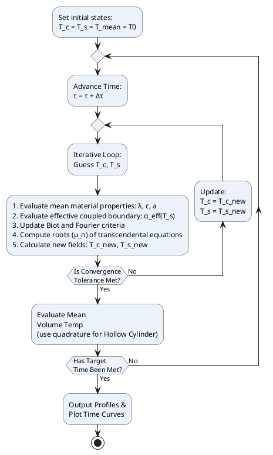

# Heat Conduction Solver: Nonlinear Time-Stepping & Convergence Framework

> **Scope:** Defines the iterative time-advancing loop, inner convergence logic, and the non-linear sequential interval method for handling $\alpha = f(T_s)$ dependency.

---

## 1. Physical Environment & Boundary Condition Routing

In industrial applications, the heat transfer coefficient $\alpha$ is not constant — it depends on the instantaneous surface temperature $T_s$. The solver applies the following routing strategy:

| Condition | BC Type | Application |
|---|---|---|
| $Bi \ge 100$ | BC I | Water quenching, aqueous salt solutions under stable nucleate boiling |
| Explicit heat flux $q(\tau)$ defined | BC II | Laser/induction heating, fixed radiant flux |
| $0.1 < Bi < 100$ | BC III | Gas-furnace heating, air/oil convection, general cooling |

**Oil-medium specifics:** For oil cooling, $\alpha$ must be evaluated as a non-linear piecewise function $\alpha = f(T_s)$ reflecting three boiling intervals: film boiling, nucleate boiling, and pure convective heat transfer. See [Heat Transfer Coefficient Regimes](../heat-transfer-coefficient/HTC_00_REGIMES_OVERVIEW.md).

**Bulk medium assumption:** The solver assumes the quenching/heating medium volume is sufficiently large to maintain a constant ambient temperature $T_{\text{c}}$ throughout the transient process (bulk medium thermal state is decoupled).

---

## 2. Outer Time-Stepping Loop

The total process duration $\tau_{\text{total}}$ is divided into discrete time increments $\Delta\tau_k$ ($k = 1, 2, \dots, K$). At each step $k$:

```
PROCEDURE TimeStepper:
  Initialize: T_c = T_s = T_mean = T0; τ = 0

  REPEAT:
    τ = τ + Δτ

    // Inner convergence loop
    REPEAT:
      1. Evaluate mean material properties: λ̄, c̄, ā  over [T_f, T_c]
      2. Evaluate total effective boundary coefficient: α_eff(T_s)
      3. Compute: Bi = α_eff · R / λ̄,  Fo = ā · τ / R²
      4. Re-solve transcendental eigenvalue equation for fresh roots μ_n (if Bi changed)
      5. Compute new fields: T_c_new (center), T_s_new (surface)
    UNTIL max(|T_c_new - T_c|, |T_s_new - T_s|) < 1e-4 °C

    Update: T_c = T_c_new, T_s = T_s_new

    // Volumetric mean (use Gauss-Legendre quadrature for hollow cylinder)
    Evaluate: T_mean(τ)

    Store: T(x_i, τ) for nodes x_i ∈ {0.0, 0.25, 0.50, 0.75, 1.0} · R

  UNTIL τ ≥ τ_end

  Output temperature profiles and time curves
END
```

---

## 3. Sequential Interval Method for Non-Linear $\alpha = f(T_s)$

### 3.1. Algorithm Control Flow

1. **Step 1 — Boundary Initialization ($k = 0$)**
   Retrieve the initial heat transfer coefficient based on the initial surface state:
   $$\alpha_0 = f(T_{\text{surface}}(0))$$

2. **Step 2 — Dimensionless State Assessment**
   Evaluate the transient Biot number for the current interval $\Delta\tau_k$:
   $$Bi_k = \frac{\alpha_k \cdot R}{\lambda}$$

3. **Step 3 — Analytical Core Execution**
   Invoke the core Fourier series solver (Sections 4.1–4.4 of respective geometry files) using $Bi_k$ to compute the temperature distribution across all nodes. Extract $T_{\text{surf},k}$ and $T_{\text{center},k}$ at the end of interval $\Delta\tau_k$.

4. **Step 4 — Non-Linear Coefficient Adaptation**
   Pass the computed surface temperature $T_{\text{surf},k}$ to the non-linear material configuration handler to determine the active boiling regime and recalculate:
   $$\alpha_{k+1} = f(T_{\text{surf},k})$$

5. **Step 5 — Temporal Advancement**
   Map the ending spatial temperature distribution of interval $k$ as the new **initial profile condition** $f(x)$ or $f(r)$ for interval $k+1$. Re-evaluate $Bi_{k+1}$ and repeat until:
   $$\sum_{k} \Delta\tau_k \ge \tau_{\text{total}}$$

---

## 4. Convergence Conditions

| Criterion | Threshold |
|---|---|
| Inner convergence tolerance | $\max(|T_{c,\text{new}} - T_c|,\; |T_{s,\text{new}} - T_s|) < 10^{-4}$ °C |
| Root recalculation trigger | $Bi_k \neq Bi_{k-1}$ (any change in Biot number) |
| Volumetric averaging method | Analytical $B_n$ summation for all geometries except hollow cylinder (use Gauss-Legendre $N=16$ nodes) |

---

## 5. Adaptive State Memory Requirements

- **Full temperature field persistence:** The solver state must maintain and cascade the complete 1D/2D/3D spatial temperature matrix $T(\vec{x}, \tau)$ between successive time steps. When a boundary condition transition occurs (e.g., film boiling → nucleate boiling), the final spatial state of step $k$ passes with zero truncation as the initial profile for step $k+1$.
- **Biot Re-evaluation Trigger:** The transcendental root-finder must recalculate a fresh set of roots $\mu_n$ or $p_n$ for every interval where $Bi_k \neq Bi_{k-1}$.
- **Profile cascading:** At each step boundary, the non-uniform temperature matrix from the end of the previous interval becomes the arbitrary function $f(\vec{x})$ for the next interval. This maps to the General Extension sections (Arbitrary Initial Profile) in each geometry module.

---

## 6. Flow Diagram



