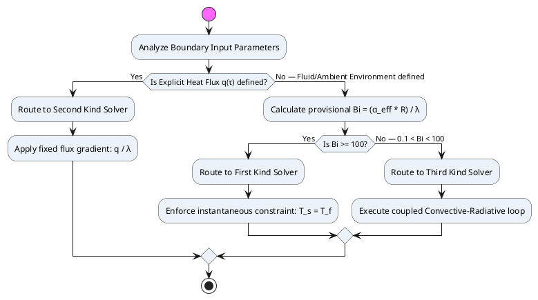
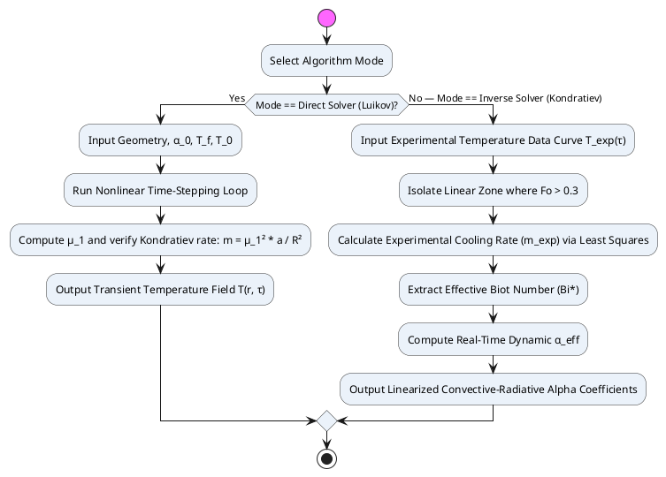

# Heat Conduction Solver: Boundary Condition Selection & Kondratiev Regular Thermal Regime

---

## PART A — Boundary Condition Selection Rules

### A.1. Selection Overview

The type of boundary condition governs the entire mathematical structure of the solver. The Biot number $Bi$ is the primary selection criterion.

$$Bi = \frac{\alpha_{\text{eff}} \cdot R}{\bar{\lambda}}$$

### A.2. Boundary Conditions of the First Kind ($Bi \ge 100$)

**Physical meaning:** The surface instantaneously reaches and maintains the temperature of the surrounding medium ($T_s = T_f$). External thermal resistance is negligible compared to internal conduction resistance.

**Mathematical criterion:** $Bi \ge 100$

**Engineering applications:**
- Rapid water quenching or aqueous salt solution quenching under stable nucleate boiling regimes ($\alpha > 10{,}000$ W/(m²·K))
- Ideal thermal contact between two highly conductive solid bodies (e.g., shrink-fitting)
- Thin steel parts undergoing explosive heating/cooling bypassing fluid convection limitations

### A.3. Boundary Conditions of the Second Kind (explicit heat flux $q$)

**Physical meaning:** The heat flux entering or leaving the surface is explicitly prescribed as a constant or time-varying function, independent of the instantaneous surface temperature.

**Mathematical criterion:** Governed by an explicit thermal power input $q(\tau)$ (W/m²):
$$-\bar{\lambda}\left.\frac{\partial T}{\partial n}\right|_s = q(\tau)$$

**Engineering applications:**
- Laser hardening, electron-beam welding, concentrated solar focusing
- High-frequency induction hardening (HFI) of gears or shafts
- Mechanical braking and friction-driven heat generation

### A.4. Boundary Conditions of the Third Kind ($0.1 < Bi < 100$)

**Physical meaning:** The heat flux at the boundary is proportional to the difference between the instantaneous surface temperature and the ambient environment:
$$-\bar{\lambda}\left.\frac{\partial T}{\partial n}\right|_s = \alpha_{\text{eff}}(T_s) \cdot (T_s - T_f)$$

**Engineering applications:**
- Standard industrial oil quenching, air cooling, gas-atmosphere furnace heating
- Heat treatment of steel billets and complex gear profiles under natural or forced convection
- Coupled convective-radiative heat exchange from furnace walls and gases

### A.5. Algorithmic Routing Logic

---

## PART B — Kondratiev's Regular Thermal Regime Theory

### B.1. Scope & Applicability

For $Fo \ge 0.3$, the infinite Fourier series solutions converge rapidly and the heating or cooling process enters **Kondratiev's Regular Thermal Regime (RTR)**. In this phase, the dimensionless temperature at any spatial node decays at a constant exponential rate that is completely **independent of the initial temperature distribution**.

### B.2. Kondratiev's Cooling Rate $m$

According to Kondratiev's first theorem, the natural logarithm of the local dimensionless temperature changes linearly with time:
$$m = -\frac{\partial \ln\Theta(r, \tau)}{\partial \tau} = \text{const} \quad [\text{s}^{-1}]$$

For classical geometries under BC III, the cooling rate $m$ is directly tied to the first eigenvalue $\mu_1$:
$$m = \mu_1^2 \cdot \frac{\bar{a}}{R^2}$$

### B.3. Kondratiev's Shape Factor $K_K$ and Efficiency Coefficient $\psi$

Kondratiev defined a generalized shape constant $K_K$ [m⁻²] and a dimensionless efficiency coefficient $\psi$:
$$m = \psi \cdot \bar{a} \cdot K_K$$

**Shape constants $K_K$ for classical geometries:**

| Geometry | Shape Constant $K_K$ |
|---|---|
| Infinite Plate | $\left(\dfrac{\pi}{2R}\right)^2$ |
| Infinite Cylinder | $\left(\dfrac{2.4048}{R}\right)^2$ |
| Solid Sphere | $\left(\dfrac{\pi}{R}\right)^2$ |

**Kondratiev's efficiency coefficient $\psi$:**
- $\psi = 1.0$ when $Bi \to \infty$ (BC I — maximum cooling velocity)
- $\psi \to 0$ when $Bi \to 0$

For arbitrary geometry (Section 6 of [HEAT_CONDUCTION_08_COMPLEX_GEOMETRIES.md](HEAT_CONDUCTION_08_COMPLEX_GEOMETRIES.md)), $\psi$ is approximated by:
$$\psi = \frac{Bi^*}{\sqrt{(Bi^*)^2 + 1.43 \cdot Bi^* + 1}}$$

---

## PART C — Inverse Heat Conduction Problem (IHCP) — Extracting $\alpha_{\text{eff}}$ from Experiment

### C.1. Principle

Kondratiev's method enables the solver to operate in an **inverse mode**: given experimental thermocouple data, the unknown dynamic heat transfer coefficient $\alpha_{\text{eff}}$ can be extracted without finite-element matching.

### C.2. Algorithmic Steps

1. **Logarithmic Linear Regression:** Sample the experimental temperature data $T_{\text{exp}}(\tau)$ for $Fo > 0.3$. Fit a straight line to $\ln(T_{\text{exp}} - T_f)$ vs. time $\tau$ to extract the experimental slope $m_{\text{exp}}$.

2. **Calculate $\psi$ Efficiency:**
   $$\psi_{\text{exp}} = \frac{m_{\text{exp}}}{\bar{a} \cdot K_K}$$

3. **Root Hunt for $Bi^*$:** Solve the transcendental efficiency equation for $Bi^*$:
   $$Bi^* = f^{-1}(\psi_{\text{exp}}) \quad \Longleftrightarrow \quad \psi_{\text{exp}} = \frac{Bi^*}{\sqrt{(Bi^*)^2 + 1.43 \cdot Bi^* + 1}}$$

4. **Extract $\alpha_{\text{eff}}$:**
   $$\alpha_{\text{eff}} = \frac{Bi^* \cdot \bar{\lambda}}{R_V}$$
   Where $R_V = V/A$ is the characteristic universal dimension.

### C.3. Dual-Mode Execution Flow

