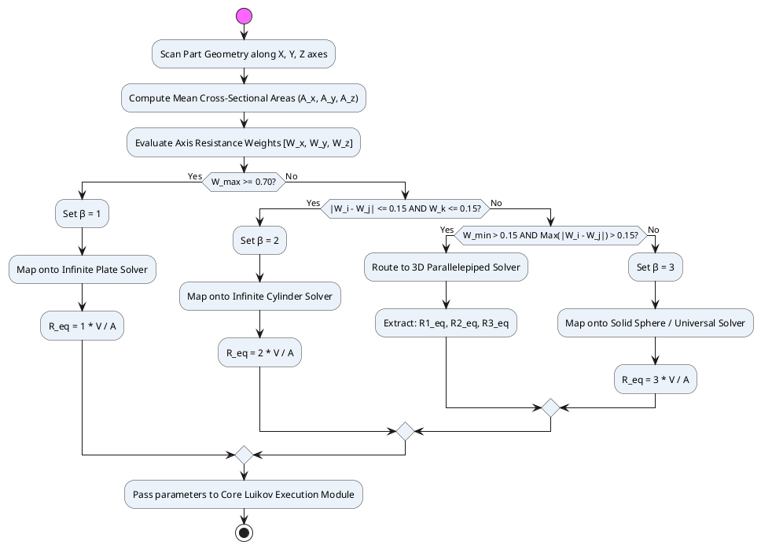

# Heat Conduction Solver: Engineering Approximations for Complex Geometries

> **Scope:** Rapid analytical thermal estimation for non-classical shapes (gears, cones, pyramids, deformed prisms) without full FEA. Based on Luikov's shape metrics and automated tri-axial topology classification.

---

## 1. Overview

When processing complex geometries that cannot be treated as a standard plate, cylinder, or sphere, exact Fourier series solutions cannot be derived directly. The solver provides two engineering paths:

- **Path A:** Luikov's Generalized Universal Method (modified similarity criteria)
- **Path B:** Equivalent Characteristic Dimension Method ($\beta$-scaling)

Both paths are preceded, where possible, by **automated topology classification** based on tri-axial cross-sectional analysis (Section 3).

---

## 2. Path A: Luikov's Generalized Universal Approach

### 2.1. Universal Characteristic Dimension

If the body features an intricate topology that cannot be unambiguously classified, absorb the shape complexity into modified dimensionless criteria using a single universal characteristic dimension:

$$R_V = \frac{V}{A}$$

Where $V$ is the true volume (m³) and $A$ is the total exposed cooling surface area (m²).

### 2.2. Modified Dimensionless Criteria

**Generalized Fourier number:**
$$Fo^* = \frac{\bar{a} \cdot \tau}{R_V^2} = \frac{\bar{a} \cdot \tau}{(V/A)^2}$$

**Generalized Biot number:**
$$Bi^* = \frac{\alpha_{\text{eff}} \cdot R_V}{\bar{\lambda}}$$

### 2.3. Mathematical Mapping

The dimensionless mean volumetric temperature $\bar{\Theta}(\tau)$ of the arbitrary body is approximated using the Solid Sphere formulation (see [HEAT_CONDUCTION_04_BC3_CYLINDER_SPHERE.md](HEAT_CONDUCTION_04_BC3_CYLINDER_SPHERE.md)), substituting $Fo \to Fo^*$ and $Bi \to Bi^*$.

This scaling matches experimental cooling curves of irregular geometries within an engineering tolerance of **5–12%**.

---

## 3. Path B: Equivalent Characteristic Dimension Method ($\beta$-Scaling)

When the body's geometry visually mimics a specific classical heat dissipation path, the complex shape is reduced to an equivalent radius $R_{\text{eq}}$ using a discrete topology factor $\beta$:

$$R_{\text{eq}} = \beta \cdot \frac{V}{A}$$

| $\beta$ | Heat Flow Dimension | Applicable Geometries | Solver |
|---|---|---|---|
| $1$ | 1D (one dominant thin dimension; heat leaves through two opposing faces) | Flat prisms, thin-walled gear shrouds, fan blades, flat structural flanges | Infinite Plate with $R = R_{\text{eq}}$ |
| $2$ | 2D (elongated along one axis; radial cooling dominates) | Spur/helical gears, gear shafts, long cones, slender pyramids, drill bits | Infinite Cylinder with $R = R_{\text{eq}}$ |
| $3$ | 3D (comparable dimensions along all three axes; isotropic cooling) | Compact short cones, pyramids, cubes, bolt heads, spherical cast lumps | Solid Sphere with $R = R_{\text{eq}}$ or Universal Luikov Path |

---

## 4. CAD Geometric Inputs

For arbitrary parts, the algorithm bypasses shape approximation by ingesting raw geometric properties from external CAD systems:

| Parameter | Description |
|---|---|
| `V_custom` | True volumetric displacement of the complex part (m³) |
| `A_custom` | True boundary surface area in contact with the thermal environment (m²) |
| `Approximation_Mode` | `"Universal"` (Path A, $Fo^*$ scaling) or `"Beta"` (Path B, $\beta$-factor) |

---

## 5. Automated Topology Classification via Tri-Axial Resistance Analysis

### 5.1. Bounding Box and Cross-Sectional Areas

Define the body's bounding box limits $2L_x, 2L_y, 2L_z$ along the three orthogonal axes, with the origin at the volumetric center of mass. Evaluate the continuous or discrete variable cross-sectional areas perpendicular to each axis:

$$\bar{A}_x = \frac{1}{2L_x} \int_{-L_x}^{L_x} A_x(x)\, dx, \qquad \bar{A}_y = \frac{1}{2L_y} \int_{-L_y}^{L_y} A_y(y)\, dy, \qquad \bar{A}_z = \frac{1}{2L_z} \int_{-L_z}^{L_z} A_z(z)\, dz$$

### 5.2. Axis Thermal Resistance Weights

The normalized dimensionless axis resistance weights are inversely proportional to the mean cross-sectional areas scaled by their characteristic lengths:

$$R_{\text{th},i} = \frac{L_i}{\bar{A}_i} \qquad \text{for } i \in \{x, y, z\}$$

$$W_i = \frac{R_{\text{th},i}}{R_{\text{th},x} + R_{\text{th},y} + R_{\text{th},z}}$$

### 5.3. Topology Classification Matrix

Sort the weights so that $W_{\text{max}} \ge W_{\text{mid}} \ge W_{\text{min}}$ and apply the following rules:

**Rule 1 — One-Dimensional (Plate Scaling, $\beta = 1$):**
$$W_{\text{max}} \ge 0.70 \quad \text{or} \quad \frac{W_{\text{max}}}{W_{\text{mid}}} \ge 3.0$$
→ Shape acts as a sheet or flat flange. Route to **Infinite Plate**: $R_{\text{eq}} = 1 \cdot V/A$.

**Rule 2 — Two-Dimensional (Cylinder Scaling, $\beta = 2$):**
$$|W_i - W_j| \le 0.15 \quad \text{AND} \quad W_k \le 0.15 \quad \text{(for the two dominant axes } i,j \text{)}$$
→ Shape acts as a long rod, shaft, or gear. Route to **Infinite Cylinder**: $R_{\text{eq}} = 2 \cdot V/A$.

**Rule 3 — Three-Dimensional Isotropic (Sphere Scaling, $\beta = 3$):**
$$W_{\text{max}} - W_{\text{min}} \le 0.20 \quad \text{(all weights near } \approx 0.33\text{)}$$
→ Shape acts as a compact spatial block. Route to **Solid Sphere**: $R_{\text{eq}} = 3 \cdot V/A$ or **Universal Luikov Path**.

**Rule 4 — Asymmetric 3D (Parallelepiped Routing):**
$$W_{\text{max}} < 0.70 \quad \text{AND} \quad W_{\text{min}} > 0.15 \quad \text{AND} \quad \max(|W_i - W_j|) > 0.15$$
→ All three axes actively resist heat flow but are significantly unequal. Route to **3D Rectangular Parallelepiped** solver (Section 6).

### 5.4. Classification Flow Diagram

---

## 6. Mapping onto the 3D Rectangular Parallelepiped Framework

### 6.1. Morphological Criterion

The solver routes to the 3D Parallelepiped framework when:
$$W_{\text{max}} < 0.70 \quad \text{AND} \quad W_{\text{min}} > 0.15 \quad \text{AND} \quad \max(|W_i - W_j|) > 0.15$$

**Physical meaning:** All three spatial dimensions actively resist heat flow (ruling out plates and infinite cylinders), but they are significantly unequal (ruling out isotropic solid sphere mapping).

**Applicable geometries:** Deformed prisms, asymmetric stepped forgings, mechanical housings, oblong casting blocks, multi-axial tool dies.

### 6.2. Equivalent Dimensions Extraction

Map the custom body's true volume $V$ and surface area $A$ onto three unique equivalent half-dimensions ($R_{1,\text{eq}}, R_{2,\text{eq}}, R_{3,\text{eq}}$) by preserving the volume-to-surface ratio and locking proportions to the computed resistance weights:

**Step 1 — Geometric proportions from resistance weights:**
$$\frac{R_{1,\text{eq}}}{R_{2,\text{eq}}} = \frac{W_x}{W_y}, \qquad \frac{R_{1,\text{eq}}}{R_{3,\text{eq}}} = \frac{W_x}{W_z}$$

**Step 2 — Volumetric constraint:**
$$V_{\text{custom}} = 8 \cdot R_{1,\text{eq}} \cdot R_{2,\text{eq}} \cdot R_{3,\text{eq}}$$

**Step 3 — Explicit solution for each dimension:**
$$R_{1,\text{eq}} = \sqrt[3]{\frac{V_{\text{custom}}}{8} \cdot \frac{W_x}{W_y} \cdot \frac{W_x}{W_z}}$$
$$R_{2,\text{eq}} = R_{1,\text{eq}} \cdot \frac{W_y}{W_x}$$
$$R_{3,\text{eq}} = R_{1,\text{eq}} \cdot \frac{W_z}{W_x}$$

### 6.3. Final Handoff

The computed values ($R_{1,\text{eq}}, R_{2,\text{eq}}, R_{3,\text{eq}}$) are passed directly into the Finite Parallelepiped solver ([HEAT_CONDUCTION_05_BC3_HOLLOW_MULTI.md Part B](HEAT_CONDUCTION_05_BC3_HOLLOW_MULTI.md)), which evaluates independent Biot numbers $Bi_1, Bi_2, Bi_3$ and executes the multi-dimensional analytical convergence loop.

