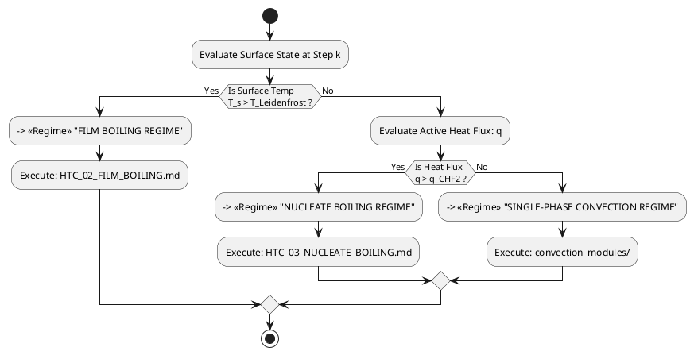

# Heat Transfer Coefficient: Multi-Regime Orchestrator & Entry Point

> **Role:** This document is the **primary entry point** and state machine for computing the instantaneous heat transfer coefficient $\alpha(T_s)$ at each discrete time step $\Delta\tau_k$. It evaluates the local solid surface state and routes calculations to the correct regime handler.
>
> **Used by:** The nonlinear time-stepping loop in [HEAT_CONDUCTION_06_TIME_STEPPING.md](../heat-conduction/HEAT_CONDUCTION_06_TIME_STEPPING.md), specifically at Step 4 (Non-Linear Coefficient Adaptation).

---

## 1. System Architecture & Regime Routing

At each time step $k$, the orchestrator evaluates the surface temperature $T_s$ and the computed heat flux $q$ against pre-calculated physics boundaries:

---

## 2. Regime Switching Boundaries

The switching boundaries are computed dynamically by [HTC_01_CRITICAL_FLUX.md](HTC_01_CRITICAL_FLUX.md). They must be evaluated **before** entering the regime coefficient calculation loop.

### 2.1. Critical Threshold Definitions

| Boundary | Symbol | Source | Description |
|---|---|---|---|
| Leidenfrost Temperature | $T_{\text{Leidenfrost}}$ | [HTC_01_CRITICAL_FLUX.md §7](HTC_01_CRITICAL_FLUX.md) | Stable film collapse minimum. $T_s$ above this means stable vapor blanket. |
| Second Critical Heat Flux | $q_{\text{CHF2}}$ | [HTC_01_CRITICAL_FLUX.md §7](HTC_01_CRITICAL_FLUX.md) | Boundary layer collapse from bubble generation into pure liquid convection. |

### 2.2. Condition Segment 1 — Film Boiling Domain

**Activation condition:**
$$T_s > T_{\text{Leidenfrost}}$$

**Action:** Terminate all lower-intensity modules. Pass full algorithmic control to **[HTC_02_FILM_BOILING.md](HTC_02_FILM_BOILING.md)**.

### 2.3. Condition Segment 2 — Nucleate Boiling Domain

**Activation condition:**
$$T_s \le T_{\text{Leidenfrost}} \quad \text{AND} \quad q > q_{\text{CHF2}}$$

**Action:** Route execution to the bubble generation loops in **[HTC_03_NUCLEATE_BOILING.md](HTC_03_NUCLEATE_BOILING.md)**.

### 2.4. Condition Segment 3 — Single-Phase Convection Domain

**Activation condition:**
$$T_s \le T_{\text{Leidenfrost}} \quad \text{AND} \quad q \le q_{\text{CHF2}}$$

**Action:** Route matrix variables to the standalone convection sub-modules under `convection_modules/`.

---

## 3. State Requirements & Data Cascading

1. **Volumetric Matrix Persistence:** The orchestrator must persist the entire 1D/2D/3D internal temperature spatial matrix $T(\vec{x}, \tau)$ inside the global runtime state engine. When a boundary condition transitions (e.g., film boiling → nucleate boiling), the final spatial state of step $k$ passes with zero truncation as the initial profile for step $k+1$.

2. **Language-Agnostic Backend Core:** All solvers must be implemented as pure structural pseudo-code algorithms. No high-level data-analysis library bindings permitted.

3. **English-Only Outputs:** All internal code comments, exception handlers, logging flags, and database variable schema strings produced by downstream solvers must be written in clear, professional English.

---

## 4. Document Index

| File | Contents |
|---|---|
| **[HTC_00_REGIMES_OVERVIEW.md](HTC_00_REGIMES_OVERVIEW.md)** | *(this file)* Orchestrator entry point, regime routing logic |
| [HTC_01_CRITICAL_FLUX.md](HTC_01_CRITICAL_FLUX.md) | Critical Heat Flux (CHF) and Minimum Heat Flux (MHF) multi-model framework; computes $T_{\text{Leidenfrost}}$ and $q_{\text{CHF2}}$ |
| [HTC_02_FILM_BOILING.md](HTC_02_FILM_BOILING.md) | Film boiling regime: Bromley conductive film model, Klimenko universal correlation, spatial orientation routing |
| [HTC_03_NUCLEATE_BOILING.md](HTC_03_NUCLEATE_BOILING.md) | Nucleate boiling regime: Labuntsov, Rohsenow, Kutateladze, Stephan-Abdelsalam, Cooper, Yang-Maas, Kovalev models |

---

## 5. Bibliography

- **Luikov, A. V.** (1968). *Analytical Heat Diffusion Theory.* New York: Academic Press. *(Original: Лыков А. В. Теория теплопроводности. М.: Высшая школа, 1967).*
- **Hsu, Y. Y., & Westwater, J. W.** (1958). Film boiling from vertical tubes. *AIChE Journal*, 4(1), 58–62.
- **Klimenko, V. V.** (1981). Film boiling on a horizontal plate — a generalized correlation. *International Journal of Heat and Mass Transfer*, 24(1), 69–79.

