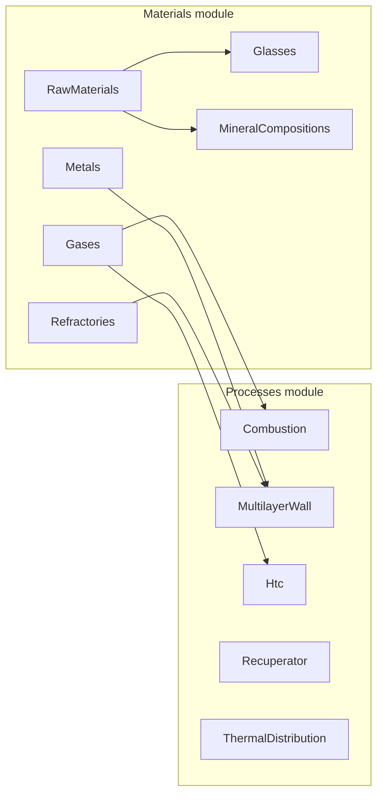

# Frontend — Engineering Calculation UI

**Status:** Planning  
**Stack:** React 19 + Vite 7 + MUI 7 + TanStack Query + axios + react-hook-form + yup + **Highcharts** (`highcharts`, `highcharts-react-official`)  
**API prefix:** `/api/v1` (same-origin via nginx; see [NGINX_ARCHITECTURE.md](../NGINX_ARCHITECTURE.md))  
**Code root:** `frontend/src/`

---

## Goal

Build a **calculation-task SPA** on top of the NestJS controllers. The engineer picks a material (or enters a composition / mix), sets conditions, clicks **Calculate**, and gets engineering results.

The UI is split into two feature modules:

| Module | Route prefix | Contents |
|--------|--------------|----------|
| **Materials** | `/materials` | Everything about *what a material is and what its properties are* |
| **Processes** | `/processes` | Furnace / heat-transfer tasks that *use* materials (combustion, walls, HTC, recuperator, transient conduction) |

---

## Materials module — six sections

Each section is self-contained: it selects its own kind of material, sets conditions and calculates the properties that kind has. There is no cross-kind "select any material" page.

| Section | Meaning | Typical task |
|---------|---------|--------------|
| **Metals** | Known metal grades | Select grade + T → λ(T), ε(T) |
| **Gases** | Pure gases and gas mixtures | Select gas or mixture composition + T, P → Cp, Cv, γ, μ, ν, ρ, λ, Pr |
| **Refractories** | Known refractory / insulation products (catalogue) | Select product + T → λ(T), ε(T), table over a T range |
| **Raw materials** | Library materials by category (oxides, silicates, clays, binders, carbides, nitrides, glasses, phosphates, …) | Select material → composition, reference properties; for mix raw materials λ_eff(T), Cp(T) at a chosen porosity |
| **Glasses** | Glass qualities *calculated from composition* | Enter oxide composition in **wt%** or **mol%** (or start from a preset) → viscosity, fixed points, T(η) |
| **Mineral compositions** | Mechanical mix of mineral compounds in size fractions | Build mix (material × size fraction × mass %) → chemical, granulometric, packing, water, shrinkage, phase and refractoriness analyses |



Processes reuse the Materials catalogues as pickers (e.g. wall layers select from Metals + Refractories).

---

## Steps

| Step | File | Scope |
|------|------|-------|
| 1 | [STEP_01_SHELL_AND_API.md](STEP_01_SHELL_AND_API.md) | Router, layout, API client, module skeletons |
| 2 | [STEP_02_SHARED_CALC_COMPONENTS.md](STEP_02_SHARED_CALC_COMPONENTS.md) | Calculator shell, composition editors, fields |
| 3 | [STEP_03_MATERIALS_MODULE.md](STEP_03_MATERIALS_MODULE.md) | Materials hub + backend catalogue endpoints |
| 4 | [STEP_04_METALS.md](STEP_04_METALS.md) | Metals: λ(T), ε(T) |
| 5 | [STEP_05_GASES.md](STEP_05_GASES.md) | Gases: pure gases and mixtures |
| 6 | [STEP_06_REFRACTORIES.md](STEP_06_REFRACTORIES.md) | Refractory product catalogue + λ/ε |
| 7 | [STEP_07_RAW_MATERIALS.md](STEP_07_RAW_MATERIALS.md) | Categorised library: reference properties, λ_eff / Cp vs T |
| 8 | [STEP_08_GLASSES.md](STEP_08_GLASSES.md) | Glass composition (wt% / mol%) → viscosity |
| 9 | [STEP_09_MINERAL_COMPOSITIONS.md](STEP_09_MINERAL_COMPOSITIONS.md) | Mix builder + all mix analyses |
| 10 | [STEP_10_PROCESS_CALCS.md](STEP_10_PROCESS_CALCS.md) | Combustion, multilayer wall |
| 11 | [STEP_11_ADVANCED_PROCESSES.md](STEP_11_ADVANCED_PROCESSES.md) | HTC, recuperator, thermal distribution |
| — | [CHECKLIST.md](CHECKLIST.md) | Acceptance checkboxes per step |

Implement in order. Step 3 contains small **backend** additions (read-only catalogue endpoints) that Steps 4–10 depend on.

---

## Target source layout

```
frontend/src/
├── app/                        # router, layout, theme, providers
├── components/calc/            # shared calculator building blocks (Step 2)
├── components/charts/          # Highcharts setup + reusable chart components (Step 2)
├── services/api/client.ts      # axios instance (Step 1)
├── pages/Home.tsx              # entry: two module tiles + health
└── modules/
    ├── materials/
    │   ├── routes.tsx
    │   ├── MaterialsLayout.tsx # section tabs / side nav
    │   ├── api/                # one API object per file (Step 3 §2.4)
    │   ├── types/              # one type per file
    │   ├── hooks/              # one hook per file
    │   ├── constants/
    │   ├── mappers/            # one pure function per file
    │   ├── components/         # MaterialPicker, …
    │   └── sections/
    │       ├── metals/
    │       ├── gases/
    │       ├── refractories/
    │       ├── raw-materials/
    │       ├── glasses/
    │       └── mineral-compositions/
    └── processes/
        ├── routes.tsx
        ├── api/
        ├── types/
        └── sections/
            ├── combustion/
            ├── multilayer-wall/
            ├── htc/
            ├── recuperator/
            └── thermal-distribution/
```

A module owns its API wrappers, types and pages. Cross-module use goes through the module's public `index.ts` (e.g. Processes imports `MaterialPicker` from `modules/materials`).

---

## Conventions

Backend and frontend specs in these steps follow [`docs/CONVENTIONS.md`](../CONVENTIONS.md), [`docs/NAMING_CONVENTIONS.md`](../NAMING_CONVENTIONS.md) and [`docs/CODE_QUALITY_STANDARDS.md`](../CODE_QUALITY_STANDARDS.md):

- **One exported construct per file** — backend: one DTO / enum / constant object / service / controller per file (the multi-class refractory DTO files are legacy, not a template); frontend: one component / hook / type / API object / mapper / constant object per file.
- Thin controllers (one service call per handler); no magic values (constants files); response and input DTOs at the API boundary.
- Backend tests in `backend/test/unit/<module>/…`, run inside Docker; Definition of Done includes the API spec, interfaces index and `IMPLEMENTATION_STATUS.md` updates.
- Frontend file naming: components `PascalCase.tsx`, hooks `useXxx.ts`, everything else `kebab-case` with a role suffix (details in [Step 3 §2.1](STEP_03_MATERIALS_MODULE.md)).

---

## UX rules (fixed)

- **Layout** = inputs left / results right (mirror `legacy/refractory/public/` calculators).
- **Charts** = every calculated series (property vs T, profiles, distributions) is shown as a Highcharts chart above the numeric table, with CSV/PNG export. Viscosity is always plotted on a **logarithmic** axis together with 1–3 reference glasses from the library (see Step 8). Chart components live in `components/charts/` (Step 2).
- **Composition units**: any oxide composition editor offers **wt% / mol%**; conversion goes through `POST /refractory/utils/convert-composition`. Endpoints that require wt% always receive wt%.
- **No auth** in v1; Nest validation errors are shown in the results panel.
- **API calls** use relative `/api/v1/...` (or `import.meta.env.VITE_API_URL`). No hardcoded host/port.
- **Backend is the source of truth** for material data and calculations — the frontend does not copy material tables or formulas.

---

## Related docs

| Doc | Role |
|-----|------|
| [STEP_04_FRONTEND_PAGES.md](../migration/STEP_04_FRONTEND_PAGES.md) | Older legacy→React sketch (superseded by this guide) |
| `legacy/refractory/public/` | UX reference: phase calculator, blend optimizer |
| Swagger UI | `/api/docs` when the stack is running |

---

## Backend change policy

- **Allowed without asking:** read-only backend endpoints that expose materials **already present in the backend library** (catalogue lists, lookup by id, property lookups over existing data).
- **Everything else needs explicit approval, one change at a time:** new calculations, new or changed request/response fields on existing endpoints, bug fixes in existing endpoints, data file edits. Each such change is listed in the relevant step as **"awaiting approval"** until the owner confirms it.

| Change | Status | Where |
|--------|--------|-------|
| Catalogue endpoints E1–E10 (read-only, existing library data; E9 = mix components, E10 = categories by primary group) | allowed by policy; specified, not implemented | [Step 3 §1](STEP_03_MATERIALS_MODULE.md) |
| Numeric `T_K` query fix on `GET /metals/thermal-properties` | **awaiting approval**; not applied | [Step 3 §1.7](STEP_03_MATERIALS_MODULE.md) |
| `POST /refractory/mix/composition` — fired-basis mix composition by component group + true density | **approved**; specified, not implemented | [Step 9 §2](STEP_09_MINERAL_COMPOSITIONS.md) (also used by [Step 7](STEP_07_RAW_MATERIALS.md)) |

Current phase: **specification only** — no backend code is changed until implementation is requested.

---

## Licensing note

Highcharts is free for personal and non-commercial use only; commercial or internal company use needs a Highcharts licence. Confirm the licence before a production release.

---

## Out of scope

- Auth, user accounts, saving mixes / glasses to a database.
- Exposing `/api/v1/numeric/*` as user-facing tasks.
- Backend changes other than read-only material catalogue endpoints, unless approved individually (see *Backend change policy*).
