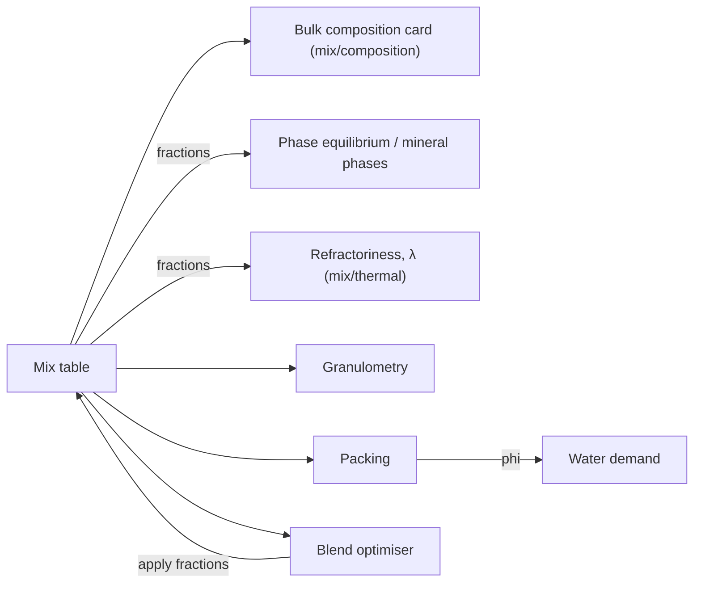

# STEP 09 — Materials: Mineral compositions (mixes of fractions)

**Priority:** HIGH  
**Depends on:** [STEP_02_SHARED_CALC_COMPONENTS.md](STEP_02_SHARED_CALC_COMPONENTS.md), [STEP_03_MATERIALS_MODULE.md](STEP_03_MATERIALS_MODULE.md)  
**Frontend root:** `frontend/src/modules/materials/sections/mineral-compositions/`  
**Backend:** `refractory.controller.ts` (+ `POST /refractory/mix/composition` — approved and implemented, §2; `POST /refractory/phase-equilibrium` takes the fractions, [FULL_PHASE_EQUILIBRIUM.md](../algorithms/phase-equilibrium/FULL_PHASE_EQUILIBRIUM.md))

---

## Goal

A **mineral composition** is a mechanical mix of **raw materials** taken in several **size fractions**. Mix components are library materials whose primary group is one of: **binders, oxides, silicates, clays, carbides, nitrides, borates, fluorides** (served by `GET /refractory/mix-components`, [Step 3](STEP_03_MATERIALS_MODULE.md) E9). More groups will be added later — glass frits, sulfates, nitrates, chlorides, phosphates — by extending the backend constant `MIX_COMPONENT_GROUPS`; the frontend needs no change for that.

Refractory products (fired bricks, sands, fibre mats), metals and gases are not mix components.

The user builds the mix once, and then runs analyses on it:

- **Chemical** — phase equilibrium and mineral phases from the fractions themselves (material, d50, mass; coarse grains keep unreacted original phases); refractoriness (solidus, liquidus, temperatures at given liquid fractions) and effective thermal conductivity (`/mix/thermal`) from the same fractions. No analysis takes an oxide list.
- **Granulometric** — how close the fractions are to an ideal particle-size distribution; reacted fraction per size fraction.
- **Packing** — packing fraction φ and green porosity.
- **Water and shrinkage** — water demand for a workability level; drying + firing shrinkage.
- **Optimisation** — blend optimiser proposes better mass fractions.



The mix lives in one section-level state (React context + `useReducer`) so every analysis tab works on the same mix without re-entering it.

---

## 1. Mix builder

### Row model

```ts
// types/mix-fraction.type.ts
export type MixFraction = {
  id: string;                 // client uuid
  materialId: string;         // mix component from GET /refractory/mix-components
  sizeKey: string;            // `<group>:<code>` from GET /refractory/particle-sizes, 'custom', or 'material' (binders)
  dMin_mm: number;
  dMax_mm: number;
  d50_mm: number;             // from the size class or the binder's own particleSize; editable for custom sizes only
  massPercent: number;        // 0–100
  density_kgm3: number;       // default = rho_true_after_firing_kgm3, editable
  isFixed?: boolean;          // keep this fraction constant in the optimiser
};
```

### UI — `FractionTable`

```
┌ Material ──────────┬ Size fraction ──────┬ dMin–dMax / d50 ┬ Mass % ┬ ρ kg/m³ ┬ Fixed ┐
│ Tabular alumina ▾  │ Coarse 1–3 mm ▾     │ 1.0–3.0 / 2.0   │ 35     │ 3950    │ ☐     │
│ Tabular alumina ▾  │ Fine 0.1–0.3 mm ▾   │ 0.1–0.3 / 0.2   │ 25     │ 3950    │ ☐     │
│ Calcined alumina ▾ │ Powder 0.01–0.05 ▾  │ …               │ 25     │ 3900    │ ☐     │
│ CAC cement ▾       │ As delivered, fixed │ 0.001–0.1/0.015 │ 15     │ 3000    │ ☑     │
└────────────────────┴─────────────────────┴─────────────────┴────────┴─────────┴───────┘
 [+ Add fraction]   Σ = 100 %   [Normalize]
```

- Material: `MaterialPicker kinds={['mix-component']}` — sections Binders, Oxides, Silicates, Clays, Carbides, Nitrides, Borates, Fluorides in the order returned by `GET /refractory/mix-components` (67 materials today).
- The backend decides eligibility (primary group in `MIX_COMPONENT_GROUPS`, `paper_clay` excluded for its paper fibre); the frontend holds no list of allowed or excluded materials.
- Every row therefore has a library composition and density: all rows take part in every analysis, including chemistry.
- Size fraction: select from the material's `availableParticleSizes` first, then all standard classes, mesh, FEPA F/P, or **Custom** (enter dMin, dMax, d50).
- **Binders** (primary group `binder`, i.e. `materialGroup[0] === 'binder'`: `cac_ca70`, `cac_ca80`, `fondu`, `cement_pc`):
  - selecting a binder sets the size automatically from the material's own `particleSize` (dMin, dMax, d50 as delivered), with `sizeKey = 'material'`. A cement is a ground product with a fixed fineness, not a graded size class;
  - the size cannot be changed: the select shows *As delivered* and is disabled, and Custom is not offered. Mass %, density and Fixed stay editable;
  - the reducer enforces this, not only the UI: an `update` that sets a binder sets its size, and size patches on a binder row are ignored;
  - changing the row from a binder to another material clears the size, so the user picks one;
  - water glass (`sodium_silicate`, `potassium_silicate`) has primary group `silicate` and keeps the normal select.
- Same material may appear in several rows (different sizes).
- Mass % must sum to 100 (Normalize button); converted to fractions 0–1 for the API.

### Backend constraints to enforce in the form

| Constraint | Source | Frontend handling |
|------------|--------|-------------------|
| `density_kgm3` 1000–4000 | `FractionInputDto` (blend optimiser) | Warn and exclude the optimiser tab when a row is outside (e.g. zirconia ≈ 5700) |
| `massFraction` 0–1 | `FractionInputDto` | Send `massPercent / 100` |
| Phase equilibrium takes fractions | `PhaseEquilibriumInputDto` | Send `{ materialId, d50_mm, massFraction: massPercent / 100 }` per row, plus `temperature` (500–2000 °C) and `holdTime_hours` (0.1–100) |
| Refractoriness and λ take fractions | `RefractorinessInputDto`, `MixThermalInputDto` | Send `{ materialId, massFraction: massPercent / 100 }` per row; repeated materials add up in the backend |
| Mix components only (binders, oxides, silicates, clays, carbides, nitrides, borates, fluorides; no fibre materials) | E9 + `POST /refractory/mix/composition` (400 otherwise) | Picker offers only E9 materials |
| Binder size = the binder's own fineness | library `particleSize` of every binder mix component (`MaterialEntryDto.particleSize`) | Size set on selection and locked (see above); a binder without `particleSize` shows a row error and is excluded from the analyses |

---

## 2. Mix composition (bulk composition card)

> **Approved and implemented** (`MixCompositionService`, algorithm in [MIX_COMPOSITION_ALGORITHM.md](../algorithms/mix/MIX_COMPOSITION_ALGORITHM.md), API in [REFRACTORY_API_SPEC.md §13](../api/REFRACTORY_API_SPEC.md)). **Change in step 3:** the accepted / other oxide split is merged into `oxides_wt`; `acceptedOxides_normalized` and the 5 % warning are removed. It replaces the legacy `MixLibraryService.calculateOxideComposition` stub, which returns `{}`. Depends on `MixComponentCatalogService` from [Step 3 §1.4](STEP_03_MATERIALS_MODULE.md).

### 2.1 Endpoint

`POST /refractory/mix/composition` — `@HttpCode(200)`, tag `Refractory Calculations`, handler in the existing `RefractoryController`.

```json
// request — mix components only (GET /refractory/mix-components)
{ "fractions": [ { "materialId": "alumina_tabular", "massFraction": 0.35 }, … ] }

// response
{
  "basis": "fired",
  "lossOnIgnition_wt": 1.4,
  "oxides_wt": { "Al2O3": 93.6, "CaO": 4.3, "B2O3": 0.3, "SiO2": 0.2, … },
  "nonOxideComponents_wt": { "carbide": 1.2 },
  "droppedMetals_wt": 0.01,
  "trueDensity_kgm3": 3840,
  "warnings": []
}
```

| Status | When |
|--------|------|
| 200 | calculated |
| 400 | validation error; Σ `massFraction` = 0; material is not a mix component (primary group not in `MIX_COMPONENT_GROUPS`, e.g. `soda_lime_glass`, `aluminum_phosphate`) or is excluded (`paper_clay`) |
| 404 | `materialId` not in the library (includes refractory product ids such as `chamotte_solid`) |

### 2.2 Calculation rules

Composition keys of each material are classified in this order (first match wins):

| # | Class | Keys | Goes to |
|---|-------|------|---------|
| 1 | Loss on ignition | `H2O`, `CO2`, `OH`, `Organic` | `lossOnIgnition_wt` |
| 2 | Oxide | formula of one or more elements followed by `O` and an optional count (`SiO2`, `Al2O3`, `CaO`, `B2O3`, `P2O5`, `ZrO2`, `Cr2O3`, `FeO`, `MnO2`, `SO3`, `Pr6O11`, …) | `oxides_wt`, one entry per key |
| 3 | Fluoride | `CaF2`, `NaF`, `KF`, `MgF2`, `AlF3`, `LiF` | `nonOxideComponents_wt.fluoride` |
| 4 | Metal impurity | elemental metal key (`Fe`, `Ti`, `Si`, `Al`, `Ca`, `Mg`, `Na`, `K`, `Mn`, `Zr`, `La`, `Cr`) **below 1 wt%** of its material | dropped, total in `droppedMetals_wt` |
| 5 | Carbon | `C` | `nonOxideComponents_wt.carbon` |
| 6 | Non-oxide | everything else (`SiC`, `TiC`, `B4C`, `AlN`, `BN`, `TiN`, `N`, `O`, metal keys ≥ 1 wt%, …) | `nonOxideComponents_wt.carbide` or `.nitride` when the material's primary group is `carbide` / `nitride`, otherwise `.other` |

Examples: silicon nitride `{ Si: 60, N: 40 }` → 100 % `nitride`; titanium carbide `{ TiC: 98.5, TiO2: 0.8, C: 0.4, Fe: 0.3 }` → 98.5 `carbide`, 0.8 `TiO2`, 0.4 `carbon`, 0.3 dropped; raku clay `Grog: 15.0` → `other` (and triggers the warning below); borax `{ Na2O: 16.3, B2O3: 36.5, H2O: 47.2 }` → LOI 47.2, oxides `Na2O` and `B2O3`; fluorite `{ CaF2: 100 }` → 100 % `fluoride`.

The four library fluorides are stored as compounds (`calcium_fluoride` `{ CaF2: 100 }`, `sodium_fluoride` `{ NaF: 100 }`, `potassium_fluoride` `{ KF: 100 }`, `magnesium_fluoride` `{ MgF2: 100 }`) instead of elements, so that `Ca`, `Na`, `K` and `Mg` are not taken for metals. Fluoride volatilisation on firing (NaF, KF vapour; SiF4 with silica) is not modelled: fluorides stay in the fired mass.

Extension note: when later groups are enabled, class 6 gains their buckets (`chloride`), class 2 already covers sulfates (`SO3`) and nitrates (`N2O5`) as oxides, and the loss-on-ignition keys must be reviewed for salts that decompose on firing. Each such rule change is part of enabling that group.

Formulas, with `wᵢ` = request mass fractions rescaled to Σ = 1 and `cᵢ,k` = wt% of key `k` in material `i`:

| Quantity | Formula |
|----------|---------|
| Raw mix | `c_raw,k = Σᵢ wᵢ · cᵢ,k` |
| `lossOnIgnition_wt` | `LOI = Σ_{k ∈ class 1} c_raw,k` |
| Fired mass base | `F = Σ_{k ∈ classes 2,3,5,6} c_raw,k` (dropped impurities excluded) |
| Fired share of key `k` | `c_fired,k = 100 · c_raw,k / F` → `oxides_wt`, `nonOxideComponents_wt` |
| `droppedMetals_wt` | `100 · Σ_{k ∈ class 4} c_raw,k / F` |
| `trueDensity_kgm3` | `1 / Σᵢ (w′ᵢ / ρᵢ)` with fired mass fractions `w′ᵢ = wᵢ · (100 − LOIᵢ) / Σⱼ wⱼ · (100 − LOIⱼ)` and `ρᵢ = rho_true_after_firing_kgm3` |
| `warnings` | one entry listing the keys of `nonOxideComponents_wt.other` (e.g. `Grog`) when it is > 0: no calculation models them |

Numbers are returned unrounded; the frontend formats them.

### 2.3 Backend files

One construct per file. Paths relative to `backend/src/modules/refractory/`.

| File | Export | Content |
|------|--------|---------|
| `enums/composition-basis.enum.ts` | `enum CompositionBasis` | `FIRED = 'fired'` |
| `enums/non-oxide-component-group.enum.ts` | `enum NonOxideComponentGroup` | `CARBIDE`, `NITRIDE`, `FLUORIDE`, `CARBON`, `OTHER` (lower-case values) |
| `constants/mix-composition.constants.ts` | `MIX_COMPOSITION_CONSTANTS` | `lossOnIgnitionKeys`, `oxideKeyPattern`, `fluorideKeys`, `metalElementKeys`, `metalImpurityThreshold_wt: 1`, `carbonKey: 'C'`, `nonOxidePrimaryGroups: { carbide, nitride }` (`acceptedOxideKeys` and `reliabilityWarningThreshold_wt` removed) |

Mix eligibility (`MIX_COMPONENT_GROUPS`, `MIX_EXCLUDED_MATERIAL_IDS`) is defined once in Step 3 and applied through `MixComponentCatalogService.getMixComponent()`.
| `dto/mix-component-input.dto.ts` | `MixComponentInputDto` | `materialId` — `@IsString() @IsNotEmpty()`; `massFraction` — `@IsNumber() @Min(0) @Max(1)` |
| `dto/mix-composition-input.dto.ts` | `MixCompositionInputDto` | `fractions` — `@IsArray() @ArrayMinSize(1) @ValidateNested({ each: true }) @Type(() => MixComponentInputDto)` |
| `dto/non-oxide-components.dto.ts` | `NonOxideComponentsDto` | optional `carbide`, `nitride`, `fluoride`, `carbon`, `other` (wt% of fired mass) |
| `dto/mix-composition-result.dto.ts` | `MixCompositionResultDto` | `basis: CompositionBasis`, `lossOnIgnition_wt`, `oxides_wt: Record<string, number>`, `nonOxideComponents_wt: NonOxideComponentsDto`, `droppedMetals_wt`, `trueDensity_kgm3`, `warnings: string[]` |
| `services/mix-composition.service.ts` | `MixCompositionService` | `calculate(dto: MixCompositionInputDto): MixCompositionResultDto`; injects `MixComponentCatalogService` (`getMixComponent`: 404 unknown, 400 not a mix component / excluded); private helpers for key classification, mixing and density |
| `controllers/refractory.controller.ts` | existing `RefractoryController` | add `@Post('mix/composition') @HttpCode(HttpStatus.OK) calculateMixComposition(@Body() dto: MixCompositionInputDto): MixCompositionResultDto` → `mixCompositionService.calculate(dto)` |
| `refractory.module.ts` | existing | add `MixCompositionService` to `providers` and `exports` |

`OxideCompositionDto` (`dto/common/common.dto.ts`) is removed in step 3: after this change, the old `/phase-equilibrium`, `/mineral-phases`, `/refractoriness` and `/thermal-conductivity` DTOs no longer use it, and nothing else does.

### 2.4 Backend tests

Inside Docker: `docker compose exec backend npm run test -- mix-composition`.

| File | Covers |
|------|--------|
| `test/unit/refractory/services/composition/mix-composition.service.spec.ts` | single oxide material (tabular alumina) → `oxides_wt` = its composition rescaled; kaolin: `LOI = 14`, `Al2O3`/`SiO2` rescaled to 100; repeated material rows add up; fractions not summing to 1 are rescaled; Σ = 0 → 400; `paper_clay`, `soda_lime_glass`, `aluminum_phosphate` → 400; unknown id and `chamotte_solid` → 404; binder + oxide + silicate + clay + carbide + nitride + borate + fluoride in one mix; borax → LOI 47.2, oxides `Na2O` and `B2O3`; zirconia → `ZrO2` in `oxides_wt`; `calcium_fluoride` → 100 % `fluoride`, nothing dropped; titanium carbide classification (carbide, TiO2, carbon, dropped Fe); silicon nitride → 100 % nitride; raku clay `Grog` → `other` + warning naming `Grog`; no warning without `other`; `trueDensity_kgm3` for a two-material mix vs hand calculation; `oxides_wt` + `nonOxideComponents_wt` sum to 100 |
| `test/unit/refractory/dto/mix-composition/mix-composition-input.dto.spec.ts` | empty `fractions` rejected; `massFraction` < 0 or > 1 rejected; missing `materialId` rejected; nested unknown property rejected |

### 2.5 Backend documentation (Definition of Done)

| Document | Entry |
|----------|-------|
| `docs/api/REFRACTORY_API_SPEC.md` | `POST /mix/composition` request, response, errors |
| `docs/algorithms/mix/MIX_COMPOSITION_ALGORITHM.md` (new) + `docs/algorithms/README.md` | classification table and formulas of §2.2 |
| `docs/INTERFACES_IMPLEMENTATION_INDEX.md` | new DTOs and enums |
| `docs/migration/IMPLEMENTATION_STATUS.md` | new service and tests |

### 2.6 Frontend

Shown read-only in `BulkCompositionCard`: every oxide of `oxides_wt` in descending order via `OxideCompositionInput readOnly` with `allowedOxides` = the keys of `oxides_wt` instead of `REFRACTORY_OXIDES` (wt% / mol% toggle through `utils/convert-composition`), then loss on ignition, non-oxide components, true density and warnings as separate rows. It refreshes automatically (debounced) when the mix changes.

The types `MixComponentInput`, `MixCompositionInput`, `NonOxideComponents`, `MixCompositionResult` and the API object `mixCompositionApi` are **module-level** ([Step 3 §2.2](STEP_03_MATERIALS_MODULE.md)), because Raw materials ([Step 7](STEP_07_RAW_MATERIALS.md)) calls the same endpoint for a single material. Section files:

| File (under `sections/mineral-compositions/`) | Export | Role |
|-----------------------------------------------|--------|------|
| `mappers/mix-composition-request.mapper.ts` | `toMixCompositionInput(fractions: MixFraction[])` | all rows; `massPercent / 100`; returns `null` for an empty mix |
| `hooks/useMixComposition.ts` | `useMixComposition(fractions)` | `useQuery` keyed by the mapped input, debounced by `MIX_COMPOSITION_UI.debounce_ms`; disabled when the mapper returns `null` |
| `constants/mix-composition-ui.constants.ts` | `MIX_COMPOSITION_UI` | `debounce_ms` |

---

## 3. Analysis tabs

### 3.1 Chemical

Every chemical analysis uses the **fractions**: phase equilibrium gets `completeFractions` mapped to `{ materialId, d50_mm, massFraction: massPercent / 100 }`; refractoriness and effective λ get `{ materialId, massFraction: massPercent / 100 }`.

| Analysis | Endpoint | Extra inputs | Key outputs |
|----------|----------|--------------|-------------|
| Phase equilibrium | `POST /refractory/phase-equilibrium` | `temperature` °C, `holdTime_hours` (default `MINERAL_COMPOSITIONS_UI.chemistry.defaultHoldTime_hours` = 2), `totalMass?` | totals at T (liquid with viscosity, glass parts rigid / softened with viscosity, crystals) and after cooling (glass parts with glass transition and softening point, crystals with origin); **unreacted original phases** (original %, unreacted %, share not reacted, unchanged / softened / transformed into); per material and per fraction reacted %; matrix composition, system, method, solidus, liquidus; warnings |
| Refractoriness | `POST /refractory/refractoriness` ([algorithm](../algorithms/phase-equilibrium/REFRACTORINESS_ALGORITHM.md)) | `liquidLevels_pct?` (default `[10, 25, 50]`) | refractoriness (temperature ± uncertainty, cone equivalent, aluminosilicate formula value when in range, ASTM C27 class and minimum when applicable), solidus, liquidus, temperature at each liquid level, system / method, inert and unmodelled %, warnings. No standard selector and no load-test values |
| Effective λ | `POST /refractory/mix/thermal` ([algorithm](../algorithms/mix/MIX_THERMAL_ALGORITHM.md)) | `temperatures_C` = the selected T plus the sweep grid; `porosity` (prefill from packing `porosity_initial`); a second call with porosity 0 | `points[]` (λ_solid, λ_eff, Cp, diffusivity), true and bulk density, warnings. Replaces the removed `/thermal-conductivity` |

The mineral-phases card uses `afterCooling` and `unreactedOriginalPhases` from the phase-equilibrium query; there is no separate mineral-phases endpoint.

Algorithm: [FULL_PHASE_EQUILIBRIUM.md](../algorithms/phase-equilibrium/FULL_PHASE_EQUILIBRIUM.md).

Legacy UX reference: `legacy/refractory/public/phase-calculator.html`.

### 3.2 Granulometry

| Analysis | Endpoint | Body built from mix |
|----------|----------|---------------------|
| Andreasen | `POST /refractory/psd/andreasen` | `fractions: [{ dMin_mm, dMax_mm, massFraction, isFixed }]`, `q` (default 0.37), `Dmin_mm?`, `Dmax_mm?` |
| Funk–Dinger | `POST /refractory/psd/funk-dinger` | same + `Dmin_mm` |
| Participation | `POST /refractory/participation` | `fractions: [{ materialId, dMin_mm, dMax_mm, d50_mm, massFraction }]`, `temperature`, `holdTime_hours` (the Chemical tab values) |

Show actual vs ideal mass % per fraction side by side (table + charts in section 4).

### 3.3 Packing

| Model | Endpoint | Body built from mix |
|-------|----------|---------------------|
| CPM | `POST /refractory/packing/cpm` | `massFractions[]`, `densities_kgm3[]`, `diameters_mm[]` (= d50), `compactionPressure_MPa?` |
| Furnas | `POST /refractory/packing/furnas` | same + `efficiencyFactor?` |

Outputs: `packingFraction_phi`, `porosity_initial`, CPM calibration metadata. Store φ and porosity in the mix context for the Water and Chemical tabs.

### 3.4 Water and shrinkage

| Analysis | Endpoint | Inputs |
|----------|----------|--------|
| Water demand | `POST /refractory/water-demand` | `packingFraction` (φ from packing tab), `workability` ∈ `firm` \| `standard` \| `flowable` (lower-case enum values) |
| Water range | `POST /refractory/water-demand/range` | `packingFraction` |
| Shrinkage | `POST /refractory/shrinkage` | `temperatureProfile_C[]`, `waterCementRatio?`, `cementContent?`, `cementType?` (`PC`\|`CAC`\|`generic`), `holdTime_hours?` |

Water tab is disabled until φ is available (run packing first, or type φ manually).

### 3.5 Blend optimisation

`POST /refractory/blend-optimization`

```json
{
  "fractions": [ { "materialId": "…", "dMin_mm": 1, "dMax_mm": 3, "massFraction": 0.35, "isFixed": false, "density_kgm3": 3950 } ],
  "options": { "qValues": [0.25, 0.3, 0.37], "methods": ["andreasen", "funk_dinger"], "packingModels": ["CPM"], "waterCementRatio": 0.5 }
}
```

Results: ranked list (`rank`, `method`, `q`, `packingModel`, `massFractionsRoundedPercent`, `packingEfficiency`, `porosity_percent_green`, `rhoBulk_gml_green`, `waterDemand_percent`, shrinkage), best-by highlights, viable ranges (`summary`, `componentRanges[].formatted`).

**Apply to mix** button on a result row writes its mass fractions back into the mix table (fixed rows untouched).

Legacy UX reference: `legacy/refractory/public/blend-optimizer.html`.

---

## 4. Charts

Series are built by pure functions in `mappers/`, one per chart (cumulative sums, sorting by size, unit scaling).

### Mix builder

| Chart | Component | Axes / series |
|-------|-----------|---------------|
| Mix structure | `CategoryBarChart` (stacked columns) | categories = size fractions sorted coarse → fine (label `dMin–dMax mm`); stacks = materials; y = mass % |
| Mix composition | `PieChart` | fired basis: the oxides of `oxides_wt` (wt%, or mol% with the toggle), oxides below 0.5 % grouped as "other oxides", then one slice per non-oxide group, hatched; loss on ignition in the subtitle |

### Chemical tab

| Chart | Component | Axes / series |
|-------|-----------|---------------|
| Liquid / glass / crystals at T | `PieChart` | `atTemperature.liquid.percent`, `atTemperature.glass.percent`, Σ `atTemperature.crystals[].percent` |
| Liquid and glass parts | table | one row per `atTemperature.liquid.parts[]` and `atTemperature.glass.parts[]`: name, %, state (liquid / rigid / softened), log η at T, model, confidence; then per `afterCooling.glass.parts[]`: glass transition, softening point, strain and working points. `null` values show "—" with the warning text as tooltip |
| Phase compositions | `CategoryBarChart` (grouped) | categories = oxides; series = liquid composition (`atTemperature.liquid.composition`), matrix composition (`matrix.composition`) |
| Liquid fraction vs T | `XYLineChart` | x = T [°C]; y = liquid % (`atTemperature.liquid.percent`); built by an optional sweep (from / to / step, ≤ 25 points) over `phase-equilibrium` with the same fractions and hold time; plot lines at `matrix.solidus_C` and `matrix.liquidus_C` of the main result |
| Mineral phases after cooling | `CategoryBarChart` (horizontal, stacked) | categories = `afterCooling.crystals[].phase` + one bar per `afterCooling.glass.parts[].name`; stacks = `origin.matrix`, `origin.unreactedUnchanged`, `origin.unreactedTransformed` |
| Unreacted original phases | `CategoryBarChart` (horizontal, grouped) + table | categories = `unreactedOriginalPhases[].phase`; series = `originalPercent`, `unreactedPercent`; table columns: phase, formula, original %, unreacted %, share not reacted %, state, transformed into |
| λ_eff vs T | `XYLineChart` | x = T [°C]; y = λ_eff [W/(m·K)] from `/mix/thermal` `points[]` (one call with all temperatures, ≤ 25 points); second series from a call with porosity = 0 for comparison |
| Refractoriness | headline + table + plot lines | headline: refractoriness `temperature_C ± uncertainty_C` and cone equivalent, then the formula value and the ASTM C27 class / minimum when present; table: solidus, liquidus and each liquid level with its temperature ("—" with the warning as tooltip when null); the refractoriness, solidus, liquidus and level temperatures as plot lines on "Liquid fraction vs T", with L\* as a horizontal line |

### Granulometry tab

| Chart | Component | Axes / series |
|-------|-----------|---------------|
| Cumulative PSD (CPFT) | `XYLineChart` | x = particle size d [mm], **logarithmic**; y = cumulative % finer, 0–100 linear; series: *actual mix* (step markers at each fraction's `dMax_mm`), *Andreasen ideal (q)*, *Funk–Dinger ideal (q, Dmin)* — ideal curves from the endpoint responses at the same fraction boundaries |
| Fraction masses | `CategoryBarChart` (grouped) | categories = fractions; series = actual %, ideal % (`massFractionsRoundedPercent`) |
| Participation | `CategoryBarChart` | reacted % per fraction (`participationFactor` × 100) |

A q slider (0.2–0.5) re-requests the ideal curves (debounced 300 ms) so the user sees the curve move.

### Packing, water and shrinkage tabs

| Chart | Component | Axes / series |
|-------|-----------|---------------|
| Packing models | `CategoryBarChart` | CPM vs Furnas: φ and porosity (two series) |
| Water demand range | `CategoryBarChart` | min / typical / max water % from `water-demand/range`; marker for the selected workability |
| Shrinkage vs T | `XYLineChart` | x = firing temperature [°C] (`firing[]` entries); y = linear shrinkage %; first point = drying shrinkage; horizontal line = `total` |

### Blend optimiser tab

| Chart | Component | Axes / series |
|-------|-----------|---------------|
| Result map | `ScatterChart` (bubble) | x = `waterDemand_percent`; y = `packingEfficiency`; bubble size = `porosity_percent_green` (inverted: smaller = better); colour by `method`; best-by results highlighted; **click a point → selects the row** and enables "Apply to mix" |
| Selected formulation | `CategoryBarChart` (stacked, 100 %) | current mix vs selected result, per fraction |
| Viable ranges | `CategoryBarChart` (columnrange-like: min–max with avg marker) | per component from `componentRanges` |

---

## Files

One export per file (conventions in [Step 3 §2.1](STEP_03_MATERIALS_MODULE.md)).

```
sections/mineral-compositions/
├── MineralCompositionsSection.tsx
├── mix/
│   ├── MixContext.tsx                     # context provider only
│   ├── mix.reducer.ts                     # mixReducer: fractions, phi, porosity
│   ├── FractionTable.tsx
│   ├── SizeFractionSelect.tsx
│   └── BulkCompositionCard.tsx
├── analyses/
│   ├── ChemicalTab.tsx                    # phase eq (fractions), unreacted phases, refractoriness, λ_eff
│   ├── GranulometryTab.tsx
│   ├── PackingTab.tsx
│   ├── WaterShrinkageTab.tsx
│   └── BlendOptimizerTab.tsx
├── charts/                                # one component per chart in section 4
├── api/                                   # one object per endpoint group (mix-composition.api.ts, psd.api.ts, packing.api.ts, …)
├── hooks/                                 # useMixComposition.ts, …
├── mappers/                               # one function per file: mix-composition-request.mapper.ts,
│                                          #   andreasen-request.mapper.ts, cpm-request.mapper.ts, …, cumulative-psd-series.mapper.ts, …
├── constants/                             # mix-composition-ui.constants.ts, …
└── types/                                 # one type per file: mix-fraction.type.ts, mix-composition-result.type.ts, …
```

All request-body shaping and chart-series building live in `mappers/` as pure functions (unit-testable), one per file.

Phase-equilibrium files:
- `mappers/phase-equilibrium-request.mapper.ts`: fractions + T + hold time → request.
- `mappers/phase-composition-bars.mapper.ts`.
- `mappers/mineral-phases-origin-bars.mapper.ts`.
- `mappers/unreacted-phases-bars.mapper.ts` and `mappers/unreacted-phases-rows.mapper.ts`.
- Types: `types/phase-equilibrium-input.type.ts`, `phase-equilibrium-result.type.ts`, `crystal-phase.type.ts`, `unreacted-phase.type.ts`, `phase-matrix.type.ts`.
- `charts/UnreactedPhasesChart.tsx`.

Refractoriness and λ files:
- `mappers/mix-fractions-request.mapper.ts`: rows → `{ materialId, massFraction }[]`, shared by refractoriness and `/mix/thermal`.
- `mappers/conductivity-sweep-series.mapper.ts`: two `/mix/thermal` results → λ_eff series.
- `mappers/refractoriness-rows.mapper.ts`.
- Types: `types/refractoriness-input.type.ts`, `refractoriness-result.type.ts`, `refractoriness-estimate.type.ts`, `astm-c27-check.type.ts`, `liquid-level.type.ts`; `conductivity-sweep-chart-props.type.ts` uses the module-level `MixThermalResult`.
- `types/chemical-request.type.ts` drops `composition: OxideComposition`; the chemical requests are built from the fractions only.
- `useChemicalAnalyses.ts`: one refractoriness query and two `/mix/thermal` queries (porosity from packing, porosity 0) instead of up to 52 `/thermal-conductivity` queries.
- Removed: `constants/refractoriness-standards.constants.ts`; module-level `api/thermal-conductivity.api.ts`, `types/thermal-conductivity-input.type.ts`, `types/thermal-conductivity-result.type.ts` and `MATERIALS_QUERY_KEYS.thermalConductivity`.

Binder size files:
- `constants/mineral-compositions-ui.constants.ts`: `materialSizeKey: 'material'`, `binderGroup: 'binder'`.
- `mappers/binder-size-patch.mapper.ts`: `MaterialEntry` → `{ sizeKey, dMin_mm, dMax_mm, d50_mm }` for a binder, `null` otherwise.
- `mix/mix.reducer.ts` applies it on `update`; `FractionTable.tsx` / `SizeFractionSelect.tsx` show *As delivered* and disable the select.

Each mapper has a vitest spec. The reducer spec covers: selecting a binder sets its size; a size patch on a binder row is ignored; binder → non-binder clears the size; non-binder → binder replaces a picked size.

---

## Acceptance criteria

- [ ] A 4-fraction mix can be built from library materials and standard size classes; Σ = 100 % enforced
- [ ] Selecting a binder sets its size fraction from the library `particleSize`; the size cannot be changed, and switching to another material clears it
- [ ] Picker offers only `GET /refractory/mix-components` materials, grouped Binders / Oxides / Silicates / Clays / Carbides / Nitrides / Borates / Fluorides
- [ ] Mix composition updates when the mix changes: fired basis, loss on ignition, every oxide (wt% / mol%), non-oxide groups, true density, warnings
- [ ] Chemical tab sends the fractions (material, d50, mass), temperature and hold time to `phase-equilibrium`, and the fractions (material, mass) to `refractoriness` and `mix/thermal`; it never causes a 400
- [ ] Refractoriness shows the refractoriness temperature with uncertainty and cone equivalent, solidus, liquidus and the liquid-level temperatures; a mix with ZrO2, B2O3 or fluorides is not cut to eight oxides
- [ ] The aluminosilicate formula value and the ASTM C27 class appear only when the backend returns them
- [ ] Unreacted original phases are shown per phase (original %, unreacted %, share not reacted, unchanged / transformed into); making a coarse fraction finer reduces them
- [ ] Andreasen / Funk–Dinger show actual vs ideal per fraction
- [ ] Packing φ flows into water demand and λ_eff porosity
- [ ] Blend optimiser results can be applied back to the mix (also by clicking a point in the result map)
- [ ] Cumulative PSD chart on a logarithmic size axis shows actual vs Andreasen / Funk–Dinger; q slider updates it
- [ ] Mix structure, bulk composition, phase, shrinkage and optimiser charts render from API data
- [ ] Rows violating backend limits (density) are flagged before sending

---

## Next

→ [STEP_10_PROCESS_CALCS.md](STEP_10_PROCESS_CALCS.md)
