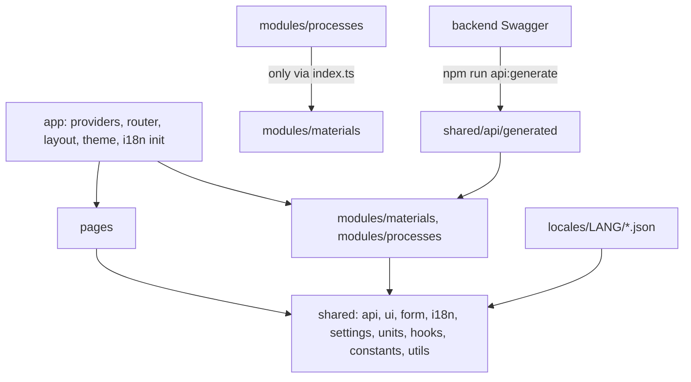

# Frontend architecture — target conventions

This document is the rulebook the refactor converges on. After the refactor it remains the permanent reference for new code.

---

## 1. Layers



| Layer | May import from | Never imports from |
|-------|-----------------|--------------------|
| `app` | everything | — |
| `pages` | `shared`, `modules/*/index.ts` | module internals |
| `modules/<m>` | `shared`, own files, other modules via `index.ts` only | another module's internals |
| `shared` | `shared`, `locales` | `app`, `pages`, `modules` |

## 2. Directory structure

```
frontend/
  scripts/        verify.mjs, generate-api.mjs, check-api.mjs
  tests/
    setup/        vitest.setup.ts, browser-polyfills.ts, highcharts-react.mock.tsx, render-app.tsx,
                  fixture-adapter.ts, recorded-response.ts
    unit/         mapper-coverage.test.ts
    smoke/        routes.smoke.test.tsx
    contract/     cases/  helpers/  *.contract.test.ts  known-backend-issues.ts
    fixtures/     responses/*.json (recorded), inputs/*.ts (typed test inputs)
  src/
    main.tsx
    app/
      components/   Layout.tsx, SettingsMenu.tsx, LanguageSwitcher.tsx
      config/       router.tsx, providers.tsx, query-client.ts, theme.ts
      constants/    app-nav.constants.ts
    locales/
      en/           common.json, home.json, materials.json, processes.json
    shared/
      api/          client.ts, health.api.ts, composition.api.ts, query-defaults.constants.ts
        generated/  openapi.json, schema.ts            (generated, never edited)
        types/
      i18n/         i18n.ts, i18n-resources.ts, i18next.d.ts, languages.constants.ts
      settings/     components/AppSettingsProvider.tsx, hooks/useAppSettings.ts, constants/, mappers/, types/
      units/        components/PrecisionScope.tsx, hooks/useQuantityUnit.ts, hooks/useFormatQuantity.ts,
                    constants/ (temperature, pressure units; quantity-precision), types/ (quantity, precision-rule)
      form/
        components/ FormNumberField.tsx, FormQuantityField.tsx, FormSelect.tsx, FormCheckbox.tsx,
                    FormNumberFieldGrid.tsx, FormGasComposition.tsx, FormOxideComposition.tsx, CalculatorForm.tsx
        hooks/      useCalculatorForm.ts
        schemas/    build-number-fields-schema.ts, sweep-range-schema.ts, points-sweep-schema.ts, yup-locale.ts
        types/      number-field-spec.type.ts, ...
      ui/
        calc/       components/  constants/  formatters/  types/  index.ts
        charts/     components/  config/  constants/  mappers/  types/  index.ts
        feedback/   ComingSoon.tsx, RouteErrorBoundary.tsx, HealthWidget.tsx
      hooks/        useSearchParamTab.ts, useSearchParamsPatch.ts, useSearchParamState.ts,
                    useDebouncedValue.ts, useCalculationQuery.ts, useCatalogueQuery.ts
      constants/    layout.constants.ts, grid.constants.ts
      utils/        linspace.ts, range-by-step.ts, without-nulls.ts
    pages/
      home/         Home.tsx, components/, constants/
      not-found/    NotFound.tsx
    modules/<module>/
      index.ts, routes.tsx
      components/   <Module>Hub.tsx, <Module>Layout.tsx, shared module components
      api/  hooks/  types/  constants/  mappers/
      sections/<section>/
        <Name>Section.tsx      the only file at the section root
        components/            other .tsx (subfolders forms/, panels/, results/ allowed)
        charts/                chart .tsx only
        hooks/                 data hooks and the view-model hook use<Name>Section.ts
        schemas/               <name>-form.schema.ts
        api/  types/  constants/  mappers/
```

## 3. Folder rules

1. **A folder holds either `.tsx` or `.ts` files, never both.** The exceptions are:
   - `index.ts`;
   - the section entry `<Name>Section.tsx` next to its folders;
   - colocated tests: `*.test.ts` beside `.ts` and `*.test.tsx` beside `.tsx`.
2. **A `types/` folder with more than about 12 files is split** into `types/api/` (generated aliases), `types/props/` (component props) and `types/form/` (form values and drafts).
3. **The file suffix decides the folder:**

   | Suffix | Folder |
   |--------|--------|
   | `.api.ts` | `api/` |
   | `.mapper.ts` | `mappers/` |
   | `.constants.ts` | `constants/` |
   | `.type.ts` | `types/` |
   | `.schema.ts` | `schemas/` |
   | `use*.ts` | `hooks/` |
   | `*Chart.tsx` | `charts/` |

4. **`shared/api/generated/` is produced by `npm run api:generate`.** It is never edited by hand and is excluded from lint and from the one-export rule.

## 4. Naming

- **Components:** `PascalCase.tsx`, one component per file, named like the file.
- **Hooks:** `useXxx.ts`, one hook per file.
- **Everything else:** `kebab-case` plus a suffix (`*.api.ts`, `*.type.ts`, `*.constants.ts`, `*.mapper.ts`, `*.schema.ts`).
- **Props types:** `types/props/<component>-props.type.ts`.
- **Constants:** `UPPER_SNAKE_CASE` objects. Text is never stored in them; store `labelKey` and `titleKey` instead.
- **One exported construct per file.** No other top-level functions or constants in a `.tsx` file.

## 5. Patterns

### 5.1 View-model hook plus presentational component

The section component only renders. Form setup, queries, derived data and handlers live in `hooks/use<Name>Section.ts`.

```tsx
export function HtcCalculator() {
  const vm = useHtcCalculator();
  return <CalculatorPage inputs={<HtcForm form={vm.form} geometries={vm.geometries} />} results={<HtcResults {...vm.results} />} />;
}
```

Limits: at most 3 `useState` calls in a component, and at most 200 lines in a `.tsx` file.

### 5.2 Forms: react-hook-form plus yup

- **Field specs are the single source of labels and limits:**

  ```ts
  type NumberFieldSpec<K extends string> = {
    key: K; labelKey: TranslationKey; quantity?: Quantity; unit?: string;
    min?: number; max?: number; required?: boolean; helperKey?: TranslationKey;
  };
  ```

  `quantity` is used for values with a user-selectable unit (temperature, temperature difference, pressure) and for precision. `unit` is fixed text, used only when there is no quantity. `min` and `max` are in canonical units (K, Pa).

- `buildNumberFieldsSchema(specs)` turns the specs into a yup object. A page adds only its special rules with `.when()`, for example "α is required when `bcType` is BC III".
- `useCalculatorForm` (`shared/form/hooks`) is the only place that calls `useForm`:

  ```ts
  const { form, request, submit } = useCalculatorForm({
    schema: htcFormSchema,
    defaultValues: HTC_DEFAULTS.draft,
    toRequest: (values) => toDimensionlessInput(values, geometry),
  });
  ```

  It wraps `useForm` with `yupResolver` and `mode: 'onSubmit'`, and keeps the last valid request. The query runs on that `request`.
- **Field wrappers** (`FormNumberField`, `FormSelect`, …) are `Controller`-based and translate `fieldState.error`.
- `<CalculatorForm form={form} onSubmit={submit}>` renders the form element, a `FormProvider`, a summary of errors at the root of the form, and the calculate button.
- **Repeating editors:** wall layers, bed layers and mix fractions use `useFieldArray`.
- **Combustion subforms:** the combustion mode forms are subforms using `useFormContext()` with a name prefix, shared by Combustion and Recuperator.
- **Prefilling:** router hand-offs and presets go through `defaultValues` or `form.reset(...)`.
- **What stays out of forms:** state shared across tabs (the mineral-compositions mix reducer and context).

### 5.3 i18n

- **Namespaces:** `common`, `home`, `materials`, `processes`. Section keys are nested: `processes:htc.fields.fluidTemperature`.
- **Languages:** `LANGUAGES = ['en', 'fr', 'ru', 'uk']`, with `fallbackLng: 'en'`.
  - Resources are discovered with `import.meta.glob('/src/locales/*/*.json')`, so adding a language means adding a folder.
  - The switcher shows only languages that have resources.
- **Typed keys:** `i18next.d.ts` declares `CustomTypeOptions` from the English JSON, so an unknown key is a TypeScript error.
- **Validation:** yup messages are keys with parameters (`{ key: 'validation.min', values: { min } }`), translated by the field wrappers.
- **Formatting:** numbers go through `Intl.NumberFormat(i18n.language)`, and Highcharts `lang` is updated when the language changes.
- **Not translated:** units, chemical formulas, backend keys and enum values, backend error messages.

### 5.4 API layer

- `shared/api/client.ts` holds the axios instance. One `*.api.ts` file per backend controller area returns typed promises.
- Input and result types are aliases of the generated Swagger types:

  ```ts
  export type RecuperatorInput = components['schemas']['RecuperatorInputDto'];
  ```

  Form drafts stay hand-written, because they are UI state.
- Calculation queries use `useCalculationQuery(key, request, queryFn)` with `CALCULATION_QUERY_OPTIONS` (`staleTime: Infinity`, `retry: false`, `placeholderData: keepPreviousData`).
- Catalogue queries use `CATALOGUE_QUERY_OPTIONS`.

### 5.5 Shared building blocks

- **`useSearchParamTab(param, options)`:** a URL-synced tab with a built-in type guard.
- **`useCatalogueQuery(key, fn)`:** every catalogue hook is one call.
- **`linspace(from, to, points)` and `rangeByStep(from, to, step)`:** the only grid generators. Sweep inputs are validated by `sweepRangeSchema` and `pointsSweepSchema`.
- **`PropertyVsTemperatureChart`:** any "property against temperature" chart is a configuration constant, not a new component.
- **`<ResultCardGrid items size="card" />`:** a grid of result cards.
- **Declarative table columns:** `{ key, labelKey, variant: 'text' | 'number' | 'boolean-chip' | 'emphasis', digits? }` in `constants/*-columns.constants.ts`.
- **Layout tokens:** `LAYOUT.grid.card | half | third | full` and `LAYOUT.field.narrow | medium`. Colours live in the theme and `chart.theme.ts`.
- **Chart constants:** axis and series configuration in `constants/<chart>-chart.constants.ts`, with titles as keys.
- **`RouteErrorBoundary`:** the `errorElement` on the root and module routes.

### 5.6 Highcharts

Never pass explicit `undefined` in options (Highcharts 13 `merge` copies it over defaults). Use conditional spreads: `...(cond ? { labels } : {})`.

### 5.7 App settings and units

- **Settings:** `useAppSettings()` gives `{ temperatureUnit, pressureUnit, language }`, persisted in `localStorage` (`thermal.settings`). They are changed only in the `SettingsMenu`; there are no page-level unit toggles.
- **Canonical units everywhere except the screen:** forms, schemas, requests, API types, query results and chart data use K and Pa.
- **Conversion at the edges only:**
  - `FormQuantityField` converts on display and input;
  - result cards, table columns and chart axes declare a `quantity` and convert through `useQuantityUnit(quantity)`.
- **`temperatureDelta`** converts without the 273.15 offset. Use it for offsets and differences.
- **Not in settings:** wt%/mol% composition toggles stay local to their pages.

### 5.8 Precision

- **Three levels, the most specific wins:**
  1. the global `QUANTITY_PRECISION` preset;
  2. a page override (`<section>/constants/<section>-precision.constants.ts` through `<PrecisionScope>`);
  3. `precision` on a single card, column or series.
- **Rules:** `{ mode: 'decimals' | 'significant', value, smallValueSignificant? }`. `significant` also rounds whole numbers (12345.6 gives `12 300`).
- **Display only:** inputs, requests, chart data and exports keep full precision.
- **No `digits` props or `*_DIGITS` constants:** precision is always a `PrecisionRule`.

### 5.9 Duplication

Anything needed in two places lives in `shared/`. Before writing a helper, hook, chart or schema, look in `shared/` first. `npm run duplication` (`jscpd`) reports clones. Step 13 makes a threshold part of `verify`.

## 6. Lint enforcement (`frontend/eslint.config.js`)

| Rule | Purpose |
|------|---------|
| `no-restricted-imports` | No deep imports from another module; `shared` must not import `@/modules` or `@/app`; no `../../../`; no `useForm` outside `shared/form` |
| `i18next/no-literal-string` (JSX markup) | No UI text in components |
| `check-file/filename-naming-convention` | PascalCase `.tsx`, kebab-case plus suffix for `.ts`, `use*.ts` |
| `check-file/folder-match-with-fex` | `use*.ts` only in `hooks/`, `*.api.ts` only in `api/`, etc. |
| `max-lines` (200, `.tsx`) | Forces the logic split |
| `react-refresh/only-export-components: error` | One component export per `.tsx` |
| `no-restricted-syntax` | No `'°C'`, `'K'` or `'Pa'` unit literals and no `digits` props in modules (use `quantity` and `precision`) |
| `jscpd` threshold (in `verify`, not ESLint) | Duplicated lines stay below the Step 13 threshold |

New rules are added as warnings in Step 02 and become errors in Step 13. Generated files and `tests/fixtures` are ignored.
