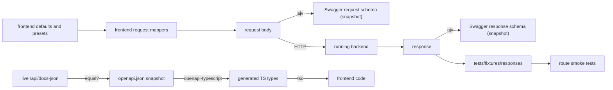

# Frontend test specification

**Goal:** after one command you know whether the frontend is OK. If it is not, you know which part failed and why, including whether the frontend and the backend still agree.

---

## 1. Commands

All commands run in the container:

```bash
docker exec thermal-frontend sh -c 'cd /app && npm run <command>'
```

| Command | What it runs | Needs backend |
|---------|--------------|---------------|
| `verify` | The full gate: typecheck, lint, lint:refactor, test, build, duplication, contract, in that order | yes |
| `lint:refactor` | Architecture rules from ARCHITECTURE §6 as warnings (information until Step 13) | no |
| `duplication` | `jscpd` clone report (information until Step 13, then a threshold) | no |
| `verify:offline` | The same without contract; the summary shows `contract: SKIPPED` | no |
| `test` | Unit, component and route smoke tests | no |
| `test:unit` / `test:component` / `test:smoke` | One layer | no |
| `test:contract` | Backend consistency suites (§5) | yes |
| `test:watch` | Vitest watch mode for development | no |
| `api:generate` | Downloads Swagger, writes `src/shared/api/generated/` | yes |
| `api:check` | Compares the live Swagger with the committed snapshot, writes nothing | yes |
| `fixtures:record` | Runs the smoke tests in record mode: every request without a fixture is fetched from the backend and saved into `tests/fixtures/responses` | yes |

From the repository root, `make test-frontend` runs `verify` in the container, and `make test-frontend OFFLINE=1` runs `verify:offline`.

The backend URL comes from `CONTRACT_API_URL`, default `http://backend:4000/api/v1`. The Swagger URL comes from `CONTRACT_SPEC_URL`, default `http://backend:4000/api/docs-json`.

**A commit is allowed only when `npm run verify` exits with code 0.**

## 2. `verify` output

`scripts/verify.mjs` runs each stage as a child process, captures its output and prints a summary:

```
STAGE          RESULT  TIME    DETAILS
typecheck      PASS    6.1s
lint           PASS    9.4s
lint:refactor  INFO    9.8s    214 architecture warnings
test           PASS    14.2s   412 passed
build          PASS    11.0s   largest chunk 412 kB
duplication    INFO    3.2s    2.4 % duplicated lines, 18 clones (baseline 4.1 %)
contract       FAIL    8.7s    3 failed, 61 passed, 4 known backend issues

FAILED: contract
  POST /recuperator/calculate [circle channels example] live response matches schema
    /flame/T_K: required property missing
Rerun only this stage: npm run test:contract
Known backend issues (still open): 4, see tests/contract/known-backend-issues.ts
```

- Stages run in order and the run stops at the first failure.
- `typecheck` checks the app (`tsconfig.json`, test files excluded) and the tests (`tsconfig.test.json`, which adds Node and jest-dom types).
- `lint:refactor` is `INFO`: it never fails the gate and reports the architecture warning count, which falls to zero by Step 13.
- `build` reports `WARN`, not `FAIL`, when a chunk exceeds 500 kB. The chunk limit becomes a failure in Step 03.
- Only the failing stage's errors are printed, followed by the command that reruns that stage.
- The exit code is 0 only if every stage passes.
- If the backend is unreachable, `contract` fails with `backend not reachable at <url>`. It is never skipped silently.
- Machine-readable results go to `frontend/test-results/` (`junit.xml`, `results.json`), which is ignored by git.

## 3. Vitest projects

The configuration lives in `vitest.config.ts`, which reuses `vite.config.ts` for the `@/` alias.

| Project | Environment | Files | Purpose |
|---------|-------------|-------|---------|
| `unit` | jsdom | `src/**/*.test.ts`, `tests/unit/**/*.test.ts` | Pure logic (jsdom because mappers import the charts barrel, which loads Highcharts) |
| `component` | jsdom | `src/**/*.test.tsx` | Components and sections |
| `smoke` | jsdom | `tests/smoke/**/*.test.tsx` | Every route renders |
| `contract` | node | `tests/contract/**/*.contract.test.ts` | Backend consistency |

- **Setup** (`tests/setup/vitest.setup.ts`):
  - registers `@testing-library/jest-dom` and initialises i18n with English (from Step 09);
  - from Step 10, the render helpers wrap components in `AppSettingsProvider`, clear `localStorage` between tests, and accept explicit settings;
  - installs `matchMedia`, `CSS.supports` and `ResizeObserver` polyfills (`tests/setup/browser-polyfills.ts`);
  - replaces `highcharts-react-official` with a stub that records the options passed in (`tests/setup/highcharts-react.mock.tsx`, read through `chartStub.options`);
  - fails any test that logs `console.error`.
- **Test placement:** tests sit next to the file they test, so `.ts` and `.tsx` folders stay separate.
- **Test names** follow `<area> › <section> › <behaviour>`, for example `processes › htc › invalid velocity shows field error and sends no request`.

## 4. Test layers

### 4.1 Static checks

| Check | Proves | Reason on failure |
|-------|--------|-------------------|
| `typecheck` | Types are consistent, including the generated backend types | file:line, TS error |
| `lint` | Conventions in [ARCHITECTURE.md](ARCHITECTURE.md) | file:line, rule |
| `build` | The production bundle builds (output to `/tmp/build-check`, never into the shared `dist` volume); from Step 03 no chunk exceeds 500 kB | Vite error, oversized chunk name |
| `duplication` | Copy-paste stays low. `INFO` until Step 13, then it fails above the threshold | Each clone with both file locations and line ranges |

### 4.2 Unit tests (`src/**/*.test.ts`)

| Target | Required cases |
|--------|----------------|
| **Request mappers** (draft or form values to request) | Defaults produce the expected body; optional fields are omitted when empty, never sent as `null` or `undefined`; mode-specific fields appear only in their mode (for example `h0_m` only for `circle_in_ring`) |
| **Series and table mappers** (response to chart or table) | Fixture response produces expected points, axis bounds, plot lines and zones; no explicit `undefined` keys (Highcharts) |
| **Schemas** (`*.schema.ts`) | Defaults are valid; for every field, a value below `min`, above `max` or empty-but-required gives the expected path and message key; conditional rules toggle correctly |
| **Constants invariants** | Ids are unique; every `labelKey` and `titleKey` exists in `locales/en`; for every field spec `min <= max`; every default lies within its spec limits |
| **Utils and formatters** | Edge values: 0, negative, very large or small, `NaN`; `linspace` and `rangeByStep` end points and floating-point drift |
| **Units** | Temperature °C/K round-trips; `temperatureDelta` ignores the offset; pressure Pa/kPa/bar/atm; stored settings with invalid or old values fall back per field |
| **Precision** | Every `PrecisionRule` mode; whole numbers rounded in `significant` mode; small-value rule for composition; resolution order (value, then page, then global) |
| **Mapper coverage** | Every `mappers/*.ts` file has a sibling `*.test.ts` (from Step 01) |
| **Locale parity** (`src/locales/locales.test.ts`) | For each language folder besides `en`: same key set as English, no empty strings, same `{{placeholders}}` per key. Runs automatically once a translation folder is added |

### 4.3 Component tests (`src/**/*.test.tsx`)

Rendered with Testing Library and `@testing-library/user-event`. API functions are mocked with `vi.mock('<section>/api/<name>.api')`.

**Every calculator section must have these cases:**

1. It renders with the defaults: the inputs show the default values and the calculate button is enabled.
2. An invalid value shows the field's error text and makes no API call.
3. A valid submit calls the API function once with exactly the body from the request mapper.
4. A mocked success response shows the result cards. The chart stub receives series with the expected names and lengths.
5. A mocked backend error is shown through `JsonErrorAlert` with the backend message.
6. Where the section has them, presets, hand-offs and tabs work: choosing a preset fills the form, router state prefills the form, and the URL `?tab=` selects the tab.
7. Switching the temperature setting between °C and K changes the displayed inputs, results and chart axis unit. The request sent stays identical, in K.

**Shared components:**
- form wrappers show translated errors;
- `CalculatorForm` blocks submit while the form is invalid;
- `FormQuantityField` shows 20 for 293.15 K when set to °C, and typing 25 stores 298.15;
- `SettingsMenu` changes and persists each setting;
- `PrecisionScope` overrides the global preset;
- `ResultTable` renders each column variant;
- `RouteErrorBoundary` shows the error and a link home.

### 4.4 Route smoke tests (`tests/smoke/routes.smoke.test.tsx`)

- The test renders the real router (`tests/setup/render-app.tsx`) once per route. The route list comes from the actual route configuration (`collectRoutePaths`, which counts `element`, `Component` and `lazy` routes and lists each path once), so a new route is covered automatically.
- A guard test pins the number of routes (`EXPECTED_ROUTE_COUNT`, 15 including the unknown path). Adding or removing a page means updating it, so the route list can never shrink silently.
- HTTP goes through a fixture adapter on the axios client (`tests/setup/fixture-adapter.ts`). It looks up the recorded file for the request key `<METHOD> <path>?<sorted query>`. The file name is `<METHOD>_<path-with-underscores>.json`; long keys are shortened and get a hash suffix.
  - A missing fixture fails with `no fixture for GET /refractory/materials … Run: npm run fixtures:record`.
  - Mapper tests read the same files through `recordedResponse<T>('GET /path')` (`tests/setup/recorded-response.ts`).
- Each route must:
  - finish loading its lazy section: the router is idle and `RouteFallback` ("Loading page") is gone;
  - show a heading;
  - finish all queries within 20 s;
  - never render an error page (neither React Router's default page nor `RouteErrorBoundary`);
  - request no endpoint without a fixture;
  - log no `console.error`.
- From Step 05, each calculator route also submits its defaults and must show results. The POST fixtures are recorded by the live contract suite.

## 5. Backend contract tests (`tests/contract`)

These prove that the frontend and the backend agree. They use the committed Swagger snapshot `src/shared/api/generated/openapi.json` and the running backend.

### 5.1 Contract cases

There is one file per backend area in `tests/contract/cases/`. A case always builds its body through the **real frontend mapper** from the **real defaults or presets**, so the test checks exactly what the UI sends.

```ts
export const recuperatorCases: ContractCase[] = [
  {
    name: 'circle channels example',
    method: 'post',
    path: '/recuperator/calculate',
    body: () => toRecuperatorRequest(RECUPERATOR_DEFAULTS.draft, RECUPERATOR_DEFAULTS.combustion),
  },
];
```

| Field | Meaning |
|-------|---------|
| `name` | Human-readable case name, shown in every failure |
| `method`, `path` | Operation as written in Swagger (without `/api/v1`) |
| `body` / `query` | Built from frontend defaults or presets through the frontend mapper |
| `expectStatus` | Default 200 or 201 |
| `recordFixture` | Default `true`: saves the response for the smoke tests |

**Required cases:**
- every mode, shape, preset and hand-off that the UI can submit with its defaults: each combustion mode, each hole form, each thermal shape and tab, each HTC geometry, each glass preset, each wall preset;
- every catalogue GET used by the UI.

### 5.2 Suites

| Suite | File | Checks | Example failure |
|-------|------|--------|-----------------|
| **Spec drift** | `spec-drift.contract.test.ts` | The live `/api/docs-json` equals the committed snapshot | `Swagger changed: POST /recuperator/calculate requestBody added required "nPasses". Run npm run api:generate, then npm run typecheck to see affected code` |
| **Spec completeness** | `spec-completeness.contract.test.ts` | Every operation used by the frontend documents a 2xx response schema | `GET /metals/thermal-properties has no response schema` |
| **Endpoint coverage** | `coverage.contract.test.ts` | Every operation called from a frontend `*.api.ts` has at least one case | `POST /thermal-distribution/criteria is called by thermal-distribution.api.ts but has no contract case` |
| **Request conformance** | `request.contract.test.ts` | Every case body validates against the Swagger request schema (ajv, offline) | `POST /recuperator/calculate [circle channels example]: /h0_m must NOT be present (additional property)` |
| **Live calls** | `live.contract.test.ts` | Each case is sent to the backend; status is 2xx; the response validates against the Swagger response schema; the fixture is saved | `POST /combustion/bed [default bed]: HTTP 500 "Cannot read properties of undefined (reading 'T_K')"` |
| **Catalogue consistency** | `catalogue.contract.test.ts` | Every option offered in frontend constants exists in the backend enum (from Swagger) or catalogue endpoint; backend values the UI does not offer are listed as information | `HOLE_FORMS contains "hexagon", not in RecuperatorInputDto.holeForm enum [square, circle, triangle, circle_in_ring]` |

**Request conformance details:**
- Validation runs against the snapshot with `ajv` and `ajv-formats`, with `additionalProperties: false` forced on request schemas. This mirrors the backend's `forbidNonWhitelisted`.
- It catches unknown fields, missing required fields, wrong enum values and values outside `minimum` or `maximum`.

**Catalogue consistency details:** deliberate exclusions are declared in the case with their reason, for example thermal-distribution `plate`, `auto` and `V_over_A`, which the backend DTO does not accept.

### 5.3 What is compared with what



Together these give four guarantees:
- the types the frontend compiles against equal the backend's Swagger;
- the bodies the UI sends are accepted;
- the responses have the fields the UI reads;
- the offline smoke tests use real backend responses.

## 6. Failure reporting

- **Every contract failure message contains:**
  - method, path and case name;
  - HTTP status and the backend `message` (for live calls);
  - for schema errors, the JSON pointer, the violated rule and the actual value.
- **Known backend issues** are declared in `tests/contract/known-backend-issues.ts`:

  ```ts
  export const KNOWN_BACKEND_ISSUES: KnownBackendIssue[] = [
    { case: 'POST /thermodynamics/dimensionless [fluid air]', description: 'returns 500 for fluid "air"', since: '2026-10-01' },
  ];
  ```

  These cases run with `it.fails`:
  - **While the bug exists,** the suite stays green and the `verify` summary lists the open issues.
  - **When the backend is fixed,** the case passes and the test turns red with `known backend issue is fixed: remove it from known-backend-issues.ts`. Fixed bugs can't hide.
- **Adding an entry** requires reporting it to the user in the same session. Backend bugs are never fixed without approval.

## 7. Writing tests: rules

1. **Test behaviour through the public surface:** the rendered UI, a mapper's output, a schema's result. Never test internal state.
2. **Use realistic inputs.** Build them from defaults, presets or recorded fixtures. Don't invent values unless testing an edge case.
3. **Write one behaviour per test**, named in `<area> › <section> › <behaviour>` form.
4. **No snapshot tests of rendered markup.** Assert specific texts, values and calls.
5. **Test units in both settings.** Any test that asserts a displayed temperature or pressure sets the unit explicitly through the settings provider, so it never depends on defaults.
6. **Every new section, endpoint call or preset needs:**
   - unit tests for its mappers and schema;
   - the component-test cases from §4.3;
   - a contract case.

   The coverage suite enforces the contract case.

## 8. Deferred: browser tests

Real-browser tests would open every page, run the default calculation and check results and charts. Playwright does not support the Alpine frontend image. The options (a separate Playwright service in `compose.yml`, or another runner) will be decided after the refactor. Until then, component tests and route smoke tests cover rendering, and the contract tests cover the backend.
