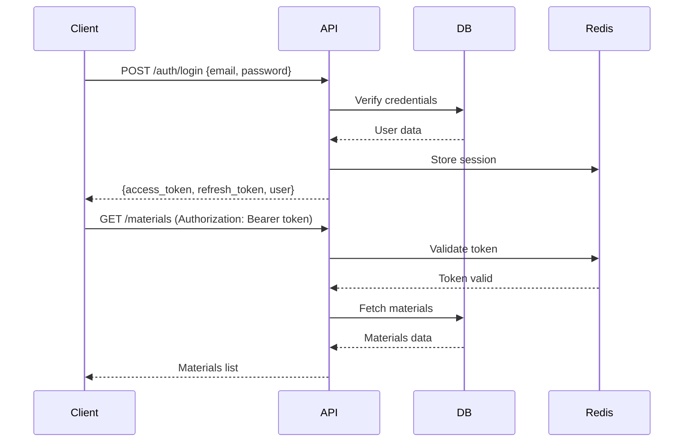

# NestJS Migration Specification

## Project: Refractory Calculator - Client-Server Architecture Migration

**Version:** 1.0.0  
**Date:** February 1, 2026  
**Status:** Planning

---

## 🚀 **WANT TO START IMPLEMENTING NOW?**

### → **[../../START_HERE.md](../../START_HERE.md)** ⭐ **READ THIS FIRST!**

**This specification is detailed and comprehensive. If you want to START CODING:**
1. Open **[../../START_HERE.md](../../START_HERE.md)**
2. Follow the step-by-step implementation
3. Come back here for API details, database schema, etc.

**START_HERE.md contains everything in one place:**
- Pre-implementation checklist  
- All mandatory rules (enforced)
- Phase-by-phase implementation (0→1→2→3→4)
- Verification checkpoints
- Links back to this spec for details

---

## ⚠️ CRITICAL: Project Rules & Manifests

Before starting implementation, **READ THESE FIRST:**

### 🔴 Mandatory Rules (MUST FOLLOW)

1. **Docker-Only Workflow**
   - ❌ NO `npx`, `npm install`, `node` commands on host
   - ✅ ALL commands via `docker-compose exec backend ...`
   - 📖 **See:** [../../PROJECT_INDEX.md - Docker-Only Commands](../../PROJECT_INDEX.md#1-docker-only-commands)
   - 📖 **Guide:** [DOCKER_FIRST_SETUP.md](DOCKER_FIRST_SETUP.md)

2. **Reports Location**
   - ⚠️ ALL reports, logs, output → `tmp/reports/`
   - ❌ NOT in project root or random folders
   - 📖 **See:** [../../PROJECT_INDEX.md - Reports Location](../../PROJECT_INDEX.md#2-reports-location)
   - 📖 **Guide:** [../REPORTS_MANAGEMENT.md](../REPORTS_MANAGEMENT.md)

3. **Secrets Protection**
   - ❌ NEVER commit: `.env`, `*.key`, `*.pem`, `*.crt`, certificates
   - ✅ USE templates: `.env.example`, `.env.production`
   - 📖 **See:** [../../PROJECT_INDEX.md - Secrets Protection](../../PROJECT_INDEX.md#3-secrets-protection)
   - 📖 **File:** [../../.gitignore](../../.gitignore)

4. **Version Control**
   - ✅ Use latest stable versions (verified Feb 1, 2026)
   - 📖 **See:** [../../VERSION.md](../../VERSION.md)

### 📋 Project Manifests (Reference Documents)

| Document | Purpose | Link |
|----------|---------|------|
| **PROJECT_INDEX.md** | Complete navigation & rules | [../../PROJECT_INDEX.md](../../PROJECT_INDEX.md) |
| **VERSION.md** | Docker image versions | [../../VERSION.md](../../VERSION.md) |
| **SETUP.md** | Environment setup | [../../SETUP.md](../../SETUP.md) |
| **REPORTS_MANAGEMENT.md** | Reports guidelines | [../REPORTS_MANAGEMENT.md](../REPORTS_MANAGEMENT.md) |
| **ENVIRONMENT_MANAGEMENT.md** | .env configuration | [../ENVIRONMENT_MANAGEMENT.md](../ENVIRONMENT_MANAGEMENT.md) |
| **Legacy MANIFEST.md** | Original project structure | [../../legacy/MANIFEST.md](../../legacy/MANIFEST.md) |

### 🚀 Implementation Start Point

**Before coding, follow these in order:**

1. ✅ Read: [../../PROJECT_INDEX.md](../../PROJECT_INDEX.md) - Understand project rules
2. ✅ Read: [DOCKER_FIRST_SETUP.md](DOCKER_FIRST_SETUP.md) - Step-by-step setup
3. ✅ Check: [../../tmp/reports/READY_FOR_IMPLEMENTATION.md](../../tmp/reports/READY_FOR_IMPLEMENTATION.md) - Checklist
4. ⏳ Then proceed with this specification

---

## Table of Contents

1. [Executive Summary](#executive-summary)
2. [Current Architecture](#current-architecture)
3. [Target Architecture](#target-architecture)
4. [Technology Stack](#technology-stack)
5. [Project Structure](#project-structure)
6. [Migration Strategy](#migration-strategy)
7. [API Design](#api-design)
8. [Database Design](#database-design)
9. [Authentication & Authorization](#authentication--authorization)
10. [Deployment Strategy](#deployment-strategy)
11. [Timeline & Milestones](#timeline--milestones)
12. [Risk Assessment](#risk-assessment)

---

## 1. Executive Summary

### Objective
Migrate the current monolithic TypeScript refractory calculator application to a modern client-server architecture using:
- **Backend:** NestJS RESTful API
- **Frontend:** React/Vue.js SPA (Single Page Application)
- **Database:** PostgreSQL with TypeORM
- **Deployment:** Docker containers with nginx reverse proxy

### Benefits
- ✅ **Scalability:** Separate backend can scale independently
- ✅ **Maintainability:** Clear separation of concerns
- ✅ **Reusability:** API can serve multiple clients (web, mobile, CLI)
- ✅ **Performance:** Better caching, load balancing, CDN support
- ✅ **Security:** Centralized authentication, input validation
- ✅ **Testing:** Easier unit and integration testing

---

## 2. Current Architecture

### Current State
```
┌─────────────────────────────────────────┐
│         Nginx (Port 18080)              │
│  Serves static files from /public/     │
└─────────────────────────────────────────┘
              │
              ↓
┌─────────────────────────────────────────┐
│     TypeScript Modules (Browser)        │
│  - BlendOptimizer.js                    │
│  - PSDCalculator.js                     │
│  - MaterialLibrary.js                   │
│  - MixLibraryService.js                 │
└─────────────────────────────────────────┘
              │
              ↓
┌─────────────────────────────────────────┐
│      Simple Node.js API (Port 3000)     │
│  - Basic HTTP server                    │
│  - 2 endpoints (components, calculate)  │
└─────────────────────────────────────────┘
```

### Current Components
- **Frontend:** Vanilla JS with ES modules
- **Backend:** Simple Node.js HTTP server (`server.js`)
- **Data Layer:** In-memory (no persistence)
- **Storage:** LocalStorage for mix library

### Limitations
- ❌ No persistent database
- ❌ No user authentication
- ❌ No API versioning
- ❌ Limited validation
- ❌ No caching strategy
- ❌ Single-threaded processing
- ❌ No logging/monitoring
- ❌ No testing infrastructure

---

## 3. Target Architecture

### High-Level Architecture
```
┌──────────────────────────────────────────────────────────┐
│                    Nginx Reverse Proxy                    │
│                      (Port 80/443)                        │
└──────────────────────────────────────────────────────────┘
           │                              │
           │                              │
           ↓                              ↓
┌─────────────────────┐        ┌─────────────────────────┐
│   Frontend (SPA)    │        │   NestJS Backend API    │
│   Port 3000         │        │   Port 4000             │
│                     │        │                         │
│  - React/Vue.js     │        │  - REST API             │
│  - Redux/Pinia      │        │  - GraphQL (optional)   │
│  - Vite build       │        │  - WebSockets           │
│  - Material-UI      │        │  - Bull Queue           │
└─────────────────────┘        └─────────────────────────┘
                                          │
                                          ↓
                               ┌─────────────────────────┐
                               │   PostgreSQL Database   │
                               │   Port 5432             │
                               │                         │
                               │  - Materials            │
                               │  - Mixes                │
                               │  - Calculations         │
                               │  - Users                │
                               └─────────────────────────┘
                                          │
                                          ↓
                               ┌─────────────────────────┐
                               │   Redis Cache           │
                               │   Port 6379             │
                               │                         │
                               │  - Calculation cache    │
                               │  - Session storage      │
                               └─────────────────────────┘
```

### Architecture Layers

#### 1. Presentation Layer (Frontend)
- **Technology:** React 18+ with TypeScript
- **State Management:** Redux Toolkit / Zustand
- **UI Framework:** Material-UI v5 / Ant Design
- **Build Tool:** Vite
- **API Client:** Axios / TanStack Query (React Query)

#### 2. API Gateway Layer
- **Technology:** Nginx
- **Functions:**
  - Reverse proxy
  - SSL termination
  - Rate limiting
  - Static file serving
  - Load balancing

#### 3. Application Layer (Backend)
- **Technology:** NestJS 10+
- **Architecture:** Modular, Domain-Driven Design
- **API Style:** RESTful + GraphQL (optional)
- **Documentation:** Swagger/OpenAPI

#### 4. Data Access Layer
- **ORM:** TypeORM
- **Database:** PostgreSQL 15+
- **Migration:** TypeORM migrations
- **Seeding:** Initial data scripts

#### 5. Caching Layer
- **Technology:** Redis
- **Purpose:**
  - Calculation results cache
  - Session management
  - Rate limiting
  - Bull queue for background jobs

---

## 4. Technology Stack

### Backend (NestJS API)

```json
{
  "core": {
    "@nestjs/core": "^10.3.0",
    "@nestjs/common": "^10.3.0",
    "@nestjs/platform-express": "^10.3.0"
  },
  "database": {
    "@nestjs/typeorm": "^10.0.1",
    "typeorm": "^0.3.20",
    "pg": "^8.11.3"
  },
  "cache": {
    "@nestjs/cache-manager": "^2.2.0",
    "cache-manager": "^5.4.0",
    "cache-manager-redis-store": "^3.0.1",
    "redis": "^4.6.12"
  },
  "validation": {
    "class-validator": "^0.14.1",
    "class-transformer": "^0.5.1"
  },
  "authentication": {
    "@nestjs/passport": "^10.0.3",
    "@nestjs/jwt": "^10.2.0",
    "passport": "^0.7.0",
    "passport-jwt": "^4.0.1",
    "bcrypt": "^5.1.1"
  },
  "api_documentation": {
    "@nestjs/swagger": "^7.2.0"
  },
  "configuration": {
    "@nestjs/config": "^3.1.1",
    "joi": "^17.12.0"
  },
  "logging": {
    "@nestjs/logger": "built-in",
    "winston": "^3.11.0"
  },
  "testing": {
    "@nestjs/testing": "^10.3.0",
    "jest": "^29.7.0",
    "supertest": "^6.3.4"
  },
  "queue": {
    "@nestjs/bull": "^10.0.1",
    "bull": "^4.12.0"
  }
}
```

### Frontend (React SPA)

```json
{
  "core": {
    "react": "^18.2.0",
    "react-dom": "^18.2.0",
    "typescript": "^5.3.3"
  },
  "routing": {
    "react-router-dom": "^6.21.3"
  },
  "state_management": {
    "@reduxjs/toolkit": "^2.1.0",
    "react-redux": "^9.1.0"
  },
  "api_client": {
    "@tanstack/react-query": "^5.17.19",
    "axios": "^1.6.5"
  },
  "ui_framework": {
    "@mui/material": "^5.15.6",
    "@mui/icons-material": "^5.15.6",
    "@emotion/react": "^11.11.3",
    "@emotion/styled": "^11.11.0"
  },
  "forms": {
    "react-hook-form": "^7.49.3",
    "yup": "^1.3.3"
  },
  "charts": {
    "recharts": "^2.10.4",
    "plotly.js": "^2.29.0",
    "react-plotly.js": "^2.6.0"
  },
  "build": {
    "vite": "^5.0.11",
    "@vitejs/plugin-react": "^4.2.1"
  }
}
```

### Database

- **PostgreSQL:** 15+
- **Redis:** 7+

### DevOps

- **Docker:** 24+
- **Docker Compose:** 2.24+
- **Nginx:** 1.25+

---

## 5. Project Structure

### New Directory Structure

```
thermal-software/
├── backend/                          # NestJS Backend API
│   ├── src/
│   │   ├── main.ts
│   │   ├── app.module.ts
│   │   ├── config/                   # Configuration
│   │   │   ├── database.config.ts
│   │   │   ├── redis.config.ts
│   │   │   └── jwt.config.ts
│   │   ├── common/                   # Shared utilities
│   │   │   ├── decorators/
│   │   │   ├── filters/
│   │   │   ├── guards/
│   │   │   ├── interceptors/
│   │   │   └── pipes/
│   │   ├── modules/
│   │   │   ├── auth/                 # Authentication module
│   │   │   │   ├── auth.controller.ts
│   │   │   │   ├── auth.service.ts
│   │   │   │   ├── auth.module.ts
│   │   │   │   ├── dto/
│   │   │   │   ├── strategies/
│   │   │   │   └── guards/
│   │   │   ├── users/                # User management
│   │   │   │   ├── users.controller.ts
│   │   │   │   ├── users.service.ts
│   │   │   │   ├── users.module.ts
│   │   │   │   ├── entities/
│   │   │   │   └── dto/
│   │   │   ├── materials/            # Material library
│   │   │   │   ├── materials.controller.ts
│   │   │   │   ├── materials.service.ts
│   │   │   │   ├── materials.module.ts
│   │   │   │   ├── entities/
│   │   │   │   └── dto/
│   │   │   ├── mixes/                # Mix library
│   │   │   │   ├── mixes.controller.ts
│   │   │   │   ├── mixes.service.ts
│   │   │   │   ├── mixes.module.ts
│   │   │   │   ├── entities/
│   │   │   │   └── dto/
│   │   │   ├── calculations/         # Calculation engine
│   │   │   │   ├── calculations.controller.ts
│   │   │   │   ├── calculations.service.ts
│   │   │   │   ├── calculations.module.ts
│   │   │   │   ├── services/
│   │   │   │   │   ├── blend-optimizer.service.ts
│   │   │   │   │   ├── psd-calculator.service.ts
│   │   │   │   │   ├── packing-calculator.service.ts
│   │   │   │   │   ├── phase-equilibrium.service.ts
│   │   │   │   │   └── thermal-performance.service.ts
│   │   │   │   ├── entities/
│   │   │   │   └── dto/
│   │   │   ├── components/           # Component dictionary
│   │   │   │   ├── components.controller.ts
│   │   │   │   ├── components.service.ts
│   │   │   │   ├── components.module.ts
│   │   │   │   ├── entities/
│   │   │   │   └── dto/
│   │   │   └── cache/                # Caching module
│   │   │       ├── cache.module.ts
│   │   │       └── cache.service.ts
│   │   └── database/
│   │       ├── migrations/
│   │       ├── seeds/
│   │       └── factories/
│   ├── test/
│   │   ├── unit/
│   │   ├── integration/
│   │   └── e2e/
│   ├── dist/
│   ├── package.json
│   ├── tsconfig.json
│   ├── nest-cli.json
│   └── .env.example
│
├── frontend/                         # React Frontend
│   ├── public/
│   ├── src/
│   │   ├── main.tsx
│   │   ├── App.tsx
│   │   ├── components/               # Reusable components
│   │   │   ├── common/
│   │   │   ├── layout/
│   │   │   ├── forms/
│   │   │   └── charts/
│   │   ├── pages/                    # Page components
│   │   │   ├── Home/
│   │   │   ├── BlendOptimizer/
│   │   │   ├── PhaseCalculator/
│   │   │   ├── MixLibrary/
│   │   │   └── Auth/
│   │   ├── features/                 # Feature modules
│   │   │   ├── blend-optimizer/
│   │   │   ├── phase-calculator/
│   │   │   ├── mix-library/
│   │   │   └── auth/
│   │   ├── store/                    # Redux store
│   │   │   ├── index.ts
│   │   │   ├── slices/
│   │   │   └── middleware/
│   │   ├── api/                      # API client
│   │   │   ├── client.ts
│   │   │   ├── endpoints/
│   │   │   └── hooks/
│   │   ├── hooks/                    # Custom hooks
│   │   ├── utils/                    # Utilities
│   │   ├── types/                    # TypeScript types
│   │   ├── styles/                   # Global styles
│   │   └── assets/                   # Static assets
│   ├── package.json
│   ├── tsconfig.json
│   ├── vite.config.ts
│   └── .env.example
│
├── shared/                           # Shared types/utilities
│   ├── types/
│   │   ├── blend-types.ts
│   │   ├── material-types.ts
│   │   └── api-types.ts
│   └── constants/
│
├── docker/
│   ├── Dockerfile.backend
│   ├── Dockerfile.frontend
│   ├── nginx.conf
│   └── docker-compose.yml
│
├── docs/
│   ├── API.md
│   ├── DEPLOYMENT.md
│   └── DEVELOPMENT.md
│
├── scripts/
│   ├── migrate-data.ts               # Data migration script
│   ├── seed-database.ts
│   └── backup-database.sh
│
└── .github/
    └── workflows/
        ├── ci.yml
        └── deploy.yml
```

---

## 6. Migration Strategy

### Phase 1: Backend Setup (Week 1-2)

#### 1.1 NestJS Project Setup
```bash
# Create NestJS project
npx @nestjs/cli new backend

# Install dependencies
cd backend
npm install @nestjs/typeorm typeorm pg
npm install @nestjs/config @nestjs/swagger
npm install class-validator class-transformer
npm install @nestjs/jwt @nestjs/passport passport passport-jwt bcrypt
npm install cache-manager cache-manager-redis-store redis
npm install @nestjs/bull bull
```

#### 1.2 Database Setup
```bash
# PostgreSQL setup
docker run --name thermal-postgres \
  -e POSTGRES_DB=${DB_DATABASE} \
  -e POSTGRES_USER=${DB_USERNAME} \
  -e POSTGRES_PASSWORD=${DB_PASSWORD} \
  -p ${DB_PORT}:5432 \
  -d postgres:${POSTGRES_VERSION}

# Redis setup
docker run --name thermal-redis \
  -p ${REDIS_PORT}:6379 \
  -d redis:${REDIS_VERSION}
```

#### 1.3 Module Generation
```bash
# Generate modules
nest g module auth
nest g module users
nest g module materials
nest g module mixes
nest g module calculations
nest g module components

# Generate services and controllers
nest g service auth
nest g controller auth
nest g service users
nest g controller users
# ... repeat for other modules
```

#### 1.4 Migrate Core Logic
- Port calculation algorithms from TypeScript modules
- Create service classes for:
  - `BlendOptimizerService`
  - `PSDCalculatorService`
  - `PackingCalculatorService`
  - `PhaseEquilibriumService`
  - `ThermalPerformanceService`

### Phase 2: Database Design & Migrations (Week 2-3)

#### 2.1 Create Entities
- User entity
- Material entity
- Mix entity
- Calculation entity
- Component entity

#### 2.2 Create Migrations
```bash
npm run typeorm migration:create -- -n InitialSchema
npm run typeorm migration:run
```

#### 2.3 Seed Data
- Migrate existing ComponentDictionary data
- Migrate MaterialLibrary data
- Create admin user

### Phase 3: API Development (Week 3-5)

#### 3.1 Authentication Endpoints
- `POST /api/auth/register`
- `POST /api/auth/login`
- `POST /api/auth/refresh`
- `GET /api/auth/profile`

#### 3.2 Materials Endpoints
- `GET /api/materials`
- `GET /api/materials/:id`
- `POST /api/materials`
- `PUT /api/materials/:id`
- `DELETE /api/materials/:id`

#### 3.3 Mixes Endpoints
- `GET /api/mixes`
- `GET /api/mixes/:id`
- `POST /api/mixes`
- `PUT /api/mixes/:id`
- `DELETE /api/mixes/:id`
- `GET /api/mixes/search`

#### 3.4 Calculations Endpoints
- `POST /api/calculations/blend-optimize`
- `POST /api/calculations/phase-equilibrium`
- `POST /api/calculations/thermal-performance`
- `GET /api/calculations/:id`
- `GET /api/calculations/history`

#### 3.5 Components Endpoints
- `GET /api/components`
- `GET /api/components/categories`
- `GET /api/components/:category/:variant`

### Phase 4: Frontend Development (Week 5-8)

#### 4.1 React Project Setup
```bash
npm create vite@latest frontend -- --template react-ts
cd frontend
npm install @mui/material @emotion/react @emotion/styled
npm install react-router-dom
npm install @reduxjs/toolkit react-redux
npm install @tanstack/react-query axios
npm install react-hook-form yup
npm install recharts
```

#### 4.2 Feature Development Order
1. **Authentication UI** (Login, Register)
2. **Dashboard/Home** (Overview, recent calculations)
3. **Blend Optimizer** (Migrate from blend-optimizer.html)
4. **Phase Calculator** (Migrate from phase-calculator.html)
5. **Mix Library** (Browse, save, load mixes)
6. **Material Browser** (View, search materials)

#### 4.3 State Management Setup
- Redux store configuration
- API slice with RTK Query
- Auth slice
- Calculation slice
- Mix library slice

### Phase 5: Integration & Testing (Week 8-9)

#### 5.1 Integration Testing
- API endpoint tests
- E2E testing with Cypress
- Load testing with k6

#### 5.2 Performance Optimization
- Implement caching strategy
- Add Redis for calculation results
- Optimize database queries
- Add pagination

### Phase 6: Docker & Deployment (Week 9-10)

#### 6.1 Containerization
- Create Dockerfile for backend
- Create Dockerfile for frontend
- Update docker-compose.yml
- Configure nginx reverse proxy

#### 6.2 Environment Configuration
- Production environment variables
- CI/CD pipeline setup
- Monitoring setup (optional)

---

## 7. API Design

### REST API Structure

#### Base URL
```
Production: https://api.thermal-software.com/v1
Development: http://localhost:4000/api/v1
```

### Authentication Flow



### Core API Endpoints

#### Authentication Module
```typescript
POST   /api/v1/auth/register
POST   /api/v1/auth/login
POST   /api/v1/auth/logout
POST   /api/v1/auth/refresh
GET    /api/v1/auth/profile
PUT    /api/v1/auth/profile
```

#### Materials Module
```typescript
GET    /api/v1/materials              # List all materials
GET    /api/v1/materials/:id          # Get material by ID
POST   /api/v1/materials              # Create material (admin)
PUT    /api/v1/materials/:id          # Update material (admin)
DELETE /api/v1/materials/:id          # Delete material (admin)
GET    /api/v1/materials/search       # Search materials
GET    /api/v1/materials/categories   # List categories
```

#### Mixes Module
```typescript
GET    /api/v1/mixes                  # List user's mixes
GET    /api/v1/mixes/:id              # Get mix by ID
POST   /api/v1/mixes                  # Save new mix
PUT    /api/v1/mixes/:id              # Update mix
DELETE /api/v1/mixes/:id              # Delete mix
GET    /api/v1/mixes/search           # Search mixes
POST   /api/v1/mixes/:id/duplicate    # Duplicate mix
GET    /api/v1/mixes/shared           # List public mixes
```

#### Calculations Module
```typescript
POST   /api/v1/calculations/blend-optimize       # Optimize blend
POST   /api/v1/calculations/phase-equilibrium    # Calculate phases
POST   /api/v1/calculations/thermal-performance  # Thermal analysis
POST   /api/v1/calculations/psd                  # PSD calculation
POST   /api/v1/calculations/packing              # Packing density
POST   /api/v1/calculations/shrinkage            # Shrinkage prediction
GET    /api/v1/calculations/history              # Calculation history
GET    /api/v1/calculations/:id                  # Get calculation result
DELETE /api/v1/calculations/:id                  # Delete calculation
```

#### Components Module
```typescript
GET    /api/v1/components                        # List all components
GET    /api/v1/components/categories             # List categories
GET    /api/v1/components/:category              # Components by category
GET    /api/v1/components/:category/:variant     # Specific component
```

### Request/Response Examples

#### Blend Optimization Request
```typescript
POST /api/v1/calculations/blend-optimize
Content-Type: application/json
Authorization: Bearer <token>

{
  "fractions": [
    {
      "dMin_mm": 0.001,
      "dMax_mm": 0.045,
      "material": {
        "category": "cement",
        "variant": "CAC"
      },
      "isFixed": true,
      "fixedAmount_pct": 5.0
    },
    {
      "dMin_mm": 0.045,
      "dMax_mm": 0.5,
      "material": {
        "category": "alumina",
        "variant": "tabular_alumina"
      },
      "isFixed": false
    }
  ],
  "options": {
    "qValues": [0.25, 0.27, 0.30],
    "methods": ["Andreasen", "FunkDinger"],
    "packingModels": ["CPM"],
    "scenarios": ["Self-compacting", "Flowable"],
    "temperatureProfile_C": [600, 800, 1000, 1200],
    "waterCementRatio": 0.35
  },
  "saveToLibrary": true,
  "mixName": "High Alumina Self-Compacting"
}
```

#### Response
```typescript
{
  "id": "calc_abc123",
  "status": "completed",
  "timestamp": "2026-02-01T12:34:56Z",
  "processingTime_ms": 234,
  "results": [
    {
      "method": "Andreasen",
      "q": 0.27,
      "packingModel": "CPM",
      "scenario": "Self-compacting",
      "psd": {
        "fractions": [...],
        "totalMass_pct": 100
      },
      "packing": {
        "density_pct": 72.3,
        "voidRatio": 0.383
      },
      "shrinkage": {
        "linear_pct": [1.2, 2.3, 3.8, 4.5],
        "volumetric_pct": [3.6, 6.9, 11.4, 13.5]
      },
      "properties": {
        "workability": "excellent",
        "strength_estimated": "high"
      }
    }
  ],
  "mixId": "mix_xyz789"
}
```

---

## 8. Database Design

### Entity-Relationship Diagram

```
┌─────────────────┐         ┌─────────────────┐
│     Users       │         │    Materials    │
├─────────────────┤         ├─────────────────┤
│ id (PK)         │         │ id (PK)         │
│ email           │         │ category        │
│ password        │         │ variant         │
│ firstName       │         │ name            │
│ lastName        │         │ description     │
│ role            │         │ composition     │
│ createdAt       │         │ density         │
│ updatedAt       │         │ createdAt       │
└─────────────────┘         └─────────────────┘
         │                           │
         │ 1                         │
         │                           │
         │ *                         │ *
         ↓                           ↓
┌─────────────────┐         ┌─────────────────┐
│      Mixes      │←────────│  MixFractions   │
├─────────────────┤    *    ├─────────────────┤
│ id (PK)         │         │ id (PK)         │
│ userId (FK)     │         │ mixId (FK)      │
│ name            │         │ materialId (FK) │
│ description     │         │ dMin_mm         │
│ category        │         │ dMax_mm         │
│ tags            │         │ amount_pct      │
│ isPublic        │         │ isFixed         │
│ createdAt       │         └─────────────────┘
│ updatedAt       │
└─────────────────┘
         │
         │ 1
         │
         │ *
         ↓
┌─────────────────┐
│  Calculations   │
├─────────────────┤
│ id (PK)         │
│ userId (FK)     │
│ mixId (FK)      │
│ type            │
│ inputData       │
│ results         │
│ status          │
│ processingTime  │
│ createdAt       │
└─────────────────┘
```

### Database Schema (TypeORM Entities)

#### User Entity
```typescript
@Entity('users')
export class User {
  @PrimaryGeneratedColumn('uuid')
  id: string;

  @Column({ unique: true })
  email: string;

  @Column()
  password: string;

  @Column()
  firstName: string;

  @Column()
  lastName: string;

  @Column({ type: 'enum', enum: ['user', 'admin'], default: 'user' })
  role: string;

  @OneToMany(() => Mix, mix => mix.user)
  mixes: Mix[];

  @OneToMany(() => Calculation, calc => calc.user)
  calculations: Calculation[];

  @CreateDateColumn()
  createdAt: Date;

  @UpdateDateColumn()
  updatedAt: Date;
}
```

#### Material Entity
```typescript
@Entity('materials')
export class Material {
  @PrimaryGeneratedColumn('uuid')
  id: string;

  @Column()
  category: string;

  @Column()
  variant: string;

  @Column()
  name: string;

  @Column('text', { nullable: true })
  description: string;

  @Column('jsonb')
  composition: Record<string, number>;

  @Column('decimal', { precision: 10, scale: 4, nullable: true })
  density_g_cm3: number;

  @Column('decimal', { precision: 10, scale: 2, nullable: true })
  meltingPoint_C: number;

  @Column('jsonb', { nullable: true })
  thermalProperties: any;

  @CreateDateColumn()
  createdAt: Date;

  @UpdateDateColumn()
  updatedAt: Date;

  @Index()
  @Column()
  categoryVariantIndex: string; // Composite index
}
```

#### Mix Entity
```typescript
@Entity('mixes')
export class Mix {
  @PrimaryGeneratedColumn('uuid')
  id: string;

  @ManyToOne(() => User, user => user.mixes)
  user: User;

  @Column()
  name: string;

  @Column('text', { nullable: true })
  description: string;

  @Column({ nullable: true })
  category: string;

  @Column('simple-array', { nullable: true })
  tags: string[];

  @Column({ default: false })
  isPublic: boolean;

  @OneToMany(() => MixFraction, fraction => fraction.mix, { cascade: true })
  fractions: MixFraction[];

  @CreateDateColumn()
  createdAt: Date;

  @UpdateDateColumn()
  updatedAt: Date;
}
```

#### MixFraction Entity
```typescript
@Entity('mix_fractions')
export class MixFraction {
  @PrimaryGeneratedColumn('uuid')
  id: string;

  @ManyToOne(() => Mix, mix => mix.fractions)
  mix: Mix;

  @ManyToOne(() => Material)
  material: Material;

  @Column('decimal', { precision: 10, scale: 6 })
  dMin_mm: number;

  @Column('decimal', { precision: 10, scale: 6 })
  dMax_mm: number;

  @Column('decimal', { precision: 5, scale: 2 })
  amount_pct: number;

  @Column({ default: false })
  isFixed: boolean;
}
```

#### Calculation Entity
```typescript
@Entity('calculations')
export class Calculation {
  @PrimaryGeneratedColumn('uuid')
  id: string;

  @ManyToOne(() => User, user => user.calculations)
  user: User;

  @ManyToOne(() => Mix, { nullable: true })
  mix: Mix;

  @Column()
  type: string; // 'blend-optimize', 'phase-equilibrium', etc.

  @Column('jsonb')
  inputData: any;

  @Column('jsonb', { nullable: true })
  results: any;

  @Column({ default: 'pending' })
  status: string; // 'pending', 'processing', 'completed', 'failed'

  @Column({ nullable: true })
  processingTime_ms: number;

  @Column('text', { nullable: true })
  errorMessage: string;

  @CreateDateColumn()
  createdAt: Date;
}
```

### Indexes

```sql
CREATE INDEX idx_users_email ON users(email);
CREATE INDEX idx_materials_category ON materials(category);
CREATE INDEX idx_materials_variant ON materials(variant);
CREATE INDEX idx_materials_category_variant ON materials(category, variant);
CREATE INDEX idx_mixes_user_id ON mixes(user_id);
CREATE INDEX idx_mixes_public ON mixes(is_public) WHERE is_public = true;
CREATE INDEX idx_calculations_user_id ON calculations(user_id);
CREATE INDEX idx_calculations_type ON calculations(type);
CREATE INDEX idx_calculations_status ON calculations(status);
CREATE INDEX idx_calculations_created_at ON calculations(created_at DESC);
```

---

## 9. Authentication & Authorization

### JWT-based Authentication

#### Flow
1. User logs in with credentials
2. Server validates and returns JWT access token + refresh token
3. Client stores tokens (httpOnly cookies recommended)
4. Client sends access token in Authorization header
5. Server validates token on each request
6. Refresh token used to get new access token when expired

#### Token Configuration
```typescript
// JWT Strategy
{
  secret: process.env.JWT_SECRET,
  signOptions: {
    expiresIn: '15m' // Access token
  }
}

// Refresh token
{
  expiresIn: '7d'
}
```

#### Guards

```typescript
// Public routes (no auth required)
@Public()
@Post('login')
async login() {}

// Protected routes (auth required)
@UseGuards(JwtAuthGuard)
@Get('profile')
async getProfile() {}

// Admin only routes
@UseGuards(JwtAuthGuard, RolesGuard)
@Roles('admin')
@Post('materials')
async createMaterial() {}
```

### Role-Based Access Control (RBAC)

| Resource | User | Admin |
|----------|------|-------|
| View materials | ✅ | ✅ |
| Create materials | ❌ | ✅ |
| Edit materials | ❌ | ✅ |
| Delete materials | ❌ | ✅ |
| View own mixes | ✅ | ✅ |
| View public mixes | ✅ | ✅ |
| Create mixes | ✅ | ✅ |
| Edit own mixes | ✅ | ✅ |
| Delete own mixes | ✅ | ✅ |
| Edit any mix | ❌ | ✅ |
| Run calculations | ✅ | ✅ |
| View calculation history | ✅ (own) | ✅ (all) |

---

## 10. Deployment Strategy

### Docker Compose Configuration

```yaml
version: '3.9'

services:
  # PostgreSQL Database
  postgres:
    image: postgres:${POSTGRES_VERSION}
    container_name: thermal-postgres
    environment:
      POSTGRES_DB: ${DB_DATABASE}
      POSTGRES_USER: ${DB_USERNAME}
      POSTGRES_PASSWORD: ${DB_PASSWORD}
    volumes:
      - postgres_data:/var/lib/postgresql/data
    ports:
      - "${DB_PORT}:5432"
    networks:
      - thermal-network
    healthcheck:
      test: ["CMD-SHELL", "pg_isready -U ${DB_USERNAME}"]
      interval: 10s
      timeout: 5s
      retries: 5

  # Redis Cache
  redis:
    image: redis:${REDIS_VERSION}
    container_name: thermal-redis
    ports:
      - "${REDIS_PORT}:6379"
    networks:
      - thermal-network
    healthcheck:
      test: ["CMD", "redis-cli", "ping"]
      interval: 10s
      timeout: 3s
      retries: 5

  # NestJS Backend
  backend:
    build:
      context: ./backend
      dockerfile: ../docker/backend/Dockerfile
    container_name: thermal-backend
    environment:
      NODE_ENV: ${NODE_ENV}
      PORT: ${BACKEND_PORT}
      DATABASE_URL: postgres://${DB_USERNAME}:${DB_PASSWORD}@${DB_HOST}:${DB_PORT}/${DB_DATABASE}
      REDIS_URL: redis://${REDIS_HOST}:${REDIS_PORT}
      JWT_SECRET: ${JWT_SECRET}
      JWT_REFRESH_SECRET: ${JWT_REFRESH_SECRET}
    expose:
      - "${BACKEND_PORT}"
    depends_on:
      postgres:
        condition: service_healthy
      redis:
        condition: service_healthy
    networks:
      - thermal-network
    volumes:
      - ./backend/src:/app/src
      - backend_node_modules:/app/node_modules
    command: npm run start:prod

  # React Frontend
  frontend:
    build:
      context: ./frontend
      dockerfile: ../docker/frontend/Dockerfile
    container_name: thermal-frontend
    environment:
      VITE_API_URL: ${VITE_API_URL}
    expose:
      - "${FRONTEND_PORT}"
    networks:
      - thermal-network
    volumes:
      - ./frontend/src:/app/src
      - frontend_node_modules:/app/node_modules

  # Nginx Reverse Proxy
  nginx:
    image: nginx:${NGINX_VERSION}
    container_name: thermal-nginx
    ports:
      - "${NGINX_HTTP_PORT}:80"
      - "${NGINX_HTTPS_PORT}:443"
    volumes:
      - ./docker/nginx/nginx.conf:/etc/nginx/nginx.conf:ro
      - ./docker/nginx/ssl:/etc/nginx/ssl:ro
    depends_on:
      - backend
      - frontend
    networks:
      - thermal-network

networks:
  thermal-network:
    driver: bridge

volumes:
  postgres_data:
  backend_node_modules:
  frontend_node_modules:
  backend_node_modules:
  frontend_node_modules:
```

### Nginx Configuration

```nginx
upstream backend {
    server backend:4000;
}

upstream frontend {
    server frontend:3000;
}

server {
    listen 80;
    server_name localhost;

    # Frontend
    location / {
        proxy_pass http://frontend;
        proxy_http_version 1.1;
        proxy_set_header Upgrade $http_upgrade;
        proxy_set_header Connection 'upgrade';
        proxy_set_header Host $host;
        proxy_cache_bypass $http_upgrade;
    }

    # Backend API
    location /api/ {
        proxy_pass http://backend;
        proxy_http_version 1.1;
        proxy_set_header X-Real-IP $remote_addr;
        proxy_set_header X-Forwarded-For $proxy_add_x_forwarded_for;
        proxy_set_header X-Forwarded-Proto $scheme;
        proxy_set_header Host $host;
        
        # CORS headers
        add_header 'Access-Control-Allow-Origin' '*' always;
        add_header 'Access-Control-Allow-Methods' 'GET, POST, PUT, DELETE, OPTIONS' always;
        add_header 'Access-Control-Allow-Headers' 'Authorization, Content-Type' always;
        
        if ($request_method = 'OPTIONS') {
            return 204;
        }
    }

    # Health checks
    location /health {
        access_log off;
        return 200 "healthy\n";
        add_header Content-Type text/plain;
    }
}
```

---

## 11. Timeline & Milestones

### Gantt Chart

```
Week 1-2:  Backend Setup
           ████████████
           - NestJS initialization
           - Module generation
           - Database setup

Week 2-3:  Database & Migrations
                   ████████████
                   - Entity creation
                   - Migrations
                   - Seed data

Week 3-5:  API Development
                           ████████████████████████
                           - Auth endpoints
                           - CRUD endpoints
                           - Calculation services

Week 5-8:  Frontend Development
                                           ████████████████████████████████
                                           - React setup
                                           - UI components
                                           - Feature pages

Week 8-9:  Integration & Testing
                                                                   ████████████
                                                                   - E2E tests
                                                                   - Performance

Week 9-10: Deployment
                                                                           ████████
                                                                           - Docker
                                                                           - CI/CD
```

### Milestones

| Week | Milestone | Deliverables |
|------|-----------|--------------|
| 2 | Backend Infrastructure | NestJS app, DB, Redis running |
| 3 | Database Ready | All entities, migrations complete |
| 5 | API Complete | All endpoints implemented, documented |
| 8 | Frontend Complete | All pages working, integrated with API |
| 9 | Testing Complete | All tests passing, performance optimized |
| 10 | Production Ready | Deployed, monitored, documented |

---

## 12. Risk Assessment

### Risks & Mitigation

| Risk | Probability | Impact | Mitigation |
|------|------------|--------|------------|
| **Data Migration Issues** | Medium | High | Create comprehensive migration scripts, test on staging data |
| **Performance Degradation** | Medium | Medium | Implement caching, optimize queries, load testing |
| **Breaking Changes** | High | High | Maintain backward compatibility, versioned API |
| **Timeline Overrun** | Medium | Medium | Phased rollout, MVP first, iterative development |
| **User Adoption** | Low | Medium | Maintain old system during transition, training docs |
| **Security Vulnerabilities** | Low | High | Security audit, penetration testing, regular updates |

---

## 13. Success Criteria

### Technical Metrics
- ✅ API response time < 200ms (p95)
- ✅ Database queries < 50ms (p95)
- ✅ Page load time < 2s
- ✅ Test coverage > 80%
- ✅ Zero critical security vulnerabilities
- ✅ Uptime > 99.5%

### Business Metrics
- ✅ All existing functionality migrated
- ✅ No data loss during migration
- ✅ User satisfaction score > 4/5
- ✅ < 5% bug reports in first month

---

## 14. Migration Checklist

### Pre-Migration
- [ ] Backup all current data (LocalStorage)
- [ ] Document current system behavior
- [ ] Set up development environment
- [ ] Create staging environment

### During Migration
- [ ] Complete backend development
- [ ] Complete frontend development
- [ ] Run integration tests
- [ ] Performance testing
- [ ] Security audit

### Post-Migration
- [ ] Deploy to production
- [ ] Monitor system health
- [ ] User acceptance testing
- [ ] Documentation complete
- [ ] Training materials ready

---

## 15. References & Resources

### Official Documentation
- [NestJS Documentation](https://docs.nestjs.com/)
- [TypeORM Documentation](https://typeorm.io/)
- [React Documentation](https://react.dev/)
- [PostgreSQL Documentation](https://www.postgresql.org/docs/)

### Best Practices
- [NestJS Best Practices](https://github.com/nestjs/awesome-nestjs)
- [React TypeScript Cheatsheet](https://react-typescript-cheatsheet.netlify.app/)
- [API Design Guidelines](https://restfulapi.net/)

---

## Appendix A: Data Migration Script Template

```typescript
// scripts/migrate-data.ts
import { ComponentDictionary } from '../refractory/dist/data/ComponentDictionary';
import { MaterialLibrary } from '../refractory/dist/data/MaterialLibrary';
import { getRepository } from 'typeorm';
import { Material } from '../backend/src/modules/materials/entities/material.entity';

async function migrateData() {
  console.log('Starting data migration...');
  
  // Migrate ComponentDictionary
  const componentDict = ComponentDictionary.getInstance();
  const categories = componentDict.listCategories();
  
  for (const category of categories) {
    const variants = componentDict.listVariants(category);
    
    for (const variant of variants) {
      const component = componentDict.getComponent(category, variant);
      
      // Create Material entity
      const material = new Material();
      material.category = category;
      material.variant = variant;
      material.name = component.name;
      material.composition = component.composition;
      material.density_g_cm3 = component.density_g_cm3;
      
      await getRepository(Material).save(material);
      console.log(`Migrated: ${category}/${variant}`);
    }
  }
  
  console.log('Migration complete!');
}

migrateData().catch(console.error);
```

---

**Document Version:** 1.0.0  
**Last Updated:** February 1, 2026  
**Author:** Thermal Software Team  
**Status:** Ready for Review

