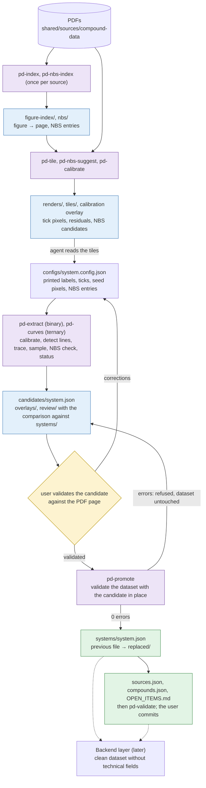
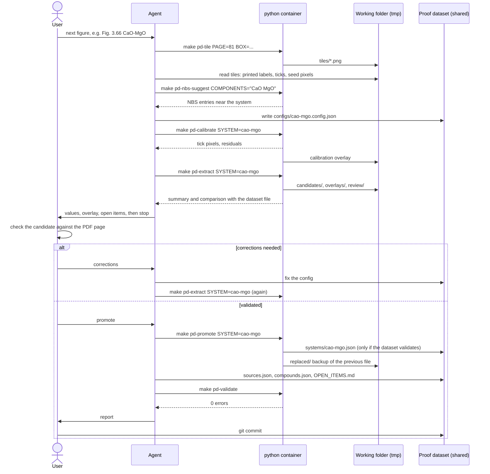

# Phase-Diagram Extraction — Specification

## Purpose

Produce the phase-diagram dataset in `shared/processed/phase-diagrams/` from scanned
figures of the Slag Atlas, cross-checked against NSRDS-NBS 61, in a reproducible way.


| Output                                                                                       | Produced from                                                   | Mode                                              |
| -------------------------------------------------------------------------------------------- | --------------------------------------------------------------- | ------------------------------------------------- |
| `candidates/<system>.json` (binary systems)                                                  | `configs/<system>.config.json` + measurements on the atlas page | Regenerated completely, in the working folder     |
| `candidates/<system>.json` (ternary: `polyline_wt` of boundary curves, isotherms and inversion curves, `liquidImmiscibility.polylines_wt` filled) | `configs/<system>.curves.config.json` + measurements            | Copy of the dataset file; nothing else changes    |
| `systems/<system>.json` in the dataset                                                       | A candidate, after user validation (`promote`)                  | Copied only if the dataset still validates        |
| Review overlay, review list, comparison, renders, indexes                                    | Same run                                                        | Working files, not committed                      |
| Validation report                                                                            | Whole dataset                                                   | Console, exit code                                |


### Data layers

1. **Working folder** `tmp/reports/python/phase-diagrams/`: renders, tiles, overlays, review
   lists, NBS dumps, the figure index and candidates. Regenerable, not committed.
2. **Proof dataset** `shared/processed/phase-diagrams/`: organised files in which every value
   keeps its source, page, pixel or NBS entry and notes, so that it can be checked against the
   original. Written only by `promote` after user validation (and by hand for `sources.json`,
   `compounds.json`, `OPEN_ITEMS.md`). Committed.
3. **Backend dataset** (later): a clean, functional dataset generated from the proof dataset
   for the backend, without the technical layers (pixels, digitization notes, comparisons).
   Not part of this tool yet.

The backend dataset feeds the phase-equilibrium implementation (step 3 of the
phase-diagram rework, see `docs/algorithms/phase-equilibrium/FULL_PHASE_EQUILIBRIUM.md`).

---


## Principles

1. **The config is the source of truth.** Everything a person decides or reads lives in
  the config: page and figure, axis tick values, printed labels, phases at each invariant,
   chosen NBS entries, notes and hand-written blocks. The tool measures the rest (pixels,
   line temperatures, curve points, digitized compositions, NBS comparisons, statuses) and
   writes the system JSON. Running it twice gives the same file.
2. **No data without proof.** Every value in the output carries its figure, printed page,
  PDF page and pixel (atlas) or entry number and page (NBS). A value that cannot be traced
   to a source is not written.
3. **OCR only suggests.** Tesseract readings of labels and captions appear in the review list
  and the figure index. They never go into the system JSON.
4. **Printed labels win over the drawing.** Temperatures and compositions of invariant points
  are the printed labels. Where the drawing differs from a label (for example Fig. 3.125
   draws the "38" eutectic at 39.3 wt%), the label is used, the difference is reported, and
   traced points near that junction are dropped (see [Curve sampling](#curve-sampling)).
   Values without a printed label are digitized and flagged as such.
5. **Statuses follow** `sources.json` **→** `statusLegend`**.** The tool computes `extracted`,
  `confirmed` and `conflict`; it never writes `recalled`.
6. **Container only.** Every step is a command of this tool running in the `python`
  container (`make pd-*` or `docker compose run --rm python …`). No scripts on the host and
  no ad-hoc scripts outside the project; an analysis needed more than once becomes a command
  or a `-v` output. Artifacts go to the working folder only.
7. **The dataset changes only through promotion.** `extract` and `trace-curves` write
  candidates; `promote` copies a candidate after user validation.

---


## Folders


| Folder                                                                                 | Content                                                                | Git                                                      |
| -------------------------------------------------------------------------------------- | ---------------------------------------------------------------------- | -------------------------------------------------------- |
| `shared/sources/compound-data/`                                                        | Slag Atlas, NSRDS-NBS 61 (Parts I, II, IV) and JANAF PDFs; paths in `sources.json` | ignored by `shared/sources/.gitignore` (large files) |
| `shared/processed/phase-diagrams/`                                                     | Dataset: `compounds.json`, `sources.json`, `OPEN_ITEMS.md`, `systems/` | ignored by `shared/.gitignore`; commit with `git add -f` |
| `shared/processed/phase-diagrams/configs/`                                             | Per-diagram configs                                                    | same as above                                            |
| `tmp/reports/python/phase-diagrams/` (`/app/reports/phase-diagrams/` in the container) | Working files                                                          | ignored (`tmp/*`)                                        |


The working folder is the only `tmp/` path mounted into the `python` container
(`./tmp/reports/python:/app/reports` in `compose.yml`), so no compose change is needed.

Working folder layout:

```
tmp/reports/python/phase-diagrams/
  renders/        slag-atlas-1995-p108-400dpi.png        ← page renders (cache)
  tiles/          p108-2280-2650-2930-3060-x1.png        ← zoom tiles with pixel rulers
  overlays/       mgo-sio2.png                           ← traced curves, invariants, ticks on the scan
  review/         mgo-sio2.md                            ← items to check + comparison with the dataset file
  candidates/     mgo-sio2.json                          ← extract / trace-curves output, waiting for validation
  replaced/       mgo-sio2.20261006-211200.json          ← dataset file replaced by promote (backup)
  figure-index/   slag-atlas-1995.json                   ← caption OCR: figure → PDF page
  nbs/            nsrds-nbs-61-1.txt                     ← pdftotext -layout dump (page breaks kept)
                  nsrds-nbs-61-1.entries.json            ← parsed entries
                  nsrds-nbs-61-1.unparsed.txt            ← lines that did not parse
```

---


## Implementation layout

One export per file, dataclasses for models, files grouped in subpackages by
responsibility (empty `__init__.py` in each), public API re-exported from the top-level
`__init__.py` (same conventions as `python/src/nasa_thermo/`). No dependencies beyond
`python/pyproject.toml` (numpy, scipy, Pillow, opencv-python, pytesseract) and the
container's `poppler-utils` and `tesseract-ocr`.

```
python/
  src/
    phase_diagrams/
      __init__.py                    ← public API re-exports
      constants/
        oxide_molar_mass.py          ← OXIDE_MOLAR_MASS
        status_tolerance.py          ← STATUS_TOLERANCE (ΔT 10 °C, Δ 1.5 wt%)
        comparison_tolerance.py      ← COMPARISON_TOLERANCE (±3 °C, ±0.2 wt% box)
      models/                        ← dataclasses
        frame.py                     ← Frame: four fitted edge lines, corners
        measured_line.py             ← MeasuredLine: y, temperature, x-extent
        traced_curve.py              ← TracedCurve: pixel path + data points
        curve_sample.py              ← CurveSample: sampled points, dropped and uncovered grid values
        axis_calibration.py          ← AxisCalibration: tick pixels ↔ values, piecewise linear
        binary_calibration.py        ← BinaryCalibration: x + y AxisCalibration + rotation
        ternary_calibration.py       ← TernaryCalibration: corners + optional quadratic warp
        calibration_result.py        ← CalibrationResult: frame, calibration, tick pixels, residuals
        binary_extraction.py         ← BinaryExtraction: system dict + measurements (overlay, review, log)
        ternary_fill.py              ← TernaryFill: new file text + traces, review, log
        nbs_entry.py                 ← NbsEntry
        nbs_comparison.py            ← NbsComparison: converted wt%, ΔT, Δ, within tolerance
        review_item.py               ← ReviewItem
        validation_issue.py          ← ValidationIssue
        system_comparison.py         ← SystemComparison: differences + notes (candidate vs dataset)
      config/
        diagram_config.py            ← DiagramConfig (binary config)
        curves_config.py             ← CurvesConfig (ternary curves config)
        invariant_spec.py            ← InvariantSpec (config entry)
        liquidus_branch_spec.py      ← LiquidusBranchSpec (config entry)
        trace_segment_spec.py        ← TraceSegmentSpec: trace | straight | flat
        config_loader.py             ← load_config: DiagramConfig or CurvesConfig by file name (+ schema checks)
        source_registry.py           ← reads sources.json: PDF paths, page mappings, figures
      rendering/
        pdf_renderer.py              ← render_page(pdf, page, dpi) with cache
        tile_renderer.py             ← render_tile(page image, box, scale) with pixel rulers
        overlay_renderer.py          ← review PNG
      detection/
        ink_mask.py                  ← ink_mask(image, threshold)
        stroke_width_filter.py       ← keep strokes in a width range (drops text and arrows)
        frame_detector.py            ← detect_frame(mask, search_box)
        tick_detector.py             ← detect_ticks(mask, frame) → pixel positions per edge
        tick_matcher.py              ← pair detected ticks with config tick values
        horizontal_line_detector.py  ← detect_horizontal_lines(mask, frame) → MeasuredLine[]
        vertical_line_detector.py    ← compound lines (vertical strokes) for the calibration check
        junction_locator.py          ← snap a seed pixel to a curve × line junction
      tracing/
        curve_tracer.py              ← trace_path(mask, start, end, waypoints) (heapq Dijkstra)
        curve_sampler.py             ← sample a TracedCurve on a wt% grid with endpoint rules
        polyline_simplifier.py       ← Douglas–Peucker in wt% space (ternary polylines)
      figures/
        label_reader.py              ← Tesseract on a crop → guess + confidence
        caption_parser.py            ← figure captions and labels in the OCR text of one page
        figure_indexer.py            ← caption OCR over a page range → figure index
        figure_index_merger.py       ← merge a re-indexed page range into the existing index
      nbs/
        nbs_text_normalizer.py       ← fixes OCR noise in the NBS text layer
        nbs_entry_index.py           ← parse the NBS dump into NbsEntry[]
        nbs_matcher.py               ← compare an invariant with NBS entries → NbsComparison[]
        status_resolver.py           ← extracted / confirmed / conflict
        composition_converter.py     ← mol% ↔ wt%
      builders/
        binary_calibrator.py         ← calibrate_binary(mask, config): frame + ticks → CalibrationResult
        binary_system_builder.py     ← config + measurements → system dict
        ternary_curve_filler.py      ← fills polyline_wt in an existing ternary file
      output/
        system_json_writer.py        ← compact layout writer (binary files)
        review_report.py             ← review markdown
        system_comparer.py           ← compare_systems(old, new) → SystemComparison
      validation/
        dataset_validator.py         ← validate the whole dataset → ValidationIssue[]
        candidate_validator.py       ← validate the dataset with a candidate in place (temporary copy)
    scripts/
      extract_phase_diagram.py       ← CLI entry point (thin wrapper)
  tests/
    phase_diagrams/                  ← no __init__.py (it would shadow src/phase_diagrams)
      conftest.py                    ← fixtures
      pd_helpers.py                  ← synthetic diagram, NBS text snippet, small dataset
      fixtures/golden/               ← writer golden files (copies of al2o3-mgo.json, mgo-sio2.json)
      test_calibration.py
      test_detectors.py
      test_curve_tracer.py
      test_curve_sampler.py
      test_composition_converter.py
      test_nbs.py
      test_figure_index.py           ← caption parser and index merge on real OCR text
      test_status_resolver.py
      test_system_json_writer.py
      test_ternary_curve_filler.py
      test_dataset_validator.py
      test_candidates.py             ← comparison, promotion check on a temporary dataset copy
      test_regression_atlas.py       ← needs the atlas PDF; skipped when absent
```

---


## Per-diagram workflow

### Data flow

One figure from PDF to the proof dataset. Colours: purple runs as `make pd-*` in the
`python` container, blue is the working layer (`tmp/reports/python/phase-diagrams/`, not
committed), green is the proof layer (`shared/processed/phase-diagrams/`, committed), yellow
is the user, white is written by the agent. Dotted: the later backend step.



### Interaction

Who does what for one figure. The agent runs every command in the container and never
writes `systems/` itself; the user validates, decides on promotion and commits.



### Binary system

1. **Locate** the figure in `figure-index/slag-atlas-1995.json` (`make pd-index` once).
2. **Render and look**: `make pd-tile PAGE=108 BOX="1050 1700 2950 4000"`. Read the
  printed labels from the tiles.
3. **Write the config** `configs/<system>.config.json`: source, axis tick values, phases,
  invariants with printed labels and seed pixels, liquidus branches, verbatim blocks.
4. **Calibrate**: `make pd-calibrate SYSTEM=mgo-sio2` detects the frame and ticks, prints
  the tick pixels and residuals, and writes an overlay. Fix the config if a tick is wrong
   (optional `tickPixels` override).
5. **Find NBS candidates**: `make pd-nbs-suggest COMPONENTS="MgO SiO2"`; add the chosen
  entry numbers to the invariants.
6. **Extract**: `make pd-extract SYSTEM=mgo-sio2` writes `candidates/mgo-sio2.json`, the
  overlay and the review list, and compares the candidate with the dataset file.
7. **Review** the overlay and `review/mgo-sio2.md`; carry open items into `OPEN_ITEMS.md`.
8. **Stop for user validation** of the candidate (overlay, review list, values vs. the page).
9. **Promote**: `make pd-promote SYSTEM=mgo-sio2` copies the candidate into `systems/` if
  the dataset still validates; the replaced file goes to `replaced/`.
10. Update `compounds.json` and `sources.json` by hand where the new figure adds sources,
  run `make pd-validate`; the user commits.


### Ternary curves

1. Write `configs/<system>.curves.config.json` (waypoints, isotherm seeds, pixel origin).
2. `make pd-curves SYSTEM=cao-mgo-sio2` writes a candidate copy of the system file with
   `polyline_wt` filled, the overlay and the review list. Check the traces on
   `make pd-tile PAGE=… BOX=… OVERLAY=cao-mgo-sio2` zooms.
3. `make pd-validate SYSTEM=cao-mgo-sio2` (dataset with the candidate in place).
4. Stop for user validation, `make pd-promote SYSTEM=cao-mgo-sio2`, validate; the user commits.


### Candidates, comparison and promotion

- The candidate name is the file name of the config output (`output` of a binary config,
  `systemFile` of a curves config): `candidates/mgo-sio2.json`.
- `compare_systems(old, new)` (also printed by `extract` / `trace-curves` and appended to the
  review list): invariant ids, type, reaction, phases, temperature, liquid compositions,
  status and NBS sources must be identical; liquidus branches and the miscibility dome must
  pass through the box ±0.2 wt% × ±3 °C (`COMPARISON_TOLERANCE`) around every point of the
  dataset file. Changed atlas source text or pixels and filled ternary polylines are notes,
  not differences. `compare` exits 1 when there are differences.
- `promote` validates a temporary copy of the dataset with the candidate in place
  (`validate_with_candidate`); with errors it refuses (exit 1) and the dataset is untouched.
  Differences do not block promotion: they are what the user validated.
- `validate --candidate SYSTEM` (`make pd-validate SYSTEM=…`) runs the same check without
  writing, so a candidate can be validated before the user review.

---


## Coordinate systems

All pixels are page coordinates of the PDF page rendered with `pdftoppm -r 400`
(3306 × 4673 px for the atlas), the same convention already used in the dataset.
A config may declare `pixelOrigin: [dx, dy]` when stored pixels come from a crop
(`cao-al2o3-sio2.json` was digitized on a 1620 × 1776 crop; its origin must be
determined once by matching the corners before its curves are traced).

### Binary calibration

- x: piecewise-linear interpolation between tick pairs (value, pixel) of the x component
in wt%. y: same for temperature in °C.
- Scan rotation: a linear term from the frame lines, `y_level = py − s · (px − px_ref)`,
where `s` is the slope of the bottom frame line (`y = a + s · x`); and
`x_level = px − k · (py − py_ref)` for the left frame tilt (`x = a + k · y`). The reference
is the bottom-left frame corner; x ticks are measured along the bottom edge, y ticks along
the left edge, so the tick pixels are already levels.
- Linear extrapolation beyond the outer ticks (needed for liquidus ends above the top tick).
- Calibration check: tick residual ≤ 2 px against a straight-line fit; compound lines
(vertical strokes) must fall within 0.3 wt% of stoichiometry.


### Ternary calibration

- Barycentric from the three corner pixels: solve
`[[xA, xB, xC], [yA, yB, yC], [1, 1, 1]] · [a, b, c] = [px, py, 1]`, then × 100.
- Optional quadratic warp (stored in the system file `digitization.warpCorrection`):
features `f = [1, x, y, x², xy, y²]` with `x = (px − 1100)/1000`, `y = (py − 1100)/1000`;
ideal pixel = `f · C`; then barycentric. Read from the system file, never refitted by the
curve filler.

---


## Config schema


### Binary config — `configs/<system>.config.json`

```json
{
  "system": "MgO-SiO2",
  "components": ["MgO", "SiO2"],
  "output": "systems/mgo-sio2.json",
  "idPrefix": "ms",
  "source": {
    "ref": "slag-atlas-1995", "figure": "Fig. 3.125", "printedPage": 88, "pdfPage": 108,
    "diagram": "MgO-SiO2 phase diagram based mainly on ...", "caption": "Atlas text (printed p. 88): ..."
  },
  "frameSearchBox": [1300, 2050, 3050, 3400],
  "axes": {
    "x": { "component": "SiO2", "ticks": [0, 10, 20, 30, 40, 50, 70, 80, 90, 100] },
    "y": { "ticks": [3000, 2800, 2600, 2400, 2200, 2000, 1800, 1600, 1400, 1200, 1000] }
  },
  "phases": ["periclase", "forsterite", "enstatite", "silica"],
  "endMembers": {
    "periclase": { "x": 0, "labelTemperature": 2822 },
    "silica": { "x": 100, "labelTemperature": 1725 }
  },
  "invariants": [
    { "id": "ms-1850", "type": "binary", "reaction": "eutectic", "phases": ["periclase", "forsterite"],
      "label": { "temperature": 1850, "composition": 38 },
      "seedPixel": [2013, 2819],
      "nbs": [],
      "notes": "Fig. 3.187 edge prints ~1860 °C at 36.2 wt% SiO2 (mas-edge-periclase-forsterite)." },
    { "id": "ms-1695", "type": "monotectic", "reaction": "monotectic", "phases": ["silica"],
      "label": { "temperature": 1695, "composition": 70, "secondComposition": null },
      "seedPixel": [2457, 2905], "secondSeedPixel": [2904, 2904], "nbs": [] }
  ],
  "liquidus": [
    { "phase": "periclase", "from": "end:periclase", "to": "ms-1850",
      "segments": [ { "kind": "trace", "seedPixel": [1798, 2522] } ],
      "grid": [0, 2, 5, 10, 15, 20, 25, 30, 32, 34, 36, 37, 38] },
    { "phase": "silica", "from": "ms-1543", "to": "end:silica",
      "segments": [
        { "kind": "trace", "to": "ms-1695", "seedPixel": [2443, 2918] },
        { "kind": "flat", "from": "ms-1695", "to": "ms-1695:second" },
        { "kind": "trace", "from": "ms-1695:second" }
      ],
      "grid": [64, 65, 66, 67, 68, 68.5, 69, 70, 100] }
  ],
  "liquidImmiscibility": {
    "monotectic": "ms-1695", "seedPixel": [2739, 2753], "waypoints": [[2862, 2798]],
    "grid": [72, 74, 76, 78, 80, 82, 84, 86, 90, 92, 94, 95, 96, 97, 98],
    "criticalPointNotes": "Critical temperature after Hageman, Oonk [5], adopted by the atlas.",
    "notes": "No crystals inside the dome; ..."
  },
  "junctionTolerance_wt": 1.5,
  "verbatim": {
    "nbsCrossCheck": { "ref": "nsrds-nbs-61-1", "result": "No MgO-SiO2 binary entry ..." },
    "solidSolutions": [],
    "inversions": []
  }
}
```


| Field                    | Required | Meaning                                                                              |
| ------------------------ | -------- | ------------------------------------------------------------------------------------ |
| `system`, `components`   | yes      | Output `system` and `components` (order of `liquid_wt` keys)                         |
| `output`                 | yes      | Path relative to the dataset folder                                                  |
| `idPrefix`               | yes      | Prefix of generated ids (`as`, `am`, `ms`, …)                                        |
| `source`                 | yes      | Copied to the output `source` block                                                  |
| `frameSearchBox`         | yes      | Page region containing the diagram (atlas pages hold two diagrams)                   |
| `axes.x.component`       | yes      | Oxide plotted on x, in wt%                                                           |
| `axes.*.ticks`           | yes      | Tick values from left to right / top to bottom; leave out a tick hidden on its edge (x: the 60 tick of Fig. 3.125 under the MgSiO3 line). y ticks hidden on the left edge are taken from the right edge |
| `axes.*.tickPixels`      | no       | Manual override when detection fails                                                 |
| `endMembers`             | yes      | Pure-oxide ends of the liquidus: x position and printed melting temperature          |
| `invariants[].label`     | yes      | Printed values; `null` composition = not printed, digitized value used and flagged. `null` temperature = not printed: the detected invariant line gives it; an unlabelled eutectic without a detected line (dashed, schematic) takes the lowest traced point of its two liquidus curves; flagged `unlabelled`. Not allowed for `compound-melting` |
| `invariants[].seedPixel` | yes      | Approximate junction pixel; snapped by `junction_locator`                            |
| `invariants[].nbs`       | yes      | Chosen NBS entry numbers (may be empty)                                              |
| `invariants[].secondSeedPixel` | monotectic | Junction of the second liquid (`<id>:second`)                                |
| `invariants[].labelBox`  | no       | `[x0, y0, x1, y1]` around the printed temperature; OCR guess goes to the review list |
| `liquidus[].segments`    | yes      | `trace` (followed along ink), `straight` (two points), `flat` (constant temperature) |
| `segments[].seedPixel`, `segments[].waypoints` | no | Points on the stroke, visited in that order (seed first) by the tracer       |
| `liquidus[].grid`        | yes      | wt% values to sample; endpoint values are replaced by the invariant labels           |
| `liquidImmiscibility`    | no       | Dome traced from the monotectic through `seedPixel` and `waypoints`; critical point = middle of the traced maximum (within 0.5 °C); `criticalPointNotes`, `notes` copied |
| `junctionTolerance_wt`   | no       | Default 1.5; see [Curve sampling](#curve-sampling)                                   |
| `strokeWidth_px`         | no       | `[min, max]`: trace the liquidus on strokes of that width only (figures that overlay thinner alternative versions); see [Ink mask and stroke filter](#ink-mask-and-stroke-filter) |
| `verbatim`               | no       | Blocks copied unchanged into the output (hand-written knowledge)                     |


References: `end:<phase>` = end-member melting point, `<id>` = invariant liquid,
`<id>:second` = second liquid of a monotectic.

### Ternary curves config — `configs/<system>.curves.config.json`

```json
{
  "systemFile": "systems/cao-mgo-sio2.json",
  "pdfPage": 154,
  "pixelOrigin": [0, 0],
  "strokeWidth_px": [3.5, 9],
  "isothermStrokeWidth_px": [2, 5],
  "endpointPixels": { "cas-edge-silica-wollastonite": [612, 1180] },
  "curves": [
    { "fields": ["silica", "wollastonite"], "path": ["cas-edge-silica-wollastonite", "cms-1320"], "waypoints": [] },
    { "fields": ["kalsilite", "corundum"], "path": ["kas-1556", "kas-1687"], "endPixel": [2010, 2330], "strokeWidth_px": [5, 14] },
    { "fields": ["mullite", "corundum"], "path": ["kas-edge-mullite-corundum", "kas-1315"],
      "waypoints": [[2050, 1853], { "pixel": [1999, 1798], "straight": true }] }
  ],
  "isotherms": [
    { "field": "silica", "temperature_C": 1400, "startPixel": [1010, 900], "endPixel": [1120, 1010], "waypoints": [] }
  ],
  "inversions": [
    { "phase": "nepheline", "change": "carnegieite → nepheline (NaAlSiO4)", "startPixel": [2052, 1200], "endPixel": [1770, 1353] }
  ],
  "liquidImmiscibility": [
    { "startPixel": [1334, 1097], "endPixel": [1672, 502], "strokeWidth_px": [3, 16],
      "waypoints": [[1546, 915], { "pixel": [1571, 876], "straight": true }] }
  ]
}
```

- Curves are matched to `boundaryCurves[]` by `fields` and `path`; isotherms by `field` and
`temperature_C`; inversions to `inversions[]` by `phase` and `change`. Unmatched config
entries are errors.
- `inversions` (optional): a polymorph boundary drawn as a line between two fields that the
model merges into one phase (carnegieite / nepheline), so it is not a boundary curve. Traced
like an isotherm from `startPixel` to `endPixel` with the curve stroke width.
- `liquidImmiscibility` (optional): branches of the two-liquid boundary on the liquidus surface,
each traced like an inversion. They are written in config order to
`liquidImmiscibility.polylines_wt` (one polyline per branch); the system file must already
have a `liquidImmiscibility` object.
- End pixels come from the invariant sources (`pixel`) of the system file. Points defined in
another system file (edge points) need `endpointPixels`.
- All config pixels (`endpointPixels`, waypoints, isotherm ends) are in the stored coordinates
of the system file; `pixelOrigin` converts them to page pixels.
- A boundary curve is traced segment by segment along its `path`; each waypoint belongs to the
nearest segment. Every path invariant is an exact polyline vertex (its `liquid_wt`).
- A waypoint is `[x, y]` (traced to) or `{ "pixel": [x, y], "straight": true }`: joined to the
previous point (waypoint or segment start) by a straight line, for a stroke hidden by a label;
the tracer would otherwise follow the letters (ink costs 1, a gap 50 per pixel). Put the
previous point on the last visible pixel before the label. Each straight step is logged.
- Polylines are rounded to 0.1 wt%. A component down to −0.3 wt% (stroke ending on an edge)
is set to 0 and taken from the largest component (logged); further outside is an error.
- `endPixel`: open end of a curve that leaves the figure; traced from the last path point,
the last vertex is the calibrated pixel (not an invariant). Required for a single-point path.
- Two consecutive path points drawn within 2 px (e.g. `kas-1140` / `kas-1150`, separated only
in an inset) are joined directly by their compositions, without tracing.
- Stroke widths: `strokeWidth_px` (default [3.5, 9]) for curves, inversions and immiscibility branches, `isothermStrokeWidth_px`
(default: `strokeWidth_px`) for isotherms; any entry may set its own `strokeWidth_px`. The
command passes the plain ink mask and each entry is traced on the mask filtered to its width
(figures draw isotherms thinner than boundary curves).

---


## Algorithms


### Ink mask and stroke filter

- Grey < 128 → ink.
- Stroke width = 2 × distance transform at the skeleton. The filter keeps strokes inside
`strokeWidth_px`; text, thin arrows and dashed lines drop out. Binaries use the plain mask
restricted to the frame; ternaries use the filtered mask.
- A binary config with `strokeWidth_px` traces the liquidus (and snaps end-member and
compound-melting pixels) on the filtered mask; calibration, invariant lines and junctions
keep the plain mask. Used when a figure overlays thinner alternative versions (Fig. 3.35).


### Frame and ticks

- Frame: the largest connected ink component inside `frameSearchBox`; each edge is a robust
straight-line fit through the outermost ink of that component (horizontal edges
`y = a + s · x`, vertical edges `x = a + k · y`), so the scan rotation comes with the frame.
- Ticks: short perpendicular runs touching the inside of the bottom, left and right edges:
≥ 5 ink pixels in a 20 px band next to the edge, no ink in the 15 px beyond the band (that
would be a curve or a compound line), cluster width ≤ 9 px.
- y ticks: right-edge ticks are moved to the left edge along the frame rotation and merged
with the left-edge ticks (averaged when both exist), so a tick hidden by a curve on one side
is taken from the other (Fig. 3.125: 2800 °C under the periclase liquidus).
- Matching: every pair of candidates is tried as two consecutive values; pixels must increase
in list order; tolerance max(3 px, 5 % of the spacing). Frame lines count as candidates (the
frame stands in for an outer tick). Winner: most matched values, then most anchors agreeing
within half a spacing (anchors = invariant seed pixels at their printed values, which resolves
evenly spaced ticks shifted by one), then spacings ≥ 75 % of the widest (minor ticks are
skipped), then the smallest mean error.
Unmatched values are errors unless `tickPixels` overrides them.


### Horizontal invariant lines

Deskewed rows inside the frame with ink runs ≥ 80 px (2 px gaps bridged); runs in
consecutive rows with overlapping extents are merged; temperature from the centre row.
Pieces of one line broken by a label (levels within 4 px, extents not overlapping) are joined;
the level is the length-weighted mean. Each invariant is matched to the line nearest its seed
(within 15 px, seed inside the line extent ± 40 px). The measured temperature goes to
`digitization.check` and the review list; the output temperature is the printed label.

### Junctions

1. `junction_locator` follows the curve from the seed in the rows just above the line and
   extends it to the line centre; for a curve meeting the line at a shallow angle it follows
   the curve column by column from the curve pixel nearest the seed instead.
2. After all segments are traced, each junction is refined from the traced branches: the
   25 path pixels after leaving the line stroke are fitted with a straight line and extended
   to the line centre; the junction is the mean over the branches (both liquidus branches of a
   eutectic, liquidus and dome at a monotectic). The digitized composition is reported next to
   the printed label.
3. Compound melting: the seed is kept when it lies on ink (otherwise snapped to the nearest
   stroke in its column); the reported maximum is the highest traced pixel within 60 path
   pixels of the seed, and its composition the middle of the region within 0.5 °C of it.
4. End members: the printed melting point moved 8 px inside the frame and snapped to the
   nearest stroke in its column.

### Curve tracing

- Shortest path (heapq Dijkstra, 8-connected) on a cost image: 1 on ink, 50 off ink, so
small gaps are bridged but labels are not followed. Optional waypoints split the path.
- Restricted to the bounding box of the endpoints and waypoints plus a 40 px margin.
- For a binary `trace` segment the endpoints are the snapped junctions or the end-member
axis crossing; the seed pixel chooses the correct stroke when several are near.
- A path that crosses more than 15 px of non-ink in total is reported as a trace gap.


### Curve sampling

- Pixel path → (wt%, °C) with the calibration; sorted by wt%; linear interpolation on the
grid.
- The first and last points of a branch are replaced by the printed invariant or end-member
values, so every branch starts and ends exactly at its invariant.
- If the drawn junction differs from its printed composition by more than 0.5 wt%, grid
points within `junctionTolerance_wt` of the printed composition are dropped (on the side
of the branch) and the omission is recorded in `liquidusSource.read`.
- Temperatures are rounded to 1 °C, compositions to 0.1 wt%.
- Ternary polylines: path → wt% triples (calibration + warp), simplified with
Douglas–Peucker at 0.1 wt%, first and last points equal to the endpoint invariants.


### Labels and figures (OCR)

- `label_reader`: crop around the label, ×4 upscale, Tesseract `--psm 7` with a digit
whitelist. The guess and confidence are compared with the config label; differences are
review items.
- `figure_indexer`: each page at 150 dpi in grey, Tesseract on the full page; output
`{figure, pdfPage, printedPage, captionStart}` per figure.
- `caption_parser`: a caption starts a line with `Fig.`, `Figs.` or `Figure(s)`, one or more
figure numbers and `.` or `,` (OCR reads some full stops as commas). Shared captions name
several figures: `Figs. 3.64 and 3.65.`, `Figures 3.188 to 3.190.` (ranges are expanded).
Text after the number on the same line makes it a caption (`captionStart` = the next 160
characters); without text it is the label under a drawing, which records the figure on that
page with an empty `captionStart` unless a caption on the page names the same figure.
Cross-references wrapped to a line start (`Fig. 3.251) are not included ...`) do not match.
- `figure_index_merger`: re-indexing a page range replaces only the entries of those pages;
the index stays sorted by PDF page and figure number.

---


## NSRDS-NBS 61


### Text index

- `pdftotext -layout` of the whole PDF into `nbs/nsrds-nbs-61-1.txt`; page breaks (`\f`)
give the PDF page; printed page = PDF page − 8 (`sources.json` page mapping).
- `nbs_text_normalizer` fixes recurrent OCR noise of the text layer before parsing:

  | Raw                                                       | Normalized |
  | --------------------------------------------------------- | ---------- |
  | `Si0 2`, `Si0,`, `SiO,`, `SiO.`                           | `SiO2`     |
  | `YlgO`, `MgoO`                                            | `MgO`      |
  | `AI,O,`, `Al,O,`, `Al,0,`, `A1,0,`                        | `Al2O3`    |
  | `Ca0`                                                     | `CaO`      |
  | `K,0`, `K 2O`, `K,O`                                      | `K2O`      |
  | `Na,O`, `Na,0`                                            | `Na2O`     |
  | `:t`, `±o`, `=` before a number in the uncertainty column | `±`        |

- Entry line: entry number (4 digits), system (components joined by `-`), composition
(one value for binaries, `a-b-c` for ternaries, optional `APP`), temperature with optional
uncertainty or `APP`, reference numbers. Lines that look like entries but do not parse go
to `nsrds-nbs-61-1.unparsed.txt`.


### Conversion and comparison

- Composition basis: mol%. Binaries: the value is mol% of the first-named component of the
NBS system (which may differ from the order of `components`). Ternaries: values in the
order of the NBS system name.
- wt% via `OXIDE_MOLAR_MASS`: CaO 56.077, MgO 40.304, SiO2 60.084, Al2O3 101.961,
Na2O 61.979, K2O 94.196 g/mol.
- ΔT = T(NBS) − T(atlas); Δ = largest absolute difference over the oxides, in wt%.
- Each comparison is written as an NBS source of the invariant (`reported`,
`converted_wt`, `originalReference`, `comparison` text, as in `al2o3-mgo.json`).
- `nbs-suggest` lists every entry whose normalized system contains exactly the given
components, with converted wt% and temperature, for choosing entries in the config.


### Status


| Condition                                                                    | Status      |
| ---------------------------------------------------------------------------- | ----------- |
| No NBS entry chosen                                                          | `extracted` |
| At least one chosen entry within tolerance (abs(ΔT) ≤ 10 °C and Δ ≤ 1.5 wt%) | `confirmed` |
| Entries chosen, none within tolerance                                        | `conflict`  |


Approximate (`APP`) entries are compared like the others and marked "(approximate value)".
Liquidus branches are always `extracted`.

---


## Output: binary system JSON

Same schema and key order as the existing binary files (`al2o3-mgo.json`, `mgo-sio2.json`).


| Key                              | From                                                                                                                                             |
| -------------------------------- | ------------------------------------------------------------------------------------------------------------------------------------------------ |
| `system`, `components`, `phases` | config                                                                                                                                           |
| `units`                          | fixed: `temperature_C` °C, `liquid_wt` wt%, `liquidus` `[wt% <x component>, °C]`                                                                 |
| `source`                         | config                                                                                                                                           |
| `nbsCrossCheck`                  | config `verbatim` (when present)                                                                                                                 |
| `digitization.render`            | generated (page, dpi, size, "full page coordinates")                                                                                             |
| `digitization.calibration`       | generated (tick pixels, rotation)                                                                                                                |
| `digitization.method`            | fixed text                                                                                                                                       |
| `digitization.check`             | generated: compound-line positions, line temperatures vs labels, digitized vs printed compositions                                               |
| `invariantPoints[]`              | config (id, type, reaction, phases, label values, notes) + generated (`liquid_wt`, `status`, atlas source reading text and `pixel`, NBS sources) |
| `liquidImmiscibility`            | generated from the config block (boundary points, critical point)                                                                                |
| `solidSolutions`, `inversions`   | config `verbatim`                                                                                                                                |
| `liquidus[]`                     | generated points; `from`/`to` from config; `status` `extracted`                                                                                  |
| `liquidusSource`                 | generated text: label end points, dropped points                                                                                                 |


Id convention: `<prefix>-<temperature>` for binary and monotectic invariants,
`<prefix>-<phase>-melting` for congruent compound melting.

Layout: 2-space indent; each invariant, liquidus branch and source on its own line or short
block, as in `mgo-sio2.json`. The layout is fixed by a golden-file test.

### Ternary files

`ternary_curve_filler` replaces the `null` of each matched `"polyline_wt": null` in the file
text, keeping the hand-written formatting. After writing, the file is parsed again and every
key other than the filled `polyline_wt` values must be unchanged; otherwise the write is
rolled back. If `units` has no `polyline_wt` entry, the filler adds
`"polyline_wt": "[wt% A, wt% B, wt% C]"` (order of `components`) to the flat `units` object.
A matched `inversions[]` entry without `polyline_wt` gets the key appended before its closing
`}`; likewise `polylines_wt` in the `liquidImmiscibility` object. These keys are the only other
changes allowed.
Polyline format: `[[a, b, c], …]` in wt% in the order of `components`; `polylines_wt` is a list
of such polylines.

---


## Review outputs

- **Overlay** (`overlays/<system>.png`): the diagram crop with detected ticks, invariant
lines, snapped junctions, traced paths and sampled points drawn in colour; legend with ids.
- **Review list** (`review/<system>.md`): one line per item, grouped by kind:

  | Kind              | Raised when                                                                                  |
  | ----------------- | -------------------------------------------------------------------------------------------- |
  | `label-drawing`   | drawn composition differs from the printed label by > 0.5 wt%, or line temperature by > 3 °C |
  | `unlabelled`      | value digitized without a printed label                                                      |
  | `nbs-conflict`    | an invariant ends as `conflict`                                                              |
  | `nbs-approximate` | an `APP` entry was used                                                                      |
  | `trace-gap`       | traced path crosses > 15 px of non-ink                                                       |
  | `tick-residual`   | tick residual > 2 px                                                                         |
  | `ocr-differs`     | OCR label guess differs from the config label                                                |
  | `dropped-points`  | grid points dropped near a junction                                                          |


The review list is copied into `OPEN_ITEMS.md` by hand after reading it.

---


## Validation

`dataset_validator` checks the whole dataset folder. Errors make the exit code 1;
warnings do not.


| Code  | Level   | Rule                                                                                                                                         |
| ----- | ------- | -------------------------------------------------------------------------------------------------------------------------------------------- |
| PD001 | error   | Every JSON file parses                                                                                                                       |
| PD002 | error   | `liquid_wt` / `secondLiquid_wt` sum to 100 ± 0.1 (inclusive: rounded values summing to 100.1 pass)                                          |
| PD003 | error   | Invariant ids unique across all system files                                                                                                 |
| PD004 | error   | Every phase id (system `phases`, invariant phases, liquidus phases, boundary-curve fields, isotherm fields) exists in `compounds.json`; `null` = unlabelled field |
| PD005 | error   | Liquidus points sorted by composition; first/last point equal the referenced invariant or end-member (composition ± 0.05, temperature exact; a compound end member of a sub-system, e.g. K2O·SiO2 in Fig. 3.117, at its stoichiometric wt%) |
| PD006 | error   | `status` is one of the `statusLegend` keys                                                                                                   |
| PD007 | error   | `confirmed` has at least one NBS source within tolerance; `conflict` has NBS sources and none within tolerance, or — without NBS sources — at least two sources that disagree (atlas-internal conflict, e.g. `nas-1063`) |
| PD008 | error   | Every cited atlas figure is listed in `sources.json` → `figures` with the same pages                                                         |
| PD009 | warning | Atlas invariant source without `pixel`                                                                                                       |
| PD010 | warning | `recalled` value present                                                                                                                     |
| PD011 | error   | Boundary-curve `path` ids exist in some system file                                                                                          |
| PD012 | warning | `polyline_wt` still `null`                                                                                                                   |
| PD013 | error   | `printedPage` / `pdfPage` consistent with the page mapping of the source                                                                     |


---


## CLI interface

```
usage: extract_phase_diagram.py [-h] [--dataset DIR] [--work-dir DIR] [-v] COMMAND ...

Extract phase-diagram data from the Slag Atlas and NSRDS-NBS 61.

global options:
  --dataset DIR    Dataset folder (default: shared/processed/phase-diagrams)
  --work-dir DIR   Working folder (default: reports/phase-diagrams, i.e. the container mount)
  -v, --verbose    Per-step log

commands:
  index-figures --source slag-atlas-1995 --pages 40-200
                   Caption OCR → figure-index/<source>.json (merged by page range)
  tile --page N --box X0 Y0 X1 Y1 [--scale S] [--overlay SYSTEM]
                   Zoom tile with pixel rulers → tiles/; --overlay draws overlays/<SYSTEM>.png
                   over the page (the overlay PNG stores its page origin)
  calibrate SYSTEM Detect frame and ticks; print tick pixels and residuals; overlay
  extract SYSTEM   Binary config → candidates/<system>.json, overlay, review list, comparison
  trace-curves SYSTEM
                   Ternary curves config → candidate with polyline_wt filled, overlay, review list
  compare SYSTEM   Candidate vs dataset file (exit 1 on differences)
  promote SYSTEM   Candidate → dataset if the dataset still validates (exit 1 if not)
  nbs-index        Dump and parse NSRDS-NBS 61 → nbs/
  nbs-suggest COMPONENT [COMPONENT ...]
                   Candidate NBS entries for exactly these components
  validate [--candidate SYSTEM]
                   Validate the whole dataset (with the candidate in place, nothing written)
```

`SYSTEM` is the file stem (`mgo-sio2`); configs are read from `<dataset>/configs/`.
PDF paths come from `sources.json` → `sources.<ref>.file`. `extract` reads the NBS index from
`nbs/nsrds-nbs-61-1.entries.json` (run `nbs-index` first when invariants list NBS entries).
`-v` adds per-step detail: pages during `index-figures` and the captions found; every detected
invariant line (temperature, rows, x extent) during `extract`.
Exit codes: 0 ok, 1 validation errors / differences / promotion refused, 2 config / input error.
The CLI runs in the `python` container only (principle 6).


### Console output example

```
[calibrate] mgo-sio2: frame (1425.4, 2173.6)–(2921.1, 3297.4), rotation +1.4 px over 1495 px
[calibrate] mgo-sio2: x ticks 10/10 matched, max residual 1.6 px; y ticks 11/11 matched, max residual 0.9 px
[extract] lines: 1965.5, 1881.5, 1851.5, 1848, 1696.5, 1621.5, 1555, 1541, 1536.5, 1469.5, 1313
[extract] ms-1850: drawn 38.9 wt% vs label 38 → label used
[extract] ms-1695: drawn 68.9 wt% vs label 70 → label used
[extract] 5 invariants (5 extracted), 5 liquidus branches, 0 NBS comparisons
[extract] overlay → reports/phase-diagrams/overlays/mgo-sio2.png
[extract] review: 6 items → reports/phase-diagrams/review/mgo-sio2.md
[extract] candidate → reports/phase-diagrams/candidates/mgo-sio2.json
[extract] vs systems/mgo-sio2.json: ms-1850: atlas source text or pixel changed
...
```

---


## Make targets

`scripts/make.d/09-phase-diagrams.mk`, all running in the `python` container:


| Target                                              | Command                                                 |
| --------------------------------------------------- | ------------------------------------------------------- |
| `make pd-index [PD_PAGES=40-200]`                   | `index-figures --source slag-atlas-1995 --pages 40-200` |
| `make pd-tile PAGE=108 BOX="x0 y0 x1 y1" [SCALE=2] [OVERLAY=mgo-sio2]` | `tile` (`--overlay`: zoom on the review overlay) |
| `make pd-calibrate SYSTEM=mgo-sio2`                 | `calibrate`                                             |
| `make pd-extract SYSTEM=mgo-sio2`                   | `extract`                                               |
| `make pd-curves SYSTEM=cao-mgo-sio2`                | `trace-curves`                                          |
| `make pd-compare SYSTEM=mgo-sio2`                   | `compare`                                               |
| `make pd-promote SYSTEM=mgo-sio2`                   | `promote` (after user validation)                       |
| `make pd-nbs-index`                                 | `nbs-index`                                             |
| `make pd-nbs-suggest COMPONENTS="MgO SiO2"`         | `nbs-suggest`                                           |
| `make pd-validate [SYSTEM=mgo-sio2]`                | `validate [--candidate mgo-sio2]`                       |
| `make pd-test`                                      | `pytest /app/tests/phase_diagrams/ -v`                  |


---


## Tests

- **Unit tests** on synthetic images drawn with Pillow (frame, ticks, horizontal lines,
curves, a fake label, a gap): calibration and rotation, tick detection and matching, line
detection, junction snapping, tracing (including gap bridging and not following a label),
sampling and endpoint rules, dropped points.
- Composition conversion (round trip, the NBS entries already in the dataset: 6095 →
55.0 / 45.0 wt%, 6077 → 95.0 / 5.0 wt%).
- NBS parsing on real text snippets with OCR noise; normalizer table; suggest filter.
- Figure index on real Tesseract output of atlas pages 80, 81, 134 and 154: single and
shared captions (`and`, ranges), bare labels, cross-references; merge of a re-indexed range.
- Status resolver on the `al2o3-mgo` cases (`am-1995` confirmed, `am-1975` conflict).
- Writer golden file; ternary filler on a small fixture (only `polyline_wt` changes,
rollback on mismatch).
- Validator: one passing fixture dataset and one fixture per error code.
- Candidates: comparison (identical, liquidus inside / outside the box, invariant and NBS
changes, pixel-only notes, filled ternary polylines); validation with a candidate (errors
reported, dataset untouched).
- **Regression** (`test_regression_atlas.py`, skipped without the atlas PDF): regenerating
every promoted binary from its config reproduces the dataset file: `compare_systems`
finds no differences. The promoted binaries are found automatically (every binary config
whose `output` file exists in `systems/`), so promoting a figure needs no test change. "Within" means the regenerated polyline passes through the box
±0.2 wt% × ±3 °C around every current point (on steep branches a 0.1 wt% shift is several
°C). The test uses the render cache and NBS index of the working folder when present.

```bash
make pd-test
docker compose run --rm python python -m pytest /app/tests/phase_diagrams/ -v
```

---


## Acceptance

1. `make pd-test` passes.
2. `make pd-validate` reports no errors on the current dataset.
3. Configs for `al2o3-mgo` and `mgo-sio2` regenerate their files within the regression
  tolerance; the candidates replace the hand-made files (`promote`) after review of the comparison.
4. CaO-MgO (Fig. 3.66, PDF p. 81) is extracted with the tool and passes user validation.

---


## Porting from the working scripts

The first extraction sessions used ad-hoc host scripts in `/tmp/sa` and `/tmp/ph` (no longer
available). Their logic now lives in these modules:


| Scratch script                                            | Module                                                    |
| --------------------------------------------------------- | --------------------------------------------------------- |
| `m64.py`, `m108.py` (calibration, `wt`, `T`)              | `axis_calibration`, `binary_calibration`, `tick_detector` |
| `m64_liq.py`, `m108_liq.py` (`trace`, `traceh`, `sample`) | `curve_tracer`, `curve_sampler`                           |
| `tile.py`                                                 | `tile_renderer`                                           |
| `thick.py`, `*_thick.npy`                                 | `stroke_width_filter`                                     |
| `cfit.py` (quadratic warp fit)                            | `ternary_calibration` (applies stored coefficients)       |
| `corners.py`, `junc.py`, `cms_fix.py`                     | `junction_locator`                                        |
| `labels.py`, `labels2.py`                                 | `label_reader`                                            |
| `/tmp/ph/all.txt`, `nbs_main.json`, `nbs_wt.json`         | `nbs_entry_index`, `nbs_matcher`                          |
| caption OCR loop (session of Fig. 3.125)                  | `figure_indexer`, `caption_parser`                        |
| regenerate-and-diff checks (sessions of this tool)        | `extract` candidates, `system_comparer`, `compare`        |


---


## References


| Source                                                       | Page mapping                 | Notes                                                                       |
| ------------------------------------------------------------ | ---------------------------- | --------------------------------------------------------------------------- |
| Slag Atlas, 2nd ed., VDEh, Verlag Stahleisen 1995, chapter 3 | PDF page = printed page + 20 | Scanned, no text layer; binaries Figs. 3.1–3.147, ternaries from Fig. 3.148 |
| NSRDS-NBS 61 Part I, Janz et al., NBS 1978                   | PDF page = printed page + 8  | Text layer with OCR noise; compositions in mol%                             |


Dataset conventions: `shared/processed/phase-diagrams/sources.json` (status legend,
figures, NBS references) and `OPEN_ITEMS.md` (open decisions and checks).